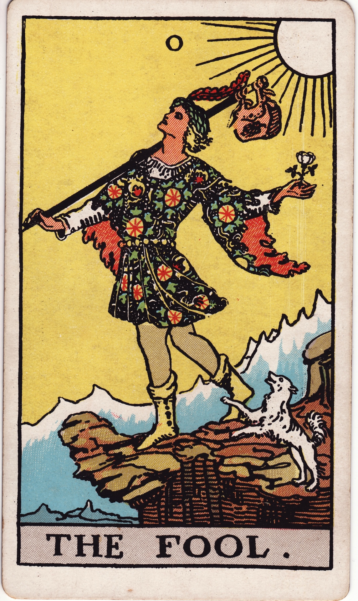

# Fool

## The Anchor

**Keywords:** new beginnings, innocence, leap of faith, spontaneity, unlimited potential

**Mood:** buoyant, free, trusting, expansive

## Core Meaning Snapshot

*   **Trust the Leap:** The Fool invites you to step into the unknown with curiosity as your compass. You may not know the destination, but the journey is blessed when you travel light.
*   **Beginner’s Mind:** Shed cynicism, refresh your senses, and embrace the awe of a first chapter. Wonder is a sacred resource.
*   **Pack Light:** The knapsack holds only what you truly need—experience distilled to its essence. Everything else can fall away.
*   **Intuition at Your Heels:** The white dog is instinct personified. When it barks, listen; when it dances, follow. Joy and caution can coexist.

## Artistic Direction

The Fool must embody the ecstasy of pure potential. Their energy is weightless, their gaze directed toward the heavens, not the abyss. The art must capture the feeling of the moment *before* flight, where gravity has lost its hold.

*   **The Figure:** A youthful, androgynous traveler, light on their feet, poised at the very edge of a precipice. Arms open, head tilted skyward—the pose should broadcast trust and wonder. This is the moment before momentum tips into flight.
*   **The Cliff:** Stage it as the luminous rim of the known world, a diving board into a fresh reality. Let the landscape beyond feel vast and inviting, emphasizing possibility over peril.
*   **The White Sun:** A radiant disc that floods the scene with divine, life-giving energy. It is the card’s engine—paint it so it feels like the spark that propels the Fool forward.
*   **The White Rose:** Delicate in one hand, signaling intention kept pure. Its petals should contrast with the rugged ledge, highlighting innocence partnered with audacity.
*   **The Bundle on a Stick:** Small and weightless, hinting at a life distilled to essentials. Include a token or two that nod to past lessons without adding heaviness.
*   **The White Dog:** Capture the companion mid-leap, both playful and cautionary. The expression should suggest instinct that both cheers and warns—the Fool’s inner compass made flesh.

## Impression Palette

*   **Invocation:** "Spirit of the void, grant me the courage to take the first step without needing to see the whole path. Let my faith be my footing and the wind my guide. I am ready to begin."

*   **Haiku:**  
    White sun on my face,  
    The cliff's edge is not an end.  
    My next breath is flight.

*   **Story Beat:** Dawn has just broken; the village behind still sleeps. The Fool hums a half-remembered tune, feeling the dog’s playful tug at their heel. The cliff edge gleams like a promise, not a threat. With a deep inhale, the Fool steps forward, trusting that the air will cradle them into a new world.

## Creator Prompt — Visualization

What is the “cliff” you stand before in your life or creative work? Close your eyes and feel the moment you shift your weight forward. Journal the trust you sense in your body before fear has time to speak.

## Esoteric Note

Correspondence: Air / Uranus — sudden awakenings, radical freedom, the genius spark that disrupts inertia.
