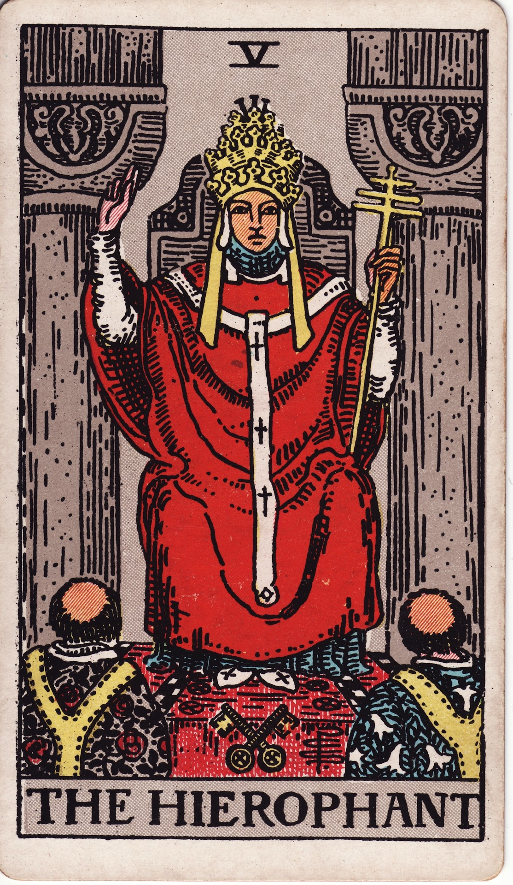

# The Hierophant (V)

The Hierophant is sacred tradition—the spiritual teacher who transmits lineage, doctrine, and communal wisdom. He invites us to seek guidance, honor ritual, and discern which traditions nourish our evolution.

*Keywords:* tradition, mentorship, spiritual authority, ethics, communal learning  
*Mood:* reverent, structured, ceremonial, compassionate  
*Polarity:* receptive, mediating

*Art interpretation cue:* Portray the Hierophant enthroned between two pillars, blessing acolytes with a triple cross staff. Keys cross at his feet, symbolizing access to sacred mysteries through proper channels.

### Artistic Direction

Blend solemnity with warmth—this is a living tradition, not dusty dogma.

*   **Core Symbolism & Composition:**
    *   **Triple Crown & Staff:** Authority over body, mind, spirit; spiritual governance.  
    *   **Gesture of Benediction:** Two fingers raised and two lowered—connection of heaven and earth through doctrine.  
    *   **Acolytes or Petitioners:** Community receiving teachings.  
    *   **Keys of Silver & Gold:** Conscious and subconscious unlocked through initiation.  
    *   **Carved Throne & Pillars:** Institutional wisdom and stability.
*   **Mood & Atmosphere:**
    Use ivory, crimson, and gold with touches of sapphire. Light streaming through stained glass conveys sanctity.

### Esoteric Correspondences

*   **Number & Path:** V; Path between Chokmah and Chesed—wisdom becoming mercy through ritual.  
*   **Title:** The Magus of the Eternal Gods.  
*   **Astrology:** Taurus—steadfast devotion, sensory ritual, sacred stewardship of the Earth.  
*   **Element:** Earth infused with spirit; tradition embodied.  
*   **Hebrew Letter:** Vav (ו) — the nail; connective force binding heaven and earth.  
*   **Kabbalah:** Guardian of spiritual institutions; channels grace into community.

### Core Meanings (Upright)

*   **Guidance & Mentorship:** Seek or offer counsel; learn from established wisdom.  
*   **Ritual & Ceremony:** Honor traditions, sacraments, or rites of passage.  
*   **Ethics & Values:** Align actions with moral frameworks; integrity matters.  
*   **Belonging:** Root in community; shared practices fortify purpose.

### Core Meanings (Reversed)

*   **Dogmatism:** Rigid doctrine, blind obedience, oppressive structures.  
*   **Rebellion:** Questioning tradition; forging an unconventional path.  
*   **Misaligned Mentor:** Teacher without integrity; misguided counsel.  
*   **Spiritual Alienation:** Feeling excluded or disconnected from community.

### Soul Lesson & Archetype

He is the Hierarch—the bridge between divine law and human experience. Lesson: discern what traditions uplift, release what constrains, and honor communal wisdom without forsaking personal truth.

### The Archetype in Human Form

*   **Upright:** The spiritual leader, educator, counselor, ceremonial facilitator, or elder.  
*   **Reversed:** The dogmatic authority, hypocrite, or isolated seeker rejecting all structure.

### Guiding Questions

*   **Upright:**
    *   Which teachings nourish my growth right now?  
    *   How can I honor my lineage while staying alive to new insight?  
    *   What role do I play in my community’s learning?  
    *   Which rituals anchor me in meaning?
*   **Reversed:**
    *   Where has tradition become a cage?  
    *   How can I reevaluate or reimagine my spiritual frameworks?  
    *   What mentorship requires boundaries or release?  
    *   Where do I need to craft my own ritual language?

### Affirmations

*   **Upright:** “I honor wisdom passed down, translating it into acts of living grace.”  
*   **Reversed:** “I retain what is sacred, shedding what stifles my authentic evolution.”

### Material World

*   **Upright:** Formal education, certification, corporate policies, unions, structured environments.  
*   **Reversed:** Bureaucratic stagnation, outdated protocols, toxic workplace culture.  
*   **Self-Question:** “Which systems support my goals, and which need renegotiation?”

### Relationships

*   **Upright:** Commitment ceremonies, shared values, community support, counsel for relationships.  
*   **Reversed:** Pressure to conform, mismatched belief systems, secrecy against tradition.  
*   **Self-Question:** “How do shared values shape the love we are building?”

### Spiritual Path

*   **Upright:** Studying sacred texts, joining circles, attending rituals, embracing lineage.  
*   **Reversed:** Spiritual independence, eclectic practice, confronting religious trauma.  
*   **Self-Question:** “What blend of tradition and innovation feeds my soul?”

### Integration Practices

1.  **Lineage Research:** Explore your ancestral or spiritual lineage; note practices that resonate.  
2.  **Ritual Renewal:** Refresh a familiar ceremony; adapt it to your current life stage.  
3.  **Mentor Dialogue:** Meet with a trusted teacher or become one for someone seeking guidance.

### Cross-Card Echoes

*   **Hierophant ↔ High Priestess:** Outer ritual meets inner mystery; integrate both.  
*   **Hierophant ↔ Justice:** Ethics examined; laws of man and spirit intertwine.  
*   **Hierophant → The Star:** After tradition is questioned, authentic faith can be reborn.

### Impression Palette

#### Liturgical Response

“Call: ‘What endures?’ Response: ‘Compassion in practice.’ Call: ‘What liberates?’ Response: ‘Wisdom shared with humility.’”

#### Catechism Verse

Candles echo hymns,  
keys glint in the teacher’s hand—  
doorways wait for all.
