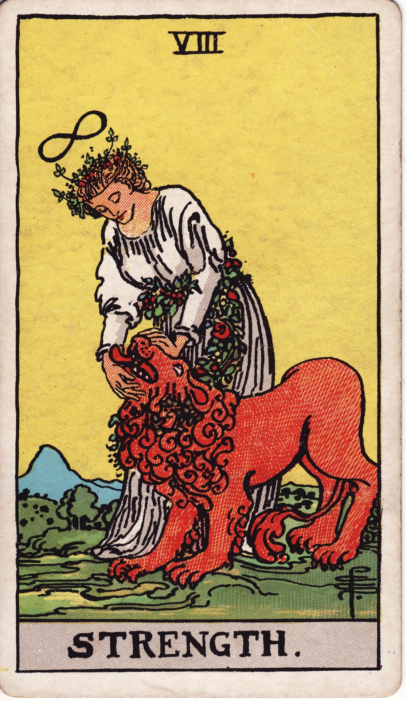

# Strength (VIII)

Strength is compassionate courage—the power born of empathy, patience, and self-mastery. It teaches us to tame inner beasts with love, transmuting raw emotion into gentle resilience.

*Keywords:* courage, compassion, inner fortitude, gentle power, resilience  
*Mood:* serene, courageous, heart-centered, steady  
*Polarity:* harmonizing, integrative

*Art interpretation cue:* Portray a calm figure softly closing or opening a lion’s jaws, garlanded with flowers. The infinity halo above their head signals endless grace; the landscape glows with warm, reassuring hues.

### Artistic Direction

Emphasize quiet power—no struggle, only mutual trust between human and beast.

*   **Core Symbolism & Composition:**
    *   **Lion:** Instinct, passion, primal energy guided rather than suppressed.  
    *   **Infinity Crown:** Boundless compassion, spiritual mastery.  
    *   **White Robe & Floral Lemniscate:** Purity and natural harmony.  
    *   **Gentle Touch:** Hands soft, conveying calm influence.  
    *   **Sunlit Meadow:** Environment of peace, signaling safe integration.

*   **Mood & Atmosphere:**
    Use honey golds, soft ambers, and verdant greens. Light should emanate from both characters, showing unified vitality.

### Esoteric Correspondences

*   **Number & Path:** VIII; Path between Chesed and Geburah—mercy and strength balanced.  
*   **Title:** Daughter of the Flaming Sword.  
*   **Astrology:** Leo—heart fire, loyalty, pride alchemized into generosity.  
*   **Element:** Fire tempered by grace.  
*   **Hebrew Letter:** Teth (ט) — the serpent; kundalini energy tamed and elevated.  
*   **Kabbalah:** Harmonizes desire and discipline; sacred heart as source of power.

### Core Meanings (Upright)

*   **Compassionate Courage:** Face challenges with kindness and conviction.  
*   **Self-Mastery:** Integrate instinct rather than repress it.  
*   **Grace Under Pressure:** Emotional intelligence in adversity.  
*   **Healing Presence:** Calming others through grounded empathy.

### Core Meanings (Reversed)

*   **Inner Conflict:** Rage, fear, or shame overwhelming poise.  
*   **Doubt & Insecurity:** Forgetting personal strength; imposter syndrome.  
*   **Forceful Control:** Dominating self or others; suppression instead of integration.  
*   **Energy Drain:** Compassion fatigue; time to replenish.

### Soul Lesson & Archetype

She is the Heart Warrior—proof that love is the most resilient force. Lesson: true strength is tender, patient, and sourced from self-trust.

### The Archetype in Human Form

*   **Upright:** The healer, therapist, animal whisperer, advocate, or survivor leading with grace.  
*   **Reversed:** The overwhelmed helper, the irritable leader, or someone doubting their worth.

### Guiding Questions

*   **Upright:**
    *   Which inner beast needs compassion rather than control?  
    *   How can I respond to pressure with calm courage?  
    *   Where does patience create deeper transformation?  
    *   What nurtures my heart so I can continue showing up?
*   **Reversed:**
    *   Where am I using force instead of love?  
    *   What support refills my emotional reserves?  
    *   How can I reframe vulnerability as strength?  
    *   What practices rebuild self-trust?

### Affirmations

*   **Upright:** “My heart is my strongest muscle; I tame storms with compassion.”  
*   **Reversed:** “I honor my limits, tending my courage with gentleness.”

### Material World

*   **Upright:** Perseverance through challenges, advocating with poise, sustainable leadership.  
*   **Reversed:** Workplace burnout, power struggles, acting out of fear.  
*   **Self-Question:** “How can I lead with calm authority rather than force?”

### Relationships

*   **Upright:** Loyal love, healing dynamics, holding space with patience.  
*   **Reversed:** Jealousy, unchecked anger, emotional exhaustion.  
*   **Self-Question:** “What boundaries or tenderness restore balance between us?”

### Spiritual Path

*   **Upright:** Heart-centered practices, compassion meditation, Reiki, breathwork.  
*   **Reversed:** Neglecting self-care, spiritual bypassing through martyrdom.  
*   **Self-Question:** “Which ritual reconnects me to my courageous heart?”

### Integration Practices

1.  **Lion’s Breath:** Practice pranayama to release pent-up emotion.  
2.  **Compassion Letter:** Write to your inner beast as a beloved friend seeking care.  
3.  **Strength Inventory:** List past challenges you survived; honor each with gratitude.

### Cross-Card Echoes

*   **Strength ↔ The Chariot:** Soft power complements willpower; together they win with integrity.  
*   **Strength ↔ Nine of Wands:** Resilience meets compassionate endurance.  
*   **Strength → Justice:** Courage now paves the way for fair, decisive action.

### Impression Palette

#### Heart Mantra

“With breath steady, hands gentle, I invite the wild to rest beside me. Love is my shield.”

#### Fable Snapshot

The lion bowed, not from defeat, but gratitude—someone finally listened to his roar as a prayer.
