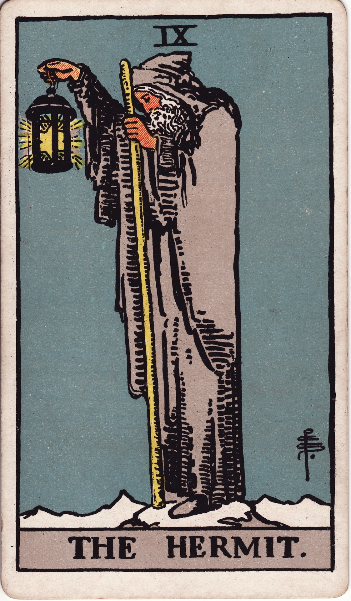

# The Hermit (IX)

The Hermit is luminous solitude—the elder sage who retreats into silence to kindle inner light. He beckons us to step away from noise, seek truth within, and guide others only after we’ve met ourselves in the dark.

*Keywords:* introspection, solitude, wisdom, guidance, soul-searching  
*Mood:* contemplative, quiet, illuminated, introspective  
*Polarity:* receptive, introspective

*Art interpretation cue:* Depict the Hermit cloaked atop a mountain ridge, lantern outstretched, staff in hand. Snowy earth below and starry night above emphasize purity of purpose and isolation.

### Artistic Direction

Let the scene glow from within—lantern light cascading onto rock and snow, contrasting with midnight hues.

*   **Core Symbolism & Composition:**
    *   **Lantern with Six-Pointed Star:** Inner wisdom illuminating the path for self and others.  
    *   **Staff:** Support through experience; spiritual authority earned.  
    *   **Mountain Peak:** Achievement of solitude and perspective.  
    *   **Snow or Night:** Silence, forgiveness, clarity.  
    *   **Downcast Eyes:** Contemplation, humility.
*   **Mood & Atmosphere:**
    Use slate blues, silvers, and soft ivory. The lantern’s gold should be the primary warm tone, symbolizing hope.

### Esoteric Correspondences

*   **Number & Path:** IX; Path between Chesed and Tiphareth—mercy tempered with beauty through inner reflection.  
*   **Title:** The Prophet of the Eternal.  
*   **Astrology:** Virgo—discernment, sacred service, refinement.  
*   **Element:** Earth interiorized; the cave of the heart.  
*   **Hebrew Letter:** Yod (י) — the divine spark, seed of creation.  
*   **Kabbalah:** Guides seekers from outer knowledge to inner wisdom.

### Core Meanings (Upright)

*   **Introspection:** Step back; contemplate deeply before acting.  
*   **Soul Guidance:** Seek mentors or become one after your own pilgrimage.  
*   **Sacred Solitude:** Time alone replenishes clarity.  
*   **Illuminated Path:** Your insights can light the way for others.

### Core Meanings (Reversed)

*   **Isolation:** Withdrawn to a fault; loneliness instead of solitude.  
*   **Avoidance:** Procrastination disguised as contemplation.  
*   **Unshared Wisdom:** Hoarding insights; refusing to mentor.  
*   **Lost Light:** Feeling directionless, disconnected from purpose.

### Soul Lesson & Archetype

He is the Sage—the seeker who becomes guide. Lesson: solitude breeds wisdom; share the lantern when ready, but do not rush the pilgrimage.

### The Archetype in Human Form

*   **Upright:** The mentor, elder, mystic, therapist, or researcher walking an intentional path.  
*   **Reversed:** The recluse, the over-isolated soul, or the burnt-out teacher in need of retreat.

### Guiding Questions

*   **Upright:**
    *   What truth emerges when I sit in silence?  
    *   Where is solitude calling me to recalibrate?  
    *   How can I integrate my lessons before sharing them?  
    *   Who benefits from my lantern once I’m ready?
*   **Reversed:**
    *   Have I withdrawn out of fear rather than reverence?  
    *   What gentle structure brings me back to connection?  
    *   Where am I resisting mentorship—from giving or receiving it?  
    *   What small light can guide me out of stagnation?

### Affirmations

*   **Upright:** “I honor my inner pilgrimage; my light grows brighter in sacred solitude.”  
*   **Reversed:** “I invite connection that respects my pace; even guides need guiding.”

### Material World

*   **Upright:** Sabbaticals, research, working behind the scenes, simplifying lifestyle.  
*   **Reversed:** Career stagnation from disengagement, ignoring collaboration, burnout.  
*   **Self-Question:** “How can I balance solitude with purposeful contribution?”

### Relationships

*   **Upright:** Mindful time apart, introspection within partnership, wise counsel.  
*   **Reversed:** Emotional distancing, ghosting, fear of vulnerability.  
*   **Self-Question:** “How can solitude serve connection instead of replacing it?”

### Spiritual Path

*   **Upright:** Meditation, retreats, contemplative prayer, ancestral communion.  
*   **Reversed:** Spiritual isolation, cynicism, rejection of community.  
*   **Self-Question:** “What practice keeps my lantern lit even when alone?”

### Integration Practices

1.  **Digital Sabbath:** Spend a day unplugged; journal what surfaces.  
2.  **Guiding Light Meditation:** Visualize yourself carrying a lantern; ask what wisdom it holds.  
3.  **Mentor Map:** List mentors and protégés; consider where reciprocal guidance is needed.

### Cross-Card Echoes

*   **Hermit ↔ High Priestess:** Inner listening deepens intuitive insight.  
*   **Hermit ↔ Nine of Pentacles:** Solitude becomes richness when chosen with intention.  
*   **Hermit → Star:** After the inward journey, hope radiates outward.

### Impression Palette

#### Solitude Mantra

“In silence, I tend the ember of knowing. When it glows steady, I offer its light.”

#### Lantern Prose

Snow whispered under his boots. Each step met the hum of an ancient song—the one that begins only when the world falls quiet.
