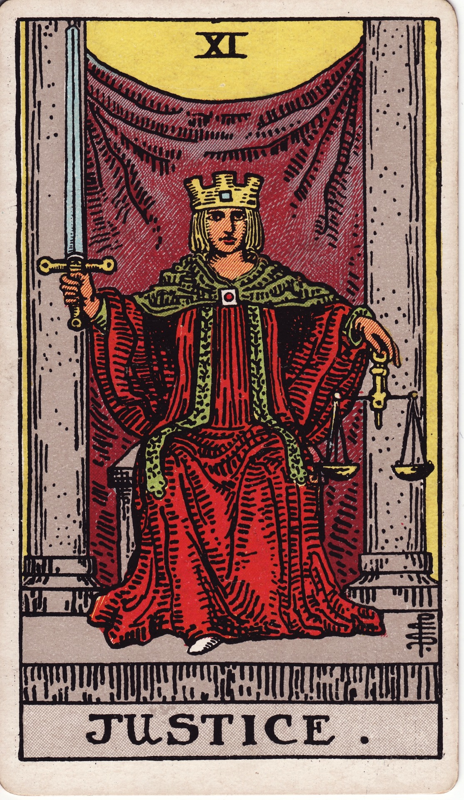

# Justice (XI)

Justice is luminous balance—the impartial arbiter who weighs truth, consequence, and integrity. She asks us to act with fairness, accept accountability, and align choices with both law and heart.

*Keywords:* fairness, truth, accountability, ethical choice, balance  
*Mood:* lucid, poised, impartial, decisive  
*Polarity:* equilibrating, clarifying

*Art interpretation cue:* Present Justice seated between pillars, sword upright in one hand and balanced scales in the other. Her gaze is direct, curtains drawn back to reveal a bright square or portal behind—truth unveiled.

### Artistic Direction

Emphasize clarity—clean lines, symmetrical composition, and crisp light.

*   **Core Symbolism & Composition:**
    *   **Scales:** Weighing actions, motives, and outcomes.  
    *   **Sword:** Swift, decisive truth; intellect guided by principle.  
    *   **Square Halo or Crown:** Stability, order, grounded logic.  
    *   **Pillars & Veil:** Law and mercy; consequences behind the curtain.  
    *   **Red Robe, White Underrobe:** Passion tempered by purity of intention.
*   **Mood & Atmosphere:**
    Use ruby, ivory, and slate. Illuminate edges sharply, giving a courtroom-esque gravitas.

### Esoteric Correspondences

*   **Number & Path:** XI; Path between Geburah and Tiphareth—severity balanced by beauty.  
*   **Title:** Daughter of the Lords of Truth.  
*   **Astrology:** Libra—harmony, diplomacy, relational balance.  
*   **Element:** Air weighed carefully; intellect applied ethically.  
*   **Hebrew Letter:** Lamed (ל) — the goad, teaching corrective movement.  
*   **Kabbalah:** Midpoint of cause and effect; karmic recalibration.

### Core Meanings (Upright)

*   **Truth & Fairness:** Seek clarity; own your choices.  
*   **Legal Matters:** Contracts, court decisions, official verdicts.  
*   **Balance Restored:** Equilibrium returns through honest action.  
*   **Moral Compass:** Align behavior with ethics and values.

### Core Meanings (Reversed)

*   **Injustice:** Bias, unfair outcomes, dishonesty.  
*   **Avoiding Accountability:** Refusing responsibility, blaming others.  
*   **Imbalance:** Decisions swayed by emotion or prejudice.  
*   **Legal Delays:** Red tape, flawed contracts, misrepresentation.

### Soul Lesson & Archetype

She is the Arbiter—the guardian of moral equilibrium. Lesson: every choice has weight; integrity is the only stable foundation.

### The Archetype in Human Form

*   **Upright:** The judge, mediator, lawyer, ethicist, activist, or truth-teller.  
*   **Reversed:** The biased official, gaslighter, or individual evading self-examination.

### Guiding Questions

*   **Upright:**
    *   What is the truthful assessment of this situation?  
    *   How do my choices impact others and myself?  
    *   Where can I restore balance or offer restitution?  
    *   What data supports my decision?
*   **Reversed:**
    *   Am I ignoring uncomfortable truths?  
    *   Where have I been unfair—to others or myself?  
    *   What accountability must be embraced?  
    *   Which biases need conscious correction?

### Affirmations

*   **Upright:** “I honor truth and fairness; my choices align with justice.”  
*   **Reversed:** “I take responsibility, restoring balance through honest action.”

### Material World

*   **Upright:** Legal wins, fair negotiations, transparent finances, HR matters resolved.  
*   **Reversed:** Lawsuits, contract issues, policy disputes, fines or penalties.  
*   **Self-Question:** “Does this agreement reflect mutual fairness?”

### Relationships

*   **Upright:** Honest communication, equitable partnership, resolving conflicts.  
*   **Reversed:** Grudges, resentment, imbalance of effort, dishonesty.  
*   **Self-Question:** “How can fairness and empathy rebuild trust here?”

### Spiritual Path

*   **Upright:** Karma yoga, ethical living, truth-telling as spiritual practice.  
*   **Reversed:** Spiritual rationalization, avoiding shadow work, lack of integrity.  
*   **Self-Question:** “What truth must I embrace to stay spiritually aligned?”

### Integration Practices

1.  **Balance Ledger:** List areas of imbalance; note actionable corrections.  
2.  **Truth Mirror:** Speak aloud a difficult truth to your reflection, witnessing without judgment.  
3.  **Justice Offering:** Support a cause or person impacted by injustice; practice reparative action.

### Cross-Card Echoes

*   **Justice ↔ The Hierophant:** Law and tradition intersect; examine institutions.  
*   **Justice ↔ Two of Swords:** Analytical decision-making; don’t refuse to choose.  
*   **Justice → Judgment:** After fairness is invoked, deeper reckoning follows.

### Impression Palette

#### Verdict Declaration

“By blade and balance, I weigh the unseen. Let truth be spoken, accountability embraced, harmony restored.”

#### Balanced Haiku

Sword bright, scales precise—  
breath held till the verdict lands.  
Even hearts recalibrate.
