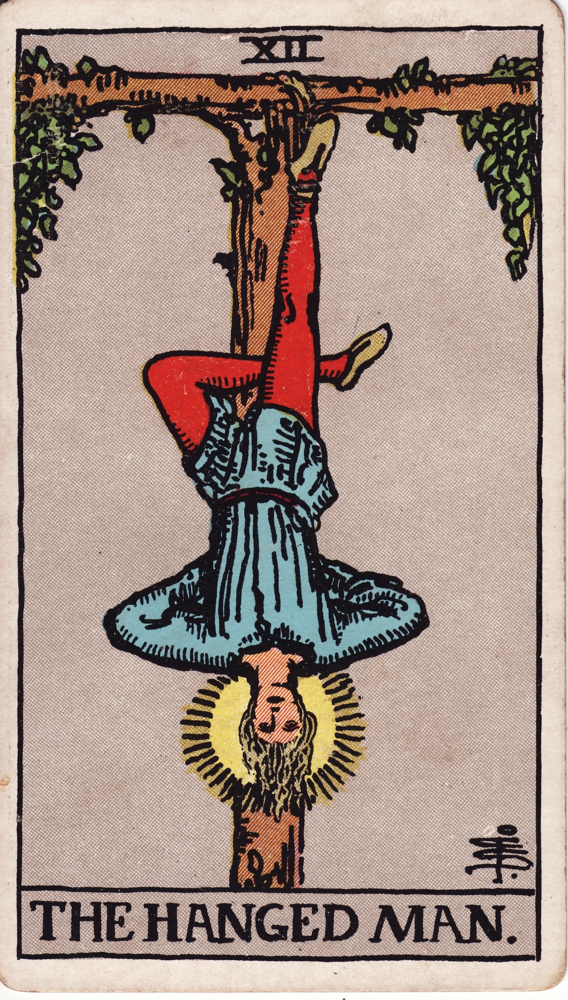

# The Hanged Man (XII)

The Hanged Man is surrendered vision—the moment suspended between action and insight where perspective inverts and new wisdom dawns. He teaches the alchemy of pause, sacrifice, and receptive transformation.

*Keywords:* surrender, new perspective, suspension, sacrifice, liminal wisdom  
*Mood:* serene, contemplative, paradoxical, luminous  
*Polarity:* receptive, transitional

*Art interpretation cue:* Depict a figure hanging upside down from a living tree, haloed in golden light. One leg crosses the other to form an inverted four; expression peaceful, not pained.

### Artistic Direction

Highlight the sanctity of pause—stillness glowing against a calm background.

*   **Core Symbolism & Composition:**
    *   **Living Tree (World Tree/Yggdrasil):** Connection to cosmic wisdom.  
    *   **Halo/Nimbus:** Enlightenment gained through surrender.  
    *   **Inverted Position:** Seeing reality from another angle.  
    *   **Tied Foot, Free Leg:** Voluntary suspension; choice within surrender.  
    *   **Blue & Gold Palette:** Spiritual serenity and illumination.
*   **Mood & Atmosphere:**
    Use muted blues, mossy greens, and radiant gold. Time should feel slowed, water-like.

### Esoteric Correspondences

*   **Number & Path:** XII; Path between Geburah and Hod—discipline yielding insight.  
*   **Title:** The Spirit of the Mighty Waters.  
*   **Astrology:** Neptune—transcendence, mysticism, dissolution of ego.  
*   **Element:** Water in suspension.  
*   **Hebrew Letter:** Mem (מ) — water, the womb of transformation.  
*   **Kabbalah:** Descent into subconscious to retrieve wisdom; the pause before rebirth.

### Core Meanings (Upright)

*   **Perspective Shift:** See from new angles; let assumptions go.  
*   **Surrender:** Release control; allow the universe to guide timing.  
*   **Spiritual Suspension:** Deep meditation, liminal spaces, waiting with purpose.  
*   **Sacrifice for Insight:** Give up what blocks clarity.

### Core Meanings (Reversed)

*   **Stagnation:** Stuck without insight; sacrifice gone stale.  
*   **Indecision:** Refusal to act; martyrdom narrative.  
*   **Avoidance:** Using spirituality to delay necessary action.  
*   **Delayed Awakening:** Insight near, but resistance persists.

### Soul Lesson & Archetype

He is the Initiate—the one who pauses willingly to see beyond illusion. Lesson: surrender births enlightenment; trust the wisdom found in stillness.

### The Archetype in Human Form

*   **Upright:** The mystic, artist, contemplative activist, or visionary pausing to realign.  
*   **Reversed:** The procrastinator, martyr, or rebel without cause resisting necessary movement.

### Guiding Questions

*   **Upright:**
    *   What happens if I release control and simply notice?  
    *   Which belief needs inverting for me to progress?  
    *   What sacrifice serves my evolution now?  
    *   How can waiting become a fertile practice?
*   **Reversed:**
    *   Am I stuck or truly surrendering?  
    *   What action has been delayed past its usefulness?  
    *   Where am I playing martyr instead of empowered seeker?  
    *   What support helps me move when insight arrives?

### Affirmations

*   **Upright:** “I surrender to sacred pause; new vision graces my patience.”  
*   **Reversed:** “I discern when to release and when to act, honoring insight with motion.”

### Material World

*   **Upright:** Strategic delays, sabbaticals, pausing negotiations, reevaluating plans.  
*   **Reversed:** Missed deadlines, paralysis, unproductive sacrifices.  
*   **Self-Question:** “Is this pause intentional or avoidance?”

### Relationships

*   **Upright:** Time-outs for reflection, seeing a partner’s perspective, compassionate patience.  
*   **Reversed:** Stalled connections, indecision, emotional self-sacrifice.  
*   **Self-Question:** “Where do we need a reset versus renewed action?”

### Spiritual Path

*   **Upright:** Meditation retreats, shadow work, mystical study, devotion through surrender.  
*   **Reversed:** Spiritual stagnation, bypassing, clinging to outdated doctrines.  
*   **Self-Question:** “What spiritual practice helps me listen deeply right now?”

### Integration Practices

1.  **Inversion Pose:** Practice gentle inversions (legs up wall) to shift physical perspective.  
2.  **Sacred Pause Ritual:** Light a candle; sit in silence for a set time, observing thoughts pass.  
3.  **Release Inventory:** List what you’re ready to surrender; ceremonially let go (burn, bury, or dissolve paper).

### Cross-Card Echoes

*   **Hanged Man ↔ The Hermit:** Deep introspection; different modes of retreat.  
*   **Hanged Man ↔ Four of Swords:** Rest with intention; healing requires pause.  
*   **Hanged Man → Death:** After surrender comes transformative release.

### Impression Palette

#### Suspension Prayer

“May this pause be holy. Upside down, I see the hidden map; I trust the river carrying me.”

#### Meditative Tanka

Roots hold me aloft,  
halo breathing waterfall—  
time ripens softly.  
Surrender tastes like sunrise  
waiting to be born again.
