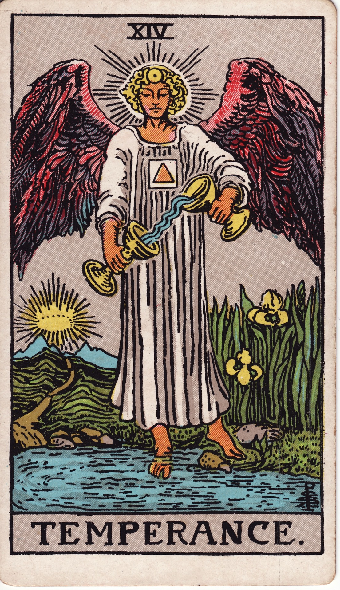

# Temperance (XIV)

Temperance is harmonious alchemy—the angel of integration blending opposites into healing flow. It invites moderation, patience, and the art of pouring one realm into another until equilibrium is restored.

*Keywords:* balance, integration, healing, moderation, alchemy  
*Mood:* tranquil, purposeful, flowing, restorative  
*Polarity:* harmonizing, refining

*Art interpretation cue:* Illustrate an angel with one foot on land and the other in water, transferring liquid between chalices seamlessly. A path leads toward a crown-lit mountain, and irises bloom nearby.

### Artistic Direction

Render serene alchemy—gentle gradients, soft light, and continuous motion between vessels.

*   **Core Symbolism & Composition:**
    *   **Angel (often Michael):** Divine mediator, blending spirit and matter.  
    *   **Two Chalices:** Flow between conscious and unconscious, mixing elements.  
    *   **One Foot Land/One Foot Water:** Balance between practical and emotional realms.  
    *   **Sunrise & Crown:** Enlightenment reached via patient integration.  
    *   **Iris Flowers:** Hope and messages from the gods.
*   **Mood & Atmosphere:**
    Use gentle golds, sky blues, and lavender tones. Smooth gradients convey the seamless pour.

### Esoteric Correspondences

*   **Number & Path:** XIV; Path between Tiphareth and Yesod—beauty streaming into foundation.  
*   **Title:** Daughter of the Reconcilers, Bringer-Forth of Life.  
*   **Astrology:** Sagittarius—questing spirit guided by higher wisdom.  
*   **Element:** Fire moderated; spiritual flame tempered.  
*   **Hebrew Letter:** Samekh (ס) — support; the prop that upholds.  
*   **Kabbalah:** Blends opposites, stabilizing the energy before embodiment.

### Core Meanings (Upright)

*   **Alchemical Healing:** Integrate body, mind, and spirit.  
*   **Moderation:** Take the middle path; avoid extremes.  
*   **Patience:** Trust the slow blend; timing is divine.  
*   **Purposeful Flow:** Align daily actions with higher calling.

### Core Meanings (Reversed)

*   **Imbalance:** Excess, burnout, overindulgence, or neglect.  
*   **Fragmentation:** Parts of life refusing to integrate.  
*   **Impatience:** Rushing the process; forcing outcomes.  
*   **Mixed Signals:** Miscommunication, disharmony in teamwork.

### Soul Lesson & Archetype

Temperance is the Alchemist—the healer who mixes elements into harmony. Lesson: moderation is sacred; integration creates miracles.

### The Archetype in Human Form

*   **Upright:** The healer, mediator, artist, or coach uniting diverse elements smoothly.  
*   **Reversed:** The perfectionist, the overindulgent, or the divided self requiring recalibration.

### Guiding Questions

*   **Upright:**
    *   Where can I blend opposites into creative harmony?  
    *   What rhythms support sustainable well-being?  
    *   How can I align daily life with my long-term vision?  
    *   Which relationships or projects need gentle mediation?
*   **Reversed:**
    *   Where have extremes drained my vitality?  
    *   What steps restore balance and health?  
    *   How can I slow down and trust divine timing?  
    *   Which boundaries or routines need recalibrating?

### Affirmations

*   **Upright:** “I pour with patience; harmony flows through every aspect of my life.”  
*   **Reversed:** “I release extremes, inviting gentle balance to heal me.”

### Material World

*   **Upright:** Strategic planning, collaborative teamwork, wellness routines, blended careers.  
*   **Reversed:** Work-life imbalance, financial extremes, chaotic schedules.  
*   **Self-Question:** “What practical adjustments support sustainable flow?”

### Relationships

*   **Upright:** Compatible partnerships, therapeutic resolution, mindful communication.  
*   **Reversed:** Mixed signals, clashing temperaments, over-giving or withholding.  
*   **Self-Question:** “How can we meet in the middle with grace?”

### Spiritual Path

*   **Upright:** Energy healing, mindful ritual, integrative spirituality, alchemical practice.  
*   **Reversed:** Spiritual extremes, neglecting physical needs, scattered focus.  
*   **Self-Question:** “Which daily practice blends heaven and earth for me?”

### Integration Practices

1.  **Blending Ritual:** Combine water and tincture, tea, or essential oils while speaking intentions for balance.  
2.  **Rhythm Audit:** Map daily habits; remove extremes, add nourishing pauses.  
3.  **Creative Fusion:** Merge two art forms or modalities to experience synergy.

### Cross-Card Echoes

*   **Temperance ↔ The Lovers:** Harmony of opposites deepens into alchemy.  
*   **Temperance ↔ Two of Pentacles:** Balance in the minor arc—keep flow light.  
*   **Temperance → Star:** Integration breeds hope and inspired renewal.

### Impression Palette

#### Alchemical Prayer

“Blend my fire with my waters, my vision with my breath. May every pour be a prayer of balance.”

#### Flowing Lune Poem

Cup to cup, slow arc—  
sunrise walks the water’s skin.  
Patience tastes like gold.
