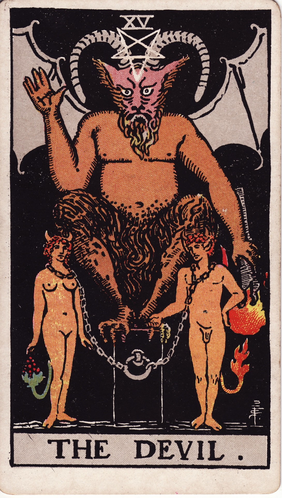

# The Devil (XV)

The Devil is shadow entanglement—the mirror of bondage, temptation, and unconscious contracts. He invites courageous examination of what chains us, transmuting shame into empowered choice.

*Keywords:* bondage, shadow work, temptation, attachment, reclamation  
*Mood:* intense, provocative, seductive, revealing  
*Polarity:* contractive, catalytic

*Art interpretation cue:* Depict the Devil enthroned atop a pedestal with torch raised, figures bound loosely at his feet. Chains should appear breakable, emphasizing choice. Reversed pentagram, dark cavern, and torchlight create dramatic contrast.

### Artistic Direction

Convey provocative allure—rich shadows, flickering firelight, textures both enticing and unsettling.

*   **Core Symbolism & Composition:**
    *   **Goat-Horned Figure:** Instinct, pan energy, primal desire.  
    *   **Torch Inverted:** Light misused; passion weaponized.  
    *   **Chained Figures:** Bondage to materialism, addiction, or limiting beliefs—chains loose to imply agency.  
    *   **Inverted Pentagram:** Spirit subordinated to matter.  
    *   **Dark Vault:** Psychological depths where shadow resides.
*   **Mood & Atmosphere:**
    Use obsidian blacks, ember reds, and metallic coppers. Highlights should glisten like temptation.

### Esoteric Correspondences

*   **Number & Path:** XV; Path between Tiphareth and Hod—beauty confronting intellect’s shadows.  
*   **Title:** Lord of the Gates of Matter, Child of the Forces of Time.  
*   **Astrology:** Capricorn—ambition, structure, material mastery (and its pitfalls).  
*   **Element:** Earth intensified; flesh and form.  
*   **Hebrew Letter:** Ayin (ע) — the eye; perception reveals (or distorts) reality.  
*   **Kabbalah:** Descent into matter; lesson of reclaiming power from illusion.

### Core Meanings (Upright)

*   **Shadow Contracts:** Identify what binds you—addiction, fear, toxic dynamics.  
*   **Temptation:** Seductive offers; discern authenticity.  
*   **Embodied Power:** Own desires without shame; integrate the shadow.  
*   **Material Mastery:** Navigate ambition ethically.

### Core Meanings (Reversed)

*   **Liberation:** Breaking chains, releasing harmful patterns.  
*   **Denial:** Refusing to acknowledge shadow, repression.  
*   **Escalating Bondage:** Addictions deepening, loops tightening.  
*   **Shame Spiral:** Self-judgment preventing healing.

### Soul Lesson & Archetype

He is the Tempter—the shadow teacher exposing where we give power away. Lesson: the chains are optional; claim your agency by owning desire and dismantling fear.

### The Archetype in Human Form

*   **Upright:** The seducer, charismatic entrepreneur, taboo artist, therapist specializing in shadow integration.  
*   **Reversed:** The manipulator, abuser, enabler, or captive to their own appetites.

### Guiding Questions

*   **Upright:**
    *   What desires have I demonized—and how can I honor them consciously?  
    *   Which patterns keep me chained, and what choice breaks them?  
    *   Where do shame and secrecy hold sway?  
    *   How can I ground power in responsibility?
*   **Reversed:**
    *   What support do I need to complete my liberation?  
    *   Where am I pretending the problem isn’t real?  
    *   How can I forgive myself while making healthier choices?  
    *   Which boundaries protect my newfound freedom?

### Affirmations

*   **Upright:** “I see my shadow clearly; in owning it, I reclaim my freedom.”  
*   **Reversed:** “I release the chains of shame, choosing liberation with compassion.”

### Material World

*   **Upright:** Ambitious deals, navigating power dynamics, confronting debt or addictions.  
*   **Reversed:** Exiting exploitative jobs, renegotiating contracts, financial recovery.  
*   **Self-Question:** “Am I enslaved by this pursuit—or empowered by it?”

### Relationships

*   **Upright:** Intense attraction, karmic ties, taboo desires, power play.  
   **Reversed:** Breaking toxic bonds, setting boundaries, healing codependency.  
*   **Self-Question:** “Does this connection feed my soul or drain it?”

### Spiritual Path

*   **Upright:** Shadow work, tantric integration, confronting spiritual materialism.  
*   **Reversed:** Ending spiritual bypass, reclaiming spiritual autonomy, detoxing from cult dynamics.  
*   **Self-Question:** “Where can shadow integration make my practice more authentic?”

### Integration Practices

1.  **Shadow Journal:** Write honestly about desires, fears, and compulsions—without censoring.  
2.  **Cord-Cutting Ritual:** Visualize chains dissolving in flame; name the new behavior replacing the old.  
3.  **Embodiment Practice:** Dance or move to claim sensual power safely.

### Cross-Card Echoes

*   **Devil ↔ Lovers:** Choice and bondage; love versus entrapment.  
*   **Devil ↔ Eight of Swords:** Psychological captivity echoes; liberation begins within.  
*   **Devil → Tower:** When chains persist, upheaval may arrive to break them.

### Impression Palette

#### Shadow Invocation

“Name your hunger. Hold it to the torch. Let honesty melt the shackles until only choice remains.”

#### Gothic Quatrain

Ash-sweet whisper, flame-kissed vow—  
will you kneel or will you bow?  
Chains fall softly when we see  
the Devil was our shadowed plea.
