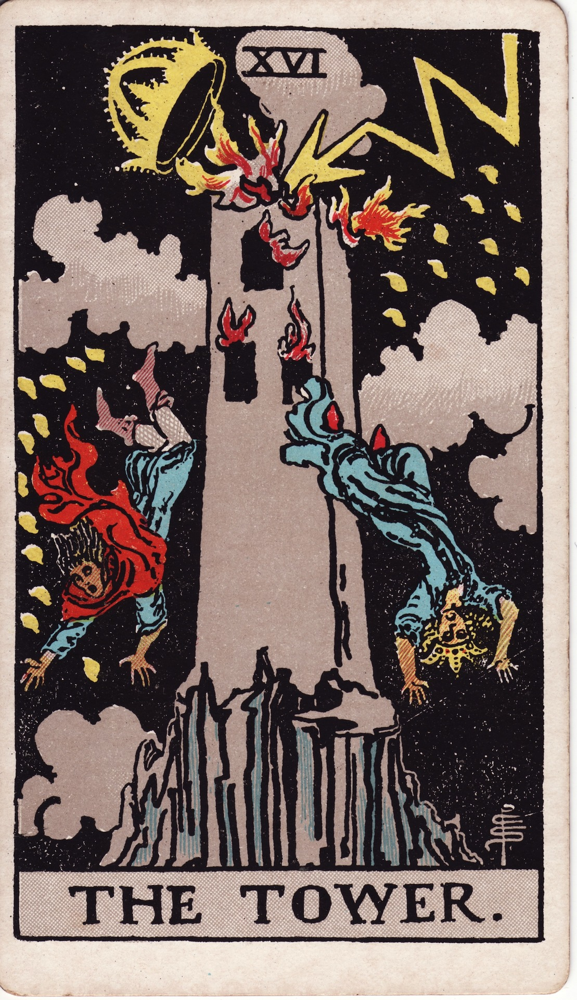

# The Tower (XVI)

The Tower is radical upheaval—lightning-struck revelation that topples false structures. It dismantles illusions, forcing truth to erupt so authentic foundations can emerge.

*Keywords:* upheaval, revelation, sudden change, liberation, awakening  
*Mood:* explosive, shocking, cathartic, clarifying  
*Polarity:* disruptive, purifying

*Art interpretation cue:* Illustrate a stone tower split by lightning, crown falling, figures tumbling into stormy night. Flames burst from windows, yet in the distance stars peek through dissipating clouds.

### Artistic Direction

Capture cinematic intensity—electric bolts, dynamic motion, and debris suspended mid-air.

*   **Core Symbolism & Composition:**
    *   **Lightning Bolt:** Sudden insight—divine intervention shattering complacency.  
    *   **Crumbling Crown:** Ego dethroned; false power undone.  
    *   **Falling Figures:** Humans cast out—humility, vulnerability, necessary descent.  
    *   **Raging Fire:** Purification through destruction.  
    *   **Night Sky with Stars:** Hope after chaos; clarity follows collapse.
*   **Mood & Atmosphere:**
    Use indigo storms, brilliant white lightning, and ember oranges. Motion blur accentuates urgency.

### Esoteric Correspondences

*   **Number & Path:** XVI; Path between Netzach and Hod—victory and intellect colliding.  
*   **Title:** Lord of the Hosts of the Mighty.  
*   **Astrology:** Mars—force, disruption, catalytic action.  
*   **Element:** Fire unleashed; explosive purification.  
*   **Hebrew Letter:** Peh (פ) — the mouth; explosive utterance of truth.  
*   **Kabbalah:** Cataclysm that clears channels for authentic revelation.

### Core Meanings (Upright)

*   **Sudden Upheaval:** Plans overturned; structures collapse unexpectedly.  
*   **Truth Bomb:** Hidden realities exposed; denial ends.  
*   **Liberation:** Freedom through destruction of limiting constructs.  
*   **Breakthrough:** Paradigm shift enabling growth despite shock.

### Core Meanings (Reversed)

*   **Avoided Disaster:** Narrow escape; heed warning signs.  
*   **Resistance:** Clinging to collapsing structures; prolonging pain.  
*   **Internal Upheaval:** Quiet breakdown, personal revelation.  
*   **Delayed Crisis:** Pressure building; intervention required.

### Soul Lesson & Archetype

The Tower is the Lightning—raw truth striking down illusion. Lesson: surrender to necessary collapse; rebuild with honesty.

### The Archetype in Human Form

*   **Upright:** The whistleblower, revolutionary, catalyst, or disruptive innovator.  
*   **Reversed:** The denialist, fear-bound leader, or person suppressing change.

### Guiding Questions

*   **Upright:**
    *   What truth can no longer be ignored?  
    *   Which structures crumble when authenticity calls?  
    *   How can I anchor myself amid sudden change?  
    *   What freedom emerges once the dust settles?
*   **Reversed:**
    *   Where am I postponing the inevitable?  
    *   How can I minimize fallout by acting now?  
    *   What support systems steady me through upheaval?  
    *   What insights do I glean from this wake-up call?

### Affirmations

*   **Upright:** “I allow false towers to fall; truth rebuilds me stronger.”  
*   **Reversed:** “I face change head-on, preventing greater harm through timely action.”

### Material World

*   **Upright:** Job loss, financial shocks, sudden market shifts, urgent relocations.  
*   **Reversed:** Near-miss disasters, restructuring, proactive course correction.  
*   **Self-Question:** “What contingency plan or pivot protects my future?”

### Relationships

*   **Upright:** Explosive arguments, shocking revelations, breakups, radical honesty.  
*   **Reversed:** Brewing tension, secrets soon to surface, resentments needing release.  
*   **Self-Question:** “How can truth be delivered constructively before it erupts?”

### Spiritual Path

*   **Upright:** Sudden awakening, dismantling beliefs, kundalini surges.  
*   **Reversed:** Resistance to awakening, spiritual ego collapse, private dark nights.  
*   **Self-Question:** “What spiritual structure must topple for deeper authenticity?”

### Integration Practices

1.  **Grounding Drill:** During upheaval, focus on breath, body scanning, naming the present moment.  
2.  **Debris Inventory:** After disruption, list what’s gone, what remains, what new forms you desire.  
3.  **Thunder Journal:** Write candidly about truths you’ve avoided; commit to acting on at least one.

### Cross-Card Echoes

*   **Tower ↔ Death:** Upheaval (Tower) clears space for intentional transformation (Death).  
*   **Tower ↔ Five of Wands:** Conflict energy foreshadows collapse if unaddressed.  
*   **Tower → Star:** After destruction, hope and healing follow.

### Impression Palette

#### Lightning Decree

“Strike, truth-fire—burn the hollow scaffolds. Let honest sky replace the smoke.”

#### Free-Fall Haiku

Crown falls, walls ignite—  
midnight air tastes sharp and clean.  
Stars wait in the ash.
