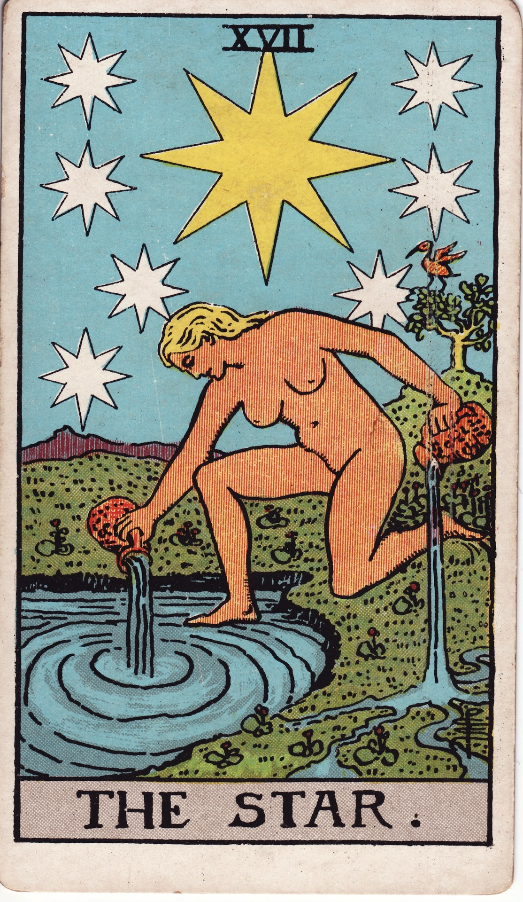

# The Star (XVII)

The Star is luminous hope—the afterglow of faith that gently heals after upheaval. She pours renewal over cracked ground, guiding us back to trust, inspiration, and cosmic belonging.

*Keywords:* hope, healing, inspiration, serenity, divine guidance  
*Mood:* tranquil, celestial, optimistic, restorative  
*Polarity:* expansive, soothing

*Art interpretation cue:* Depict a radiant figure kneeling at a pool, one foot in water and one on land, pouring liquid from twin vessels. A vast night sky shimmers with one dominant star and seven smaller companions; verdant growth returns around her.

### Artistic Direction

Evoke gentle luminescence—soft gradients, twinkling starlight, and flowing water.

*   **Core Symbolism & Composition:**
    *   **Central Star & Seven Secondary Stars:** Guiding light and chakric harmony.  
    *   **Vessels Pouring:** Healing flowing into both conscious (land) and unconscious (water) realms.  
    *   **Nudity:** Vulnerability, authenticity, purity.  
    *   **Ibis or Bird:** Higher perspective, Thoth’s wisdom.  
    *   **Flora:** Nature reawakening under starlight.
*   **Mood & Atmosphere:**
    Use shades of aquamarine, lavender, and silver. Keep lines soft, emphasizing peace.

### Esoteric Correspondences

*   **Number & Path:** XVII; Path between Netzach and Yesod—desire soothing the subconscious.  
*   **Title:** Daughter of the Firmament, Dweller Between the Waters.  
*   **Astrology:** Aquarius—innovation, humanitarian vision, cosmic connection.  
*   **Element:** Air infused with water; celestial rain.  
*   **Hebrew Letter:** Tzaddi (צ) — fishhook; drawing inspiration from the depths.  
*   **Kabbalah:** Reconnection to hope; the channel between dream and manifestation.

### Core Meanings (Upright)

*   **Healing & Renewal:** Recovery after hardship; gentle restoration.  
*   **Hopeful Vision:** Faith in future; inspired creativity.  
*   **Authentic Expression:** Being seen as you truly are; vulnerability rewarded.  
*   **Guidance:** Synchronicities and spiritual downloads illuminating path.

### Core Meanings (Reversed)

*   **Doubt:** Loss of faith, pessimism, creative dryness.  
*   **Delayed Healing:** Resistance to rest or self-care.  
*   **Disconnection:** Feeling alienated, unworthy, or unseen.  
*   **False Dawn:** Naïve optimism ignoring practical steps.

### Soul Lesson & Archetype

She is the Cosmic Healer—the muse who bathes wounds in starlight. Lesson: hope is a sacred practice; let inspiration refill you.

### The Archetype in Human Form

*   **Upright:** The healer, artist, visionary, influencer, or humanitarian uplifting collective spirits.  
*   **Reversed:** The disillusioned dreamer, burnout survivor, or disconnected empath needing restoration.

### Guiding Questions

*   **Upright:**
    *   What nourishes my hope right now?  
    *   How can I share my authentic light?  
    *   Which creative or humanitarian vision wants expression?  
    *   Where am I being guided by subtle signs?
*   **Reversed:**
    *   What dimmed my faith, and how can I rekindle it?  
    *   Where am I overextending my light without refilling it?  
    *   Who or what reminds me of my value?  
    *   What practical steps support healing alongside hope?

### Affirmations

*   **Upright:** “I am bathed in starlight; hope and inspiration restore me.”  
*   **Reversed:** “I gently rekindle my light, trusting healing unfolds in its own time.”

### Material World

*   **Upright:** Creative projects, humanitarian work, visionary planning, brand revitalization.  
*   **Reversed:** Lack of direction, stalled inspiration, unrealistic expectations.  
*   **Self-Question:** “How can I align practical plans with my inspired vision?”

### Relationships

*   **Upright:** Reconciliation, renewed optimism, honest vulnerability, soulful connections.  
*   **Reversed:** Emotional distance, idealization, neglecting partnership nurturing.  
*   **Self-Question:** “What authentic sharing restores intimacy?”

### Spiritual Path

*   **Upright:** Meditation, energy healing, cosmic downloads, hope rituals.  
*   **Reversed:** Spiritual drought, cynicism, overreliance on escapist fantasies.  
*   **Self-Question:** “Which practice reconnects me to awe and gratitude?”

### Integration Practices

1.  **Starlight Bath:** Meditate outdoors or visualize starlight washing over you.  
2.  **Hope Journal:** Record daily glimmers—small miracles, acts of kindness, personal wins.  
3.  **Water Blessing:** Infuse water with intentions, then drink or use for plant care to symbolize renewal.

### Cross-Card Echoes

*   **Star ↔ Temperance:** Flowing healing and balance after turmoil.  
*   **Star ↔ Nine of Cups:** Emotional fulfillment and hope interlace.  
*   **Star → Moon:** Hope leads into deeper intuition; remain anchored as mystery beckons.

### Impression Palette

#### Celestial Benediction

“May your scars drink starlight. May your breath remember wonder. May your path glow with quiet yeses.”

#### Lyric Haiku

Star-water listens—  
broken ground drinks silver hymns.  
Hope grows, soft and wild.
