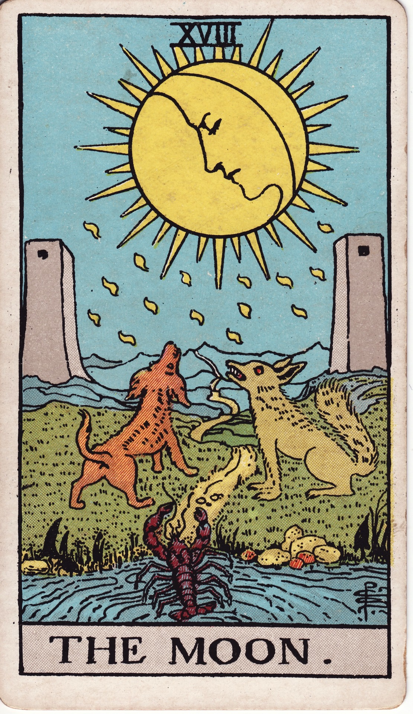

# The Moon (XVIII)

The Moon is nocturnal mystery—the realm of dreams, intuition, and illusion. It beckons us through shadowy landscapes where instincts sharpen, fears surface, and hidden truths shimmer beneath the tide.

*Keywords:* intuition, illusion, dreams, subconscious, uncertainty  
*Mood:* surreal, mystical, enigmatic, tidal  
*Polarity:* receptive, fluctuating

*Art interpretation cue:* Show a vast moon casting silver light over a path that winds between towers. A dog and wolf howl on either side, crayfish emerging from dark waters, symbolizing layers of instinct awakening.

### Artistic Direction

Create a liminal dreamscape—soft gradients, mist, and reflective water amplifying mystery.

*   **Core Symbolism & Composition:**
    *   **Full Moon:** Illumination of subconscious; shifting perception.  
    *   **Twin Towers:** Gateway between seen and unseen realms.  
    *   **Dog & Wolf:** Tamed and wild instincts responding to lunar pull.  
    *   **Crayfish/Crawfish:** Primal consciousness rising from depths.  
    *   **Winding Path:** Journey through night toward eventual dawn.
*   **Mood & Atmosphere:**
    Use indigo, teal, and moonlit silver. Misty textures evoke uncertainty and allure.

### Esoteric Correspondences

*   **Number & Path:** XVIII; Path between Netzach and Malkuth—desire descending into material experience.  
*   **Title:** Ruler of Flux and Reflux.  
*   **Astrology:** Pisces—dreams, empathy, dissolving boundaries.  
*   **Element:** Water in its psychic, reflective state.  
*   **Hebrew Letter:** Qoph (ק) — the back of the head; subconscious processes.  
*   **Kabbalah:** Passage through shadow to reach grounded intuition.

### Core Meanings (Upright)

*   **Intuitive Navigation:** Trust gut feelings; logic alone falters.  
*   **Dreamwork:** Messages through dreams, symbols, synchronicities.  
*   **Mystery & Illusion:** Not all is revealed; proceed with discernment.  
*   **Emotional Tides:** Heightened sensitivity, psychic openings.

### Core Meanings (Reversed)

*   **Clarity Emerging:** Fog lifts; confusion dissipates.  
*   **Fear & Anxiety:** Paranoia, projections, nightmares dominating.  
*   **Illusion Unmasked:** Deception revealed, self-delusion confronted.  
*   **Psychic Overwhelm:** Boundaries needed, return to body.

### Soul Lesson & Archetype

She is the Dream Weaver—the lunar guide through uncertainty. Lesson: move with intuition, confront fear, and trust feelings as data.

### The Archetype in Human Form

*   **Upright:** The intuitive, artist, empath, dream analyst, or mystic journeying through liminal realms.  
*   **Reversed:** The anxious mind, manipulator, or ungrounded visionary lost in fantasy.

### Guiding Questions

*   **Upright:**
    *   What is my intuition whispering beneath the surface?  
    *   Where am I called to explore rather than control?  
    *   What dreams or symbols repeat, asking for attention?  
    *   How do I soothe fear while honoring instinct?
*   **Reversed:**
    *   Which illusions am I ready to release?  
    *   How can I ground my sensitivity?  
    *   Where has anxiety replaced intuition?  
    *   What honest conversation dispels confusion?

### Affirmations

*   **Upright:** “I navigate mystery with trust; intuition lights my nocturnal path.”  
*   **Reversed:** “I dispel illusion through grounded presence and honest reflection.”

### Material World

*   **Upright:** Creative ventures, research, lunar timing, stealth projects, psychic professions.  
*   **Reversed:** Miscommunication, unclear contracts, gaslighting at work.  
*   **Self-Question:** “What facts need verification before I proceed?”

### Relationships

*   **Upright:** Deep emotional bonds, empathetic communication, intuitive knowing between partners.  
*   **Reversed:** Secrets, misunderstandings, projection, suspicion.  
*   **Self-Question:** “How can we clarify feelings without dismissing intuition?”

### Spiritual Path

*   **Upright:** Dreamwork, moon rituals, trance journeying, shadow integration.  
*   **Reversed:** Spiritual confusion, psychic overload, escapism.  
*   **Self-Question:** “Which grounding ritual supports my intuitive gifts?”

### Integration Practices

1.  **Lunar Journal:** Track dreams, moods, and lunar phases for one cycle.  
2.  **Moonlit Walk:** Safely walk under moonlight; note sensations and intuitive hits.  
3.  **Symbol Meditation:** Choose a recurring dream symbol; meditate on its messages.

### Cross-Card Echoes

*   **Moon ↔ High Priestess:** Intuition deepens; inner world illuminated.  
*   **Moon ↔ Seven of Cups:** Fantasy and reality blur—choose discerningly.  
*   **Moon → Sun:** After night’s lessons, clarity and joy dawn.

### Impression Palette

#### Nocturne Invocation

“Silver tide, teach me to trust the darkness. Let every ripple reveal a truth my eyes have yet to see.”

#### Dream Cinquain

Moonlight  
Mirror of mist—  
Instincts hush and awaken,  
Secrets breathing in tide-song—  
Listen.
