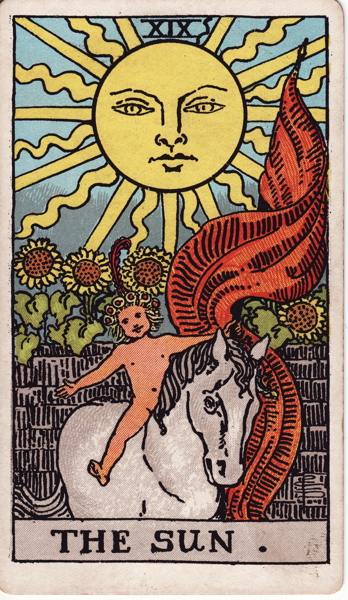

# The Sun (XIX)

The Sun is radiant vitality—joy unfiltered, success celebrated, and innocence reclaimed. It bathes life in clarity, warmth, and confidence, reminding us that happiness is both right and responsibility.

*Keywords:* joy, success, vitality, clarity, celebration  
*Mood:* exuberant, bright, victorious, wholehearted  
*Polarity:* expansive, life-affirming

*Art interpretation cue:* Depict a child riding a white horse beneath a blazing sun with anthropomorphic rays. Sunflowers bloom, and a crimson banner waves triumphantly in the air.

### Artistic Direction

Infuse the scene with generous light—bold colors, crisp lines, and radiant energy.

*   **Core Symbolism & Composition:**
    *   **Child on Horse:** Innocence empowered, ego integrated.  
    *   **White Horse:** Purity, strength, forward momentum.  
    *   **Sun with 21 Rays:** Conscious illumination covering all major arcana lessons.  
    *   **Sunflowers:** Thriving in light; growth following the sun.  
    *   **Red Banner:** Victory, passion, life force.
*   **Mood & Atmosphere:**
    Use golden yellows, vivid whites, and joyful reds. Lighting should feel midday bright, casting soft shadows.

### Esoteric Correspondences

*   **Number & Path:** XIX; Path between Hod and Yesod—intellect enlightening foundation.  
*   **Title:** Lord of the Fire of the World.  
*   **Astrology:** Sun—identity, vitality, illumination.  
*   **Element:** Fire in its most life-giving form.  
*   **Hebrew Letter:** Resh (ר) — the head; conscious awareness.  
*   **Kabbalah:** Solar influx revitalizing the subconscious and manifest realms.

### Core Meanings (Upright)

*   **Joy & Success:** Celebrate wins; acknowledge progress.  
*   **Clarity:** Truths revealed with kindness; shadows dissolve.  
*   **Vitality:** Health, energy, enthusiasm restored.  
*   **Visibility:** Shine publicly; share your gifts confidently.

### Core Meanings (Reversed)

*   **Dimmed Light:** Temporary setbacks, waning confidence, hidden joy.  
*   **Ego Inflation:** Overconfidence, arrogance, eclipsing others.  
*   **Delayed Success:** Progress slowed but not denied.  
*   **Need for Authenticity:** Smile masking exhaustion; reconnect with genuine joy.

### Soul Lesson & Archetype

The Sun is the Joy Bringer—the child sage who teaches that happiness is sacred. Lesson: bask in your light, share it generously, and stay true to what makes you feel alive.

### The Archetype in Human Form

*   **Upright:** The celebrant, leader, performer, teacher, or healer whose positivity uplifts communities.  
*   **Reversed:** The showboat, burnout achiever, or person forgetting their inner child.

### Guiding Questions

*   **Upright:**
    *   What success deserves celebration right now?  
    *   How can I live more transparently and joyfully?  
    *   Which passions fuel my vitality?  
    *   How do I share my light without apology?
*   **Reversed:**
    *   Where has my radiance dimmed—and why?  
    *   What rest or support rekindles enthusiasm?  
    *   Am I shining from ego or authenticity?  
    *   How can I let gratitude soften perfectionism?

### Affirmations

*   **Upright:** “I shine with joyful authenticity; my light blesses the world.”  
*   **Reversed:** “I gently rekindle my radiance, honoring the pace my heart needs.”

### Material World

*   **Upright:** Career breakthroughs, successful launches, recognition, prosperous collaborations.  
*   **Reversed:** Temporary delays, working behind the scenes, needing rest before next push.  
*   **Self-Question:** “How do I sustain success without burning out?”

### Relationships

*   **Upright:** Soulful happiness, healthy partnerships, joyful family experiences.  
*   **Reversed:** Ego clashes, performative happiness, need for authentic connection.  
*   **Self-Question:** “How do we celebrate together while staying true to ourselves?”

### Spiritual Path

*   **Upright:** Solar rituals, inner child healing, gratitude practice, expressive worship.  
*   **Reversed:** Spiritual dryness, forced positivity, neglecting shadow integration.  
*   **Self-Question:** “What practice brightens my spirit from the inside out?”

### Integration Practices

1.  **Gratitude Sun Salutation:** Perform morning stretches facing the sun, naming three joys.  
2.  **Radiance List:** Write accomplishments and small wins; display where you’ll see them.  
3.  **Play Date:** Schedule time for pure play—art, music, dancing, time with children/pets.

### Cross-Card Echoes

*   **Sun ↔ Fool:** Joyful innocence connecting first and near-final arcana.  
*   **Sun ↔ Six of Wands:** Public recognition mirrored in minor arcana.  
*   **Sun → Judgment:** After illumination, heed the call to purposeful awakening.

### Impression Palette

#### Solar Blessing

“Rise laughing, heart—a thousand petals of light awaiting your footfall. Today is worthy of exuberance.”

#### Joy Haiku

Sun banners unfurl,  
laughter gallops through the fields—  
daylight tastes like gold.
