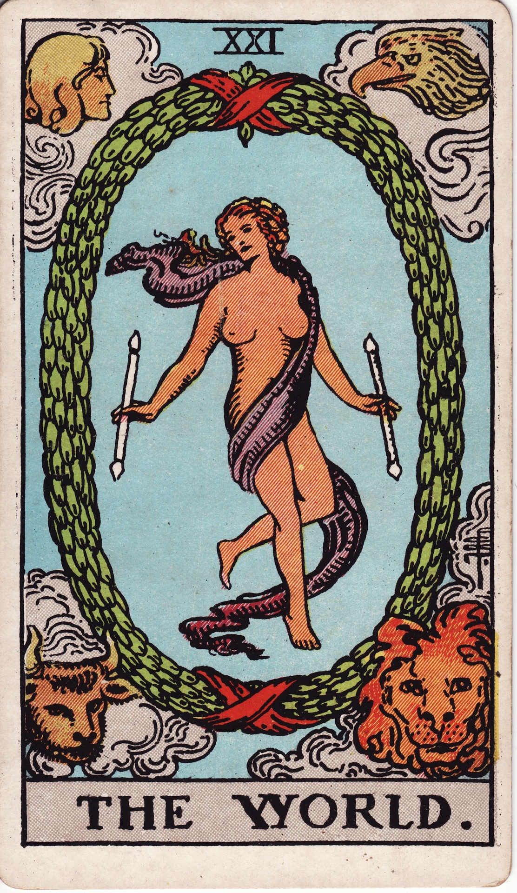

# The World (XXI)

The World is triumphant completion—the dance of fulfillment where lessons integrate, cycles conclude, and wholeness is celebrated. It blesses arrival while hinting at new journeys yet to spiral forth.

*Keywords:* completion, fulfillment, integration, celebration, unity  
*Mood:* expansive, joyous, accomplished, transcendent  
*Polarity:* harmonizing, culminating

*Art interpretation cue:* Portray a dancer encircled by a laurel wreath, holding wands or ribbons, suspended in graceful motion. The four living creatures (lion, bull, eagle, angel) occupy the corners, witnessing the culmination.

### Artistic Direction

Exude cosmic harmony—balanced composition, flowing movement, and luminous atmosphere.

*   **Core Symbolism & Composition:**
    *   **Laurel Wreath/Oval Portal:** Victory, cyclical completion, gateway to new cycle.  
    *   **Dancer (Androgynous):** Wholeness, integration of masculine/feminine energies.  
    *   **Twin Wands:** Mastery of polarity, conscious creation.  
    *   **Tetramorph:** Fixed signs anchoring completion—Leo, Taurus, Scorpio, Aquarius.  
    *   **Flowing Sash:** Movement continues; endings birth new beginnings.
*   **Mood & Atmosphere:**
    Use iridescent blues, violets, and soft golds. Let the wreath glow like a halo.

### Esoteric Correspondences

*   **Number & Path:** XXI; Path between Yesod and Malkuth—dream manifest as reality.  
*   **Title:** The Great One of the Night of Time.  
*   **Astrology:** Saturn—culmination, mastery, earned success.  
*   **Element:** Earth perfected; integration of all elements.  
*   **Hebrew Letter:** Tav (ת) — the mark; signature of completion.  
*   **Kabbalah:** Crown of the great work; union of body and spirit realized.

### Core Meanings (Upright)

*   **Completion:** Projects conclude successfully; celebrate achievements.  
*   **Integration:** Lessons internalized; identity feels whole.  
*   **Global Perspective:** Travel, cultural exchange, public recognition.  
*   **Ascension:** Spiritual graduation; readiness for new cycle.

### Core Meanings (Reversed)

*   **Incomplete Cycle:** Loose ends; final tasks remain undone.  
*   **Delayed Success:** Last steps postponed, closure elusive.  
*   **Fear of Finish:** Avoiding endings, self-sabotaging near the goal line.  
*   **Limited Perspective:** Need wider worldview; expand beyond comfort.

### Soul Lesson & Archetype

The World is the Cosmic Dancer—celebrating unity of all experiences. Lesson: honor completion, share your mastery, and step forward with gratitude into the next spiral.

### The Archetype in Human Form

*   **Upright:** The graduate, world traveler, accomplished leader, or artist presenting a masterwork.  
*   **Reversed:** The perfectionist delaying release, the traveler stuck at home, or someone afraid to be seen.

### Guiding Questions

*   **Upright:**
    *   What milestone deserves full-hearted celebration?  
    *   How can I share my journey’s wisdom with others?  
    *   Where is life inviting me to broaden my reach?  
    *   What new cycle begins after this completion?
*   **Reversed:**
    *   Which unfinished detail needs attention?  
    *   What fear keeps me from closing this chapter?  
    *   How can I expand my horizons beyond current limits?  
    *   Who can support me in crossing the finish line?

### Affirmations

*   **Upright:** “I honor the fullness of my journey; I am whole, ready for the next adventure.”  
*   **Reversed:** “I complete what I began, trusting that closure frees me to evolve.”

### Material World

*   **Upright:** Graduation, product launch, international success, relocation, long-term goals achieved.  
*   **Reversed:** Project delays, missing components, logistical hurdles, postponed travel.  
*   **Self-Question:** “What final polish ensures this work is ready for the world?”

### Relationships

*   **Upright:** Celebrating commitment, blending families, long-distance connections thriving.  
*   **Reversed:** Unfinished emotional conversations, reluctance to commit, barriers to reunion.  
*   **Self-Question:** “How can we honor what we’ve built while envisioning the future?”

### Spiritual Path

*   **Upright:** Spiritual integration, completion of an initiatory cycle, global consciousness.  
*   **Reversed:** Feeling stuck before breakthrough, seeking new teachers, refining practice.  
*   **Self-Question:** “What ceremony marks my evolution and opens the next portal?”

### Integration Practices

1.  **Completion Ritual:** Create a closing ceremony—offer gratitude, document lessons, release the old cycle.  
2.  **Global Perspective Practice:** Engage with diverse voices, travel, or study to widen worldview.  
3.  **Embodied Dance:** Celebrate with movement—let your body express the journey’s triumph.

### Cross-Card Echoes

*   **World ↔ Fool:** Endings flow into beginnings; mastery returns to innocence.  
*   **World ↔ Six of Wands:** Public recognition mirrored; celebrate with community.  
*   **World → Ace of Pentacles:** Completion seeds tangible new opportunities.

### Impression Palette

#### Completion Ode

“Circle closed, song complete—every step a constellation. I exhale gratitude, inhale tomorrow.”

#### Spiral Haiku

Laurel crown aglow—  
I dance the edge of endings,  
feet already new.
