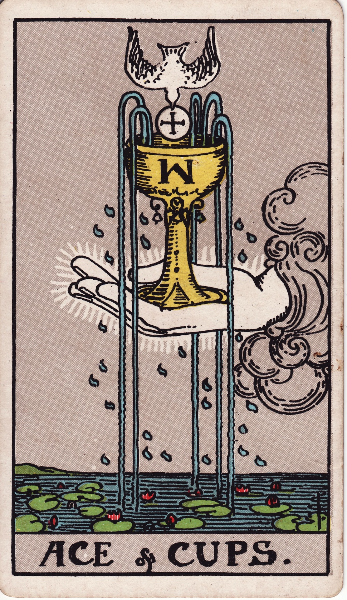

# Ace of Cups

The Ace of Cups is the first, pure stirring of heart-water: the moment when feeling overflows its vessel and invites us to receive without reservation. It marks the dawn of an emotional cycle, a luminous and consecrated current of spiritual receptivity. This is the sacred overflow, the birth of a connection that promises to quench a thirst we may have only just discovered.

*Keywords:* emotional awakening, pure love, spiritual receptivity, sacred overflow
*Mood:* luminous, gentle, consecrated
*Polarity:* receptive, expansive

*Art interpretation cue:* Portray the cup not merely as a vessel, but as a living spring. Light should emanate from within it, and the surrounding environment must feel consecrated—alive with the scent of rain on dry earth, vibrating with fresh possibility.

### Artistic Direction

This card demands a vision of blessing poured directly from Source. Everything in the scene must communicate a gentle but profound invitation, a softness that speaks of holy abundance.

*   **Core Symbolism & Composition:**
    *   **The Sacred Cup:** A chalice or vessel, perhaps suspended or held by an unseen hand, from which water flows in an endless, living stream. It is the fountainhead. Incorporate symbols like a descending dove, a blooming lotus, or a radiant halo to signal its divine, unmediated nature.
    *   **Overflowing Waters:** The water should form ripples of liquid light. Consider five distinct streams cascading from the cup—echoing the five senses—to show how spiritual nourishment enters and sanctifies embodied life.
    *   **Lotus or Water Lilies:** These flowers, floating on the surface of the pool created by the overflow, represent the awakening heart, its purity unfolding petal by petal.
    *   **Sky & Horizon:** A dawn-lit sky or a soft rainbow arc suggests both blessing and covenant. The palette should be opalescent—pearlescent whites, pale blues, and gentle blush tones that feel like the inside of a shell.
*   **Mood & Atmosphere:**
    The scene must feel silent yet intensely alive, suffused with a glimmering mist. Use soft gradients and subtle, crystalline sparkles. The cup is not a static object; it is a portal through which love continuously pours, a perpetual wellspring.

### Esoteric Correspondences

*   **Title:** The Root of the Powers of Water.
*   **Astrology:** The pure, undifferentiated element of Water, often associated with the cardinal water sign Cancer, but representing the element in its archetypal state.
*   **Element:** Water as the principle of healing, empathy, intuition, and connection.
*   **Kabbalah:** Kether in Briah (the Crown in the World of Creation); the initial, unmanifested impulse of emotion.
*   **Timing:** Signals a new emotional chapter opening. Its influence is strongest at the start of any cycle or during the water seasons (Cancer, Scorpio, Pisces).

### Numerology (Ace)

The Ace is unity—the seed that contains the entire suit's potential. It represents an unfiltered, primordial essence, the first movement from spirit into form. In the suit of Cups, the Ace is pure feeling, an emotion still free of story, expectation, or complication.

### Core Meanings (Upright)

*   **Emotional Birth:** A new relationship, creative spark, or spiritual calling arrives with profound openness and trust.
*   **Overflowing Compassion:** Heart-centered generosity that expands beyond former limits, given without expectation of return.
*   **Sacred Receptivity:** A powerful willingness to receive love, support, or intuitive insight without questioning worthiness.
*   **The Healing Wellspring:** An opportunity for emotional renewal after a period of drought; a chance to cleanse, forgive, and begin again.

### Core Meanings (Reversed)

*   **Blocked Flow:** Emotions are held back, vulnerability is resisted, or the soul feels spiritually parched and disconnected.
*   **Conditional Affection:** Love is offered with strings attached or withheld as a form of protection or control.
*   **Emotional Overwhelm:** Being flooded by feeling without a vessel to contain it; a need for grounding practices to find stability.
*   **Creative Stagnation:** Inspiration is present as a subtle whisper but is not yet being nurtured into tangible form.

### The Card as a Person

*   **Upright:** Someone whose heart has just been thrown wide open—a new lover, a budding artist, a mystic. They radiate a gentle, unconditional acceptance that inspires others to soften their own defenses.
*   **Reversed:** Someone afraid to feel fully, who may hide behind a shield of cynicism, numbness, or over-analysis to avoid the perceived risk of tenderness.

### Guiding Questions

*   **Upright:**
    *   What new feeling or relationship is asking to be welcomed into your life?
    *   How can you honor the first, pure impulse of your heart before doubt seeps in?
    *   Where are you being invited to receive with grace, rather than to strive or give?
    *   What small ritual could help you consecrate this new beginning?
*   **Reversed:**
    *   What fear is damming up your emotional flow?
    *   How can you cultivate enough inner safety to allow love to enter?
    *   Which practice grounds you when feelings surge and threaten to overwhelm?
    *   What would happen if you allowed yourself to be truly moved?

### Affirmations

*   **Upright:** “I open to the wellspring of love and allow it to fill and renew me.”
*   **Reversed:** “I acknowledge my fears and gently create space for my heart to receive.”

### Love & Relationships

*   **Upright:** The dawn of a new romance, deep emotional renewal in an existing bond, or a heartfelt gesture that signals absolute sincerity.
*   **Reversed:** Guardedness in the face of intimacy, a fear of being vulnerable, or projecting past wounds onto present connections.
*   **Self-Question:** “What honest emotion am I ready to share, without agenda or apology?”

### Work & Money

*   **Upright:** Creative opportunities that are rooted in genuine passion, soul-aligned collaborations, and a call for compassionate leadership.
*   **Reversed:** Feeling uninspired, undervalued, or disengaged from your work. A reminder to reconnect to the ‘why’ that fuels your efforts.
*   **Self-Question:** “Where can empathy and imagination guide my next professional move?”

### Spiritual & Psychological

*   **Themes:** Heart chakra awakening, receiving intuitive downloads, emotional baptism, the practice of unconditional love.
*   **Actionable Advice:**
    1.  **Consecrate a Vessel:** Fill a special cup with fresh water. Bless it with a specific intention for emotional opening. Sip it slowly while naming a new emotional commitment you are making to yourself or another.
    2.  **Sensory Meditation:** Engage all five senses (echoing the five streams) to invite yourself into a state of complete presence and receptivity.
    3.  **Gratitude Flow:** Keep a journal of moments when love or kindness arrived unexpectedly. Let the act of appreciation keep the channel open for more.

### Cross-Card Echoes

*   **Ace → Two of Cups:** The seed of pure feeling finds a counterpart, evolving into a conscious, reciprocal bond.
*   **Ace ↔ Ace of Pentacles:** Spiritual and emotional abundance finds its echo in tangible, material support.
*   **Ace → Ten of Cups:** This card marks the headwaters of the stream; follow it from this first feeling all the way to the communal ocean of the Ten.

### Impression Palette

#### Invocation

“Cup of dawn, fill my cupped hands with dew. Let this tenderness spill past the rim of what I thought I could hold, and teach me the grace of overflow.”

#### Haiku

Dawn pours into stone.
Five streams teach the heart to bloom.
Breath tastes like new rain.