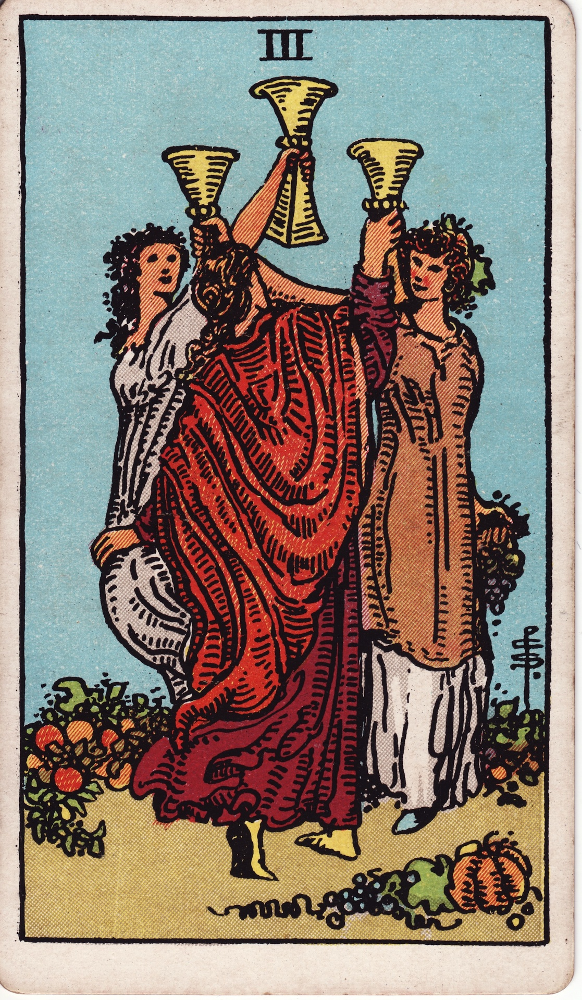

# Three of Cups

The Three of Cups celebrates shared joy. It is the chorus of laughter, the toasts raised together, the sisterhood or siblinghood born from heartfelt alliance.

*Keywords:* celebration, community, collaboration, shared joy  
*Mood:* effervescent, supportive, festive  
*Polarity:* expressive, expansive

*Art interpretation cue:* Show the moment of uplift—three figures or symbols mid-toast, dancing, or leaning in with delight. Let the scene glow with communal warmth.

### Artistic Direction

Capture a gathering where emotional abundance multiplies. The card should echo resonance and rhythm.

*   **Core Symbolism & Composition:**
    *   **Three Figures or Cups:** Interlocking arms or aligned vessels raised in celebration. Vary heights or postures to show diversity within harmony.
    *   **Fruit & Harvest:** Grapes, pomegranates, or ripe fruit scattered to symbolize abundance, sensual pleasure, and creative fertility.
    *   **Flowers & Garlands:** Floral crowns, garlands, or petals underfoot to convey festivity and blessing.
    *   **Circular Motion:** A round dance, spiral, or ring of light to signify collective flow.
*   **Mood & Atmosphere:**
    Use warm golds, coral, and verdant greens. The environment can be a garden, orchard, or communal courtyard. Make the viewer feel invited to join.

### Esoteric Correspondences

*   **Title:** Lord of Abundance.
*   **Astrology:** Mercury in Cancer (July 2 – July 11). Emotionally intelligent communication and social bonding.
*   **Element:** Water expressed through creativity and kinship.
*   **Kabbalah:** Binah in Briah (Understanding in the Creative World). Emotional insight blossoms into shared experience.

### Numerology (3)

Three brings expansion, expression, and the manifestation of collaboration. In Cups, it’s the shared song that emerges after two hearts join.

### Core Meanings (Upright)

*   **Celebration:** Parties, milestones, reunions, and joyful rites of passage.
*   **Support Network:** Friendships, communities, or teams that uplift and protect.
*   **Creative Collaboration:** Group projects, performance, co-creation that flows easily.
*   **Emotional Resonance:** Feeling seen, heard, and mirrored by a trusted circle.

### Core Meanings (Reversed)

*   **Exclusion or FOMO:** Feeling left out, social anxiety, or cliques.
*   **Overindulgence:** Partying to numb feelings, gossip, or boundary issues.
*   **Creative Block in Teams:** Group conflict, misaligned priorities, or lack of cohesion.
*   **Need for Intention:** Celebrations that ignore deeper emotional needs.

### The Card as a Person

*   **Upright:** A connector who curates gatherings, the friend who celebrates others’ wins wholeheartedly.
*   **Reversed:** Someone burnt out by social demands or seeking validation through constant activity.

### Guiding Questions

*   **Upright:**
    *   Who can I gather to honor this moment?
    *   How can I celebrate others without comparison?
    *   What collaboration wants to be born through joy?
    *   Which rituals keep my friendships nourished?
*   **Reversed:**
    *   Where am I overextending myself socially?
    *   Do I need to clarify boundaries with my community?
    *   How can I invite support instead of pretending all is well?
    *   What quieter celebration might feel more authentic?

### Affirmations

*   **Upright:** “I rejoice with those who rejoice, and joy multiplies.”
*   **Reversed:** “I choose communities that honor my truth and rhythm.”

### Love & Relationships

*   **Upright:** Announcements, engagements, weddings, supportive friend groups.
*   **Reversed:** Third-party complications, comparison, or social pressure on relationships.
*   **Self-Question:** “How does community support this love?”

### Work & Money

*   **Upright:** Successful teamwork, launch parties, shared milestones.
*   **Reversed:** Office politics, lack of recognition, collaborative burnout.
*   **Self-Question:** “Where can celebration renew our motivation?”

### Spiritual & Psychological

*   **Themes:** Sisterhood/brotherhood, collective ritual, emotional resonance.
*   **Actionable Advice:**
    1.  **Gratitude Circle:** Host a small gathering where each person shares a joy or gratitude.
    2.  **Creative Jam:** Set aside time for group art, music, or brainstorming with no agenda.
    3.  **Support Check-In:** Send messages to three friends acknowledging their presence in your life.

### Cross-Card Echoes

*   **Two → Three:** Intimacy ripples outward into community celebration.
*   **Three ↔ Three of Pentacles:** Both celebrate collaboration—the Cups do so emotionally, the Pentacles materially.
*   **Three → Four:** After the party, introspection arrives; balance joy with restoration.

### Impression Palette

#### Toast

“To the joy that finds us in each other’s laughter, to the circle that keeps widening, to the music we make together.”

#### Tanka

Grapes burst on the tongue.  
Hands clap rhythm into dusk—  
Moonlight braids our hair.  
Three voices climb into one,  
Echoing the heart’s harvest.
