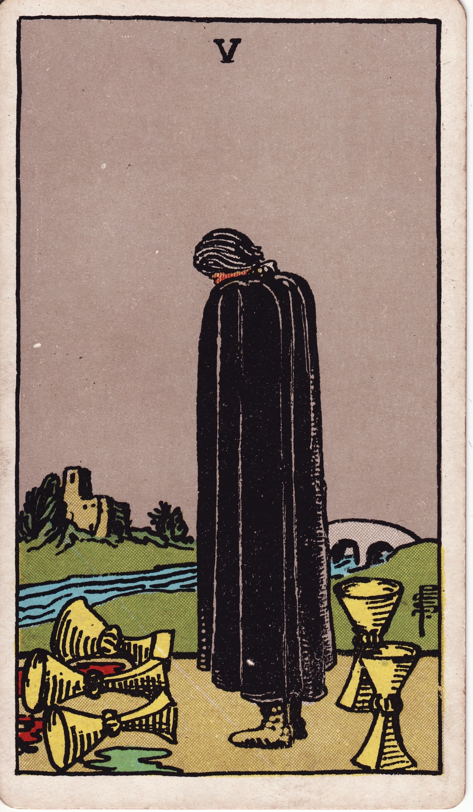

# Five of Cups

The Five of Cups meets us in the hushed moment after a heartbreak, when we cannot yet see beyond what has been spilled. It names the ache of disappointment and the protective instinct that keeps us turned toward what is gone.

*Keywords:* loss, grief, bittersweet remembering, regret, emotional contraction  
*Mood:* somber, rain-soaked, introspective  
*Polarity:* receptive, contracting

*Art interpretation cue:* Lead the viewer into the gravity of grief first, while letting hints of resilience glimmer at the edges. The hope here is quiet—something noticed only when the eyes finally lift.

### Artistic Direction

This card must capture the gravity of grief while hinting at a quiet, resilient hope. The viewer should feel the chill of loss before they notice the warmth of what remains.

*   **Core Symbolism & Composition:**
    *   **The Cloaked Figure:** This central character is the embodiment of mourning. Their posture must be hunched, conveying both the weight of sorrow and a self-imposed isolation. The cloak itself is a shield, hiding raw emotion but also narrowing their perception of the world.
    *   **The Spilled Cups (3):** These are not just containers; they are monuments to what has been lost, dominating the foreground. Spilled liquid, perhaps dark like wine, should pool around them, representing wasted potential or deep hurt. Their staggered placement suggests that the losses feel multiple or have a ripple effect.
    *   **The Upright Cups (2):** These represent the love, resources, and opportunities that endure. They must be placed within the figure's peripheral vision—close enough to be reached, yet currently ignored. They should catch a subtle light, a quiet glimmer in the otherwise somber scene.
    *   **The Landscape:** A river or shoreline emphasizes the flowing, turbulent nature of emotion. In the distance, a sturdy, narrow **Bridge** offers a clear, deliberate path away from grief, leading toward a distant **Home or Castle**—a symbol of sanctuary and the promise that belonging still exists beyond this moment of pain. These elements should recede into a softer focus.

*   **Mood & Atmosphere:**
    Anchor the composition in stillness and a muted, cool-toned color palette. The sky should be overcast or misty to convey emotional pressure, but allow for a subtle break in the clouds or a glimmer of light on the horizon to symbolize the potential for reprieve. The overall feeling is that time has slowed to a crawl around the figure, who is frozen in a loop of replaying their loss.

### Esoteric Correspondences

*   **Title:** Lord of Loss in Pleasure (The steep drop following an emotional high).
*   **Astrology:** Mars in Scorpio. This combination signifies a penetrating, intense feeling that can fixate on a wound. Mars brings heat and urgency; Scorpio digs down where it hurts.
*   **Element:** Water in its contracting phase, where emotions consolidate around grief instead of flowing freely.
*   **Kabbalah:** Geburah in Briah (Severity in the Creative World). Reality presses in, pruning what cannot continue and asking for a disciplined response to pain.

### Numerology (5)

Five is the destabilizer of the suit: it introduces volatility, friction, and the challenge that demands adaptation. In the suit of Cups, the number five pulls us from the comfort of emotional harmony and confronts us with the necessity of feeling, processing, and eventually transforming sorrow.

### Core Meanings (Upright)

*   **Acute Grief or Disappointment:** A fresh heartbreak, letdown, or the realization that something meaningful is gone.
*   **Attachment to the Loss Narrative:** Fixating on “what might have been,” replaying missteps, and resisting the invitation to look up.
*   **Emotional Seclusion:** Withdrawing into sadness, declining support, and staying in the safety of mourning rather than risking hope.
*   **Threshold Before Acceptance:** The pivotal moment when acknowledging pain must precede integration, forgiveness, or renewed trust.

### Core Meanings (Reversed)

*   **Reorientation Toward What Remains:** The gaze shifts to the upright cups; gratitude or possibility begins to gain ground.
*   **Release and Forgiveness:** Letting go of blame toward oneself or others and loosening the emotional knot of the past.
*   **Emotional Resilience:** Choosing to stay present with feeling without letting it define the future; rebuilding faith in connection.
*   **The Alchemy of Grief:** Channeling the experience into compassion, creativity, or a new, wiser relational pattern.

### The Card as a Person

*   **Upright:** The mourner who needs time before advice or action. They may replay the past out loud, appear withdrawn, or feel unreachable while they honor what was lost.
*   **Reversed:** The survivor who has touched bottom and is ready to return. They speak of lessons learned, open up to help, and begin to plan their next step across the bridge.

### Guiding Questions

*   **Upright:**
    *   What loss or disappointment is asking to be fully acknowledged?
    *   How am I honoring my feelings, and where am I clinging to the past?
    *   What support am I declining because I believe I must stay in grief?
    *   Which bridge presents itself if I only look up?
*   **Reversed:**
    *   What is ready to be reclaimed or appreciated again?
    *   Who or what can help me transform this pain into wisdom?
    *   Which forgiveness—toward myself or another—would lighten this load?
    *   How will I recognize that I have crossed to the other side of this experience?

### Affirmations

*   **Upright:** “I let sorrow move through me; feeling it is how I honor what mattered.”
*   **Reversed:** “My heart remembers the love that remains. I step toward healing with each breath.”

---

### In Application

#### Love & Relationships

*   **Upright:** Grieving a breakup, mourning a breach of trust, or revisiting an old hurt that still colors the present. Partners may feel emotionally distant while they process what was lost.
*   **Reversed:** A thaw after heartbreak. A time for naming and mending resentments, or consciously appreciating the partner who stayed. New relationships are possible when past disappointments are processed rather than projected.
*   **Self-Question:** “Am I nurturing my grief in a way that keeps me safe, or in a way that keeps me stuck?”

#### Work & Money

*   **Upright:** Coping with a layoff, a failed launch, or an investment that did not yield results. This card flags demoralization and the temptation to focus on mistakes instead of lessons.
*   **Reversed:** Reframing a setback, salvaging resources, or spotting the opportunity that remains untouched. This is the moment when resilience becomes a professional asset.
*   **Self-Question:** “What wisdom can I salvage from this loss, and how can it inform my next strategy?”

#### Spiritual & Psychological

*   **Themes:** A micro “dark night of the soul” where faith feels hollow. Learning to feel grief without letting it calcify into identity. Repatterning emotional responses so regret becomes compassion instead of punishment.
*   **Actionable Advice:**
    1.  **Name the Loss:** Write, speak, or ritualize exactly what was lost to acknowledge its significance.
    2.  **Witness the Survivors:** List the relationships, strengths, or resources that remain standing—your two cups.
    3.  **Choose a Bridge Step:** Identify one concrete act of reconnection or self-care that signals a willingness to move forward.

### Cross-Card Echoes

*   **The Tower → Five of Cups:** After a sudden upheaval (The Tower), this card shows the emotional fallout and the necessary mourning process that follows.
*   **Five of Cups → The Hermit:** This sequence suggests a withdrawal into solitude (The Hermit) to process grief and seek insight in quiet reflection.
*   **Five of Cups → Six of Cups:** This pairing shows the narrative arc from loss to nostalgic remembering, where bittersweet memories become a source of comfort.
*   **Five of Cups ↔ Five of Pentacles:** These cards mirror each other with themes of lack and exclusion—one emotional, one material—reminding us to seek support on all fronts.

### Impression Palette

#### Koan Story

A novice told Master Tenri, “If sorrow guards the gate, who crosses when the gate stays closed?” Tenri poured tea until the novice cried, “Master, the cup is full!” Tenri smiled, “Sorrow only keeps the gate when you refuse to pour.” The novice swept the spilled tea, knelt, and bowed. Tenri pointed beyond the courtyard. “Two cups stand ready. Bridge and castle have never moved. When your hands empty, your feet will walk.” The novice felt the cool wind, rose, and found the gate already open.

#### A Verse on Spilled Wine

The stain runs dark on cold, grey stone,
A map of all that is undone.
My eyes trace where the three have bled,
And hear again the words unsaid.

Behind me, two still catch the light,
A bridge stands waiting in plain sight.
But my whole world's this patch of ground,
Where loss is the only sound.
