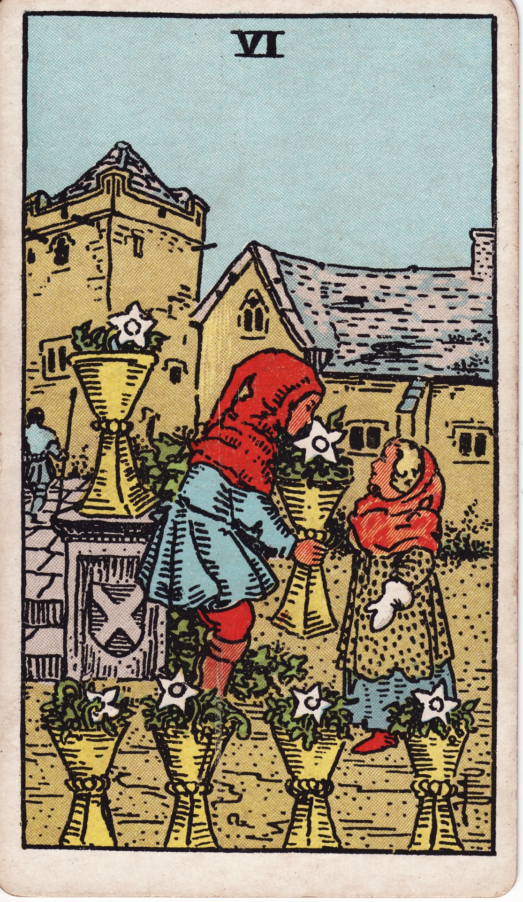

# Six of Cups

*Keywords:* nostalgia, generosity, inner-child healing  
*Mood:* warm, protected, memory-soaked  
*Polarity:* receptive, restorative

*Art interpretation cue:* Look for tenderness and warm light. The scene should feel like a **safe return** to a cherished memory, not a regression into the past.

### Visual symbols (common across decks, esp. RWS)

* **Six cups** — Often staged at multiple heights, suggesting memories from different eras that still belong together.
* **Two children** — 6–8 years old, relaxed posture; one offering, one receiving to show the flow of trust.
* **Gesture of giving/offering** — palm open, no grasping; communicates generosity without expectation.
* **Flowers in cups (often white)** — lean into small, fragrant blooms (iris, hyacinth) = purified emotion, scent-triggered memory.
* **Courtyard/garden** — walled, sun-washed space; signals sanctuary from harsher outside influences.
* **Large house/manor** — Tudor or ancestral vibe; reads as lineage support instead of wealth flaunting.
* **Path leading out** — keep it gently curving toward the future; implies integration of past sweetness into next steps.
* **Background adult/guard** — unfocused but present; the grown-up world watching over but not interfering.
* **Gloves/old-style clothing** — nod to tradition/etiquette; texture should read soft, not stiff.
* **No water shown** (cups filled with flowers) — emotion held, elevated, intentionally arranged versus raw overflow.
* **Sixfold arrangement/balance** — three-and-three or two-two-two clusters; cue for reciprocity and mutual care.

### Scene dynamics

The scene should land as a moment of remembered warmth: the manor anchors heritage, the courtyard creates psychological safety, and the winding path keeps the story moving forward. The flowers stand in for memories curated with love, while the adult silhouette hints that protection exists without smothering. Lighting should sit in late-afternoon gold so the emotional temperature stays soft and hospitable.

### Golden Dawn / Esoteric correspondences

* **Title: Lord of Pleasure** — pleasure is deliberate, not indulgent; design choices should feel gracious.
* **Sun in Scorpio (Nov 3–12)** — **Illuminated depths**. A blend of cozy warmth with subtle intensity. A powerful cue for reunions that have the potential to transform.
* **Element: Water (Cups)** — flow stays emotional and relational; flowers in the vessels keep it contained yet heartfelt.
* **Sephirah: Tiphareth in Briah** — beauty through balance; symmetry and soft glow underline harmony.
* **Planetary flavor** — solar healing working through Scorpio excavation equals joy after the deep work, never bypassing it.

### Numerology (6)

* Harmony, balance, caretaking, generosity, home/family, restorative energy

### Core meanings (upright)

* **Nostalgia & Happy Memories:** A safe and welcome return to the past. Signals it’s time to revisit and harvest what nourishes you from your history. Think childhood friends, family reunions, or visiting a cherished place.
* **Innocence & Simple Joys:** A focus on sincerity, goodwill, and uncomplicated happiness. The card spotlights **soft gestures** over grand ones.
* **Gifting & Generosity:** Represents acts of kindness, sharing, and hospitality. A central question becomes: “What gift is being given or received, and is it purely offered?”
* **Safety & Support:** Points to emotionally safe, wholesome environments and supportive roots. It asks you to recognize the "containers" (people, places, communities) that hold you.
* **Healing & Reconciliation:** A powerful cue for forgiveness and healing the past. An invitation for repair conversations rooted in tenderness, not blame.

### Core meanings (reversed / shadow)

* **Stuck in the Past:** Being trapped in "the good old days." Look for where **comfort is masking avoidance** of the present.
* **Unrealistic Idealism:** Over-idealizing childhood or "the way it was." It's crucial to separate the fond memory from the complex reality.
* **Unresolved Issues:** Can flag unresolved childhood patterns or family conditioning being replayed in current relationships.
* **Conditional Giving:** "Kindness" that comes with strings attached. Check if an act of generosity is actually a bid for control.
* **Refusal to Move On:** Difficulty letting go of old ties or making new memories. The invitation is to **bless and release** the past to make room for the future.

### The Card as a Person

* **Upright:** Someone gentle, kind, and perhaps a bit sentimental. They are trustworthy, generous, and make others feel safe. They might be a childhood friend, a caring family member, or anyone who embodies a sense of "home."
* **Reversed:** Someone emotionally immature, naive, or stuck in the past. They may have trouble with adult responsibilities or constantly compare the present unfavorably to an idealized past. They might be clinging to an old version of you.

### Questions to Ask

* **Upright:**
    * What gift from your past can nourish you right now?
    * Who in your life offers you a sense of safety and unconditional kindness?
    * What simple joy have you been overlooking?
    * Is there an old friend or family member you feel called to reconnect with?
* **Reversed:**
    * Is nostalgia preventing you from embracing the present?
    * Are you idealizing a past relationship or situation? What was the reality?
    * What childhood pattern is replaying itself in your current life?
    * Is it time to create new memories instead of reliving old ones?

### Affirmations

* **Upright:** "I draw strength and joy from my happy memories. I am safe to be generous and open-hearted."
* **Reversed:** "I honor my past without living in it. I am creating a beautiful present."

### Love/relationships (quick hits)

* **Upright:** sweet romance, reunions, old flames, safe affection, caring gestures
* **Reversed:** clinging to exes, comparing partners to the past, infantilizing dynamics
* **Self-question:** “Is my love for who is here now, or for a memory of who they were?”

### Work/money

* **Upright:** supportive teams, legacy brands/family biz, client goodwill, returning customers
* **Reversed:** outdated methods, nostalgia blocking innovation, comfort-zone stagnation
* **Self-question:** “Which tradition deserves revival, and which needs a respectful sunset?”

### Spiritual/psychological

* Inner-child work, reclaiming joy, memory as medicine
* Honoring lineage/ancestors; healing family stories
* Creating safe containers (rituals/spaces) for tender emotions
* Self-question: “Which past version is asking for acknowledgment before the next step?”
* **Actionable Advice:**
    * **Sensory Anchor:** Recreate a scent, song, or meal that evokes a positive memory without creating stagnation.
    * **Practical Gratitude:** Send a thank-you note, archive a cherished photo, or schedule a heartfelt check-in with someone from your past.
    * **Shift Forward (if reversed):** Consciously choose a new memory-making activity this week to shift your story forward.

### Cross-card echoes

* **Five of Cups → Six of Cups** — grief to sweetness; highlights the emotional arc across spreads.
* **Six of Cups ↔ Six of Wands** — both Tiphareth: harmony in heart vs. public recognition; useful contrast when both appear.
* **Judgement pairing** — when they land together, it’s a full-circle healing narrative (past remembered + soul call).

### Prompts & practices (internal use)

* **Journal:** “Which memory is asking to be honored today, and what is the gift it still offers?”
* **Ritual:** brew a nostalgic tea/scent, place six small offerings, thank the ancestors known for gentle support.
* **Spread idea:** Past gift / Present container / Future offering — use when mentoring or coaching self/clients.
