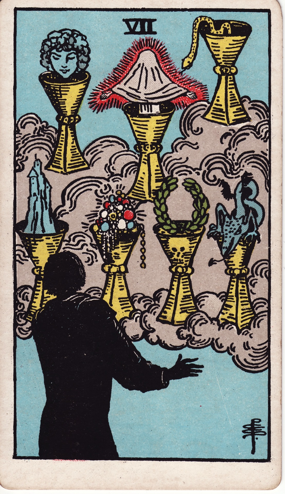

# Seven of Cups

The Seven of Cups is the dreamer’s crossroads: a hall of mirrors filled with glittering options, illusions, and intuitive whispers. It invites discernment amid desire.

*Keywords:* imagination, choices, fantasy, temptation, visioning  
*Mood:* surreal, shimmering, ambiguous  
*Polarity:* receptive, dispersing

*Art interpretation cue:* Let seven vessels hover in a cloudscape or dream chamber, each holding a different symbol—some blessings, some illusions. The figure below should appear entranced yet uncertain.

### Artistic Direction

Render a liminal space where possibility blurs with deception. Use contrast between alluring imagery and shadowed undertones.

*   **Core Symbolism & Composition:**
    *   **Seven Cups Aloft:** Fill them with archetypal symbols—crown, serpent, jewels, laurel, castle, dragon, dove—to show varied choices.
    *   **Veiled Figure:** Someone gazing upward, arms raised or hesitating, symbolizing the human confronted with many dreams.
    *   **Clouds or Mist:** Represent the mental/emotional fog; the scene feels otherworldly.
    *   **Light & Shadow Play:** Some cups brightly illuminated, others looming or partially obscured.
*   **Mood & Atmosphere:**
    Experiment with iridescent blues, purples, and silver. Incorporate glows, starbursts, or sparkles to show allure, with subtle shadows hinting at the need for discernment.

### Esoteric Correspondences

*   **Title:** Lord of Illusionary Success.
*   **Astrology:** Venus in Scorpio (November 13 – November 22). Desire intensified, passion entangled with mystery.
*   **Element:** Water exploring imagination and desire’s underworld.
*   **Kabbalah:** Netzach in Briah (Victory in the Creative World). The heart’s desires multiplied, requiring wise selection.

### Numerology (7)

Seven seeks meaning beneath the surface, often through introspection, dreams, or spiritual quests. In Cups, it challenges us to distinguish fantasy from soul truth.

### Core Meanings (Upright)

*   **Visioning:** brainstorming, creative dreaming, exploring possibilities.
*   **Intuitive Choice:** Listening to gut wisdom to select the authentic path.
*   **Shadow Desire:** Recognizing glamour, escapism, or addictive fantasies.
*   **Spiritual Quest:** Mystical experiences, lucid dreaming, or visionary practices.

### Core Meanings (Reversed)

*   **Analysis Paralysis:** Overthinking choices, stuck in indecision.
*   **Reality Check:** Illusions falling away; choosing practical action.
*   **Escapism:** Avoiding responsibilities through fantasy, substances, or denial.
*   **Focused Intention:** Clarifying priorities, committing to one path.

### The Card as a Person

*   **Upright:** A visionary, artist, or mystic with expansive imagination.
*   **Reversed:** Someone scattered, unreliable, or lost in daydreams and “what-ifs.”

### Guiding Questions

*   **Upright:**
    *   Which cup speaks to my soul, and which to my ego?
    *   What discernment practices help me choose wisely?
    *   How can imagination serve creation rather than avoidance?
    *   What emotion hides beneath my fantasies?
*   **Reversed:**
    *   What practical step can crystallize my vision?
    *   Where am I chasing mirages instead of truth?
    *   How do I ground myself when choices feel overwhelming?
    *   Which commitments deserve my full attention?

### Affirmations

*   **Upright:** “My imagination is sacred; I choose the visions that nourish my soul.”
*   **Reversed:** “I release illusion and act on the dream that feels true.”

### Love & Relationships

*   **Upright:** Romantic fantasies, discussing future possibilities, rekindling allure.
*   **Reversed:** Mixed signals, unrealistic expectations, or being caught in “what could be” instead of what is.
*   **Self-Question:** “Am I loving the person, or my idea of them?”

### Work & Money

*   **Upright:** Brainstorming, multiple offers, creative ideation sessions.
*   **Reversed:** Scattered goals, shiny-object syndrome, or unclear strategy.
*   **Self-Question:** “Which opportunity aligns with my deeper purpose?”

### Spiritual & Psychological

*   **Themes:** Shadow work around desire, divination, dream interpretation, visionary journeys.
*   **Actionable Advice:**
    1.  **Vision Board with Discernment:** Create imagery for each desire, then eliminate those that lack heart resonance.
    2.  **Dream Journal:** Record nighttime dreams for seven days to identify repeating symbols.
    3.  **Grounding Practice:** Pair creative visualization with embodiment—movement, breathwork, or touch—so fantasy can root into reality.

### Cross-Card Echoes

*   **Six → Seven:** Sweet nostalgia meets the need to choose a future; don’t get lost in past or fantasy.
*   **Seven ↔ The Moon:** Both explore the unconscious; the Seven invites conscious choice.
*   **Seven → Eight:** After choosing, commitment requires walking away from what does not serve.

### Impression Palette

#### Oracle Fragment

“Seven cups shimmer; only one mirrors your true face. Breathe until the reflection steadies.”

#### Dream Log Entry

I stood in a cathedral of mist. Cups circled me, each humming a different note. I touched the cup shaped like a heart, and every other vision faded, leaving a single doorway lit with soft blue fire. I stepped through, carrying only what sang back to me.
