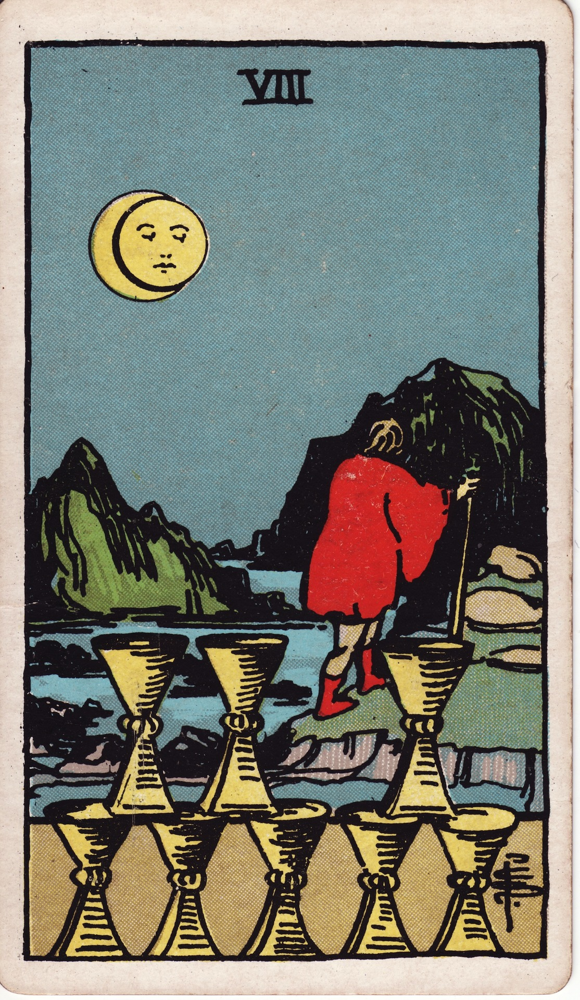

# Eight of Cups

The Eight of Cups is the pilgrim’s card: the moment when we leave familiar shores to seek deeper meaning. It acknowledges bittersweet departures made in service of the soul.

*Keywords:* departure, soul-searching, transition, emotional maturity  
*Mood:* solemn, resolute, wistful  
*Polarity:* receptive, releasing

*Art interpretation cue:* Depict a figure walking away from stacked cups toward distant mountains or a moonlit horizon. The arrangement of cups should feel deliberate yet incomplete, hinting at what is left behind.

### Artistic Direction

Illustrate the quiet bravery of walking away. Emphasize the path forward while honoring the emotional weight of departure.

*   **Core Symbolism & Composition:**
    *   **Eight Cups:** Often stacked in two tiers—five below, three above—with a gap or misalignment showing the missing piece.
    *   **Departing Figure:** Cloaked or carrying a staff, moving toward mountains, sea, or star-lit terrain.
    *   **Moon & Eclipse:** A moon or partial eclipse to signify liminality and inner guidance.
    *   **Landscape:** Rocky paths, water’s edge, or a valley giving way to mountains—journey imagery.
*   **Mood & Atmosphere:**
    Use deep blues, indigo, and midnight hues. Let the light source be moon or lantern, casting elongated shadows that underline the gravity of choice.

### Esoteric Correspondences

*   **Title:** Lord of Abandoned Success.
*   **Astrology:** Saturn in Pisces (February 19 – February 28). Emotional discipline, karmic release.
*   **Element:** Water choosing structure, channeling emotion into purposeful departure.
*   **Kabbalah:** Hod in Briah (Splendor in the Creative World). Clarity born of introspection and letting go.

### Numerology (8)

Eight speaks to cycles, power, and mastery. In Cups, it reveals the strength required to leave comfort for authenticity.

### Core Meanings (Upright)

*   **Soul Departure:** Leaving relationships, jobs, or identities that no longer nourish.
*   **Spiritual Pilgrimage:** Seeking deeper truth, retreat, or personal quest.
*   **Emotional Integrity:** Choosing long-term well-being over short-term comfort.
*   **Completion & Transition:** Recognizing when a chapter has truly ended.

### Core Meanings (Reversed)

*   **Avoidance:** Fear of change, staying despite dissatisfaction.
*   **Return:** Revisiting a past situation to finish unresolved business.
*   **Emotional Drift:** Wandering without purpose, feeling untethered.
*   **Delayed Exit:** Knowing it’s time to leave but waiting for the “perfect moment.”

### The Card as a Person

*   **Upright:** A seeker, pilgrim, or therapist who helps others release attachments and move on.
*   **Reversed:** Someone stuck in limbo, holding on from fear, or running away without reflection.

### Guiding Questions

*   **Upright:**
    *   What am I ready to walk away from, despite lingering affection?
    *   Where is my soul leading me next?
    *   What rituals can honor what I’m leaving behind?
    *   How will I support myself during this transition?
*   **Reversed:**
    *   What keeps me rooted in a place I’ve outgrown?
    *   Have I identified my destination, or am I drifting?
    *   Which relationships or commitments deserve closure?
    *   How can I face fears of being alone or uncertain?

### Affirmations

*   **Upright:** “I honor the past and walk toward my soul’s calling.”
*   **Reversed:** “I release avoidance and step forward with intention.”

### Love & Relationships

*   **Upright:** Conscious uncoupling, sabbaticals, redefining relationship terms.
*   **Reversed:** Feeling stuck, returning to an ex, or leaving abruptly without communication.
*   **Self-Question:** “Does this connection sustain who I am becoming?”

### Work & Money

*   **Upright:** Career changes, sabbaticals, leaving stable but meaningless roles.
*   **Reversed:** Fear of leaving a secure job, burnout cycles, escapist fantasies about quitting.
*   **Self-Question:** “What purpose guides my professional journey?”

### Spiritual & Psychological

*   **Themes:** Pilgrimage, shadow work, solitude, rites of passage.
*   **Actionable Advice:**
    1.  **Release Ritual:** Write a farewell letter to what you’re leaving; burn or release it to water.
    2.  **Wayfinding Map:** Sketch your inner landscape—where you’ve been, where you’re called.
    3.  **Compassion Practice:** Offer yourself kindness for choosing courage over comfort.

### Cross-Card Echoes

*   **Seven → Eight:** After evaluating illusions, the heart chooses a true path.
*   **Eight ↔ The Hermit:** Both cards speak to solitary journeys seeking wisdom.
*   **Eight → Nine:** The pilgrimage leads to emotional fulfillment earned through commitment.

### Impression Palette

#### Travel Journal Entry

“I stacked the cups with care before dawn. One remained out of place, like the note that never fit the chord. The moon opened a path across the water, and I followed, each step echoing with both ache and relief.”

#### Cinquain

Leaving—  
Moonlit resolve.  
Each footstep blesses change;  
The tide hums softly, ‘Carry on.’  
Release.
