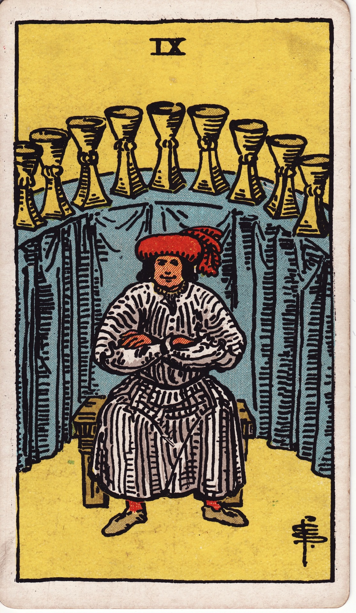

# Nine of Cups

The Nine of Cups is the wish fulfilled—the deep satisfaction that comes from gratitude, alignment, and enjoying the fruits of emotional labor.

*Keywords:* contentment, wishes granted, satisfaction, gratitude  
*Mood:* radiant, confident, cozy  
*Polarity:* receptive, integrating

*Art interpretation cue:* Highlight a figure at ease, surrounded by nine gleaming cups arranged like trophies or blessings. The setting should feel abundant yet grounded.

### Artistic Direction

Showcase luxuriant but humble joy. This is not excess; it is appreciation.

*   **Core Symbolism & Composition:**
    *   **Nine Cups:** Often arranged in an arc behind the central figure, like a halo of achievements.
    *   **Seated Host:** Arms crossed or open, smiling with serene pride. Clothing and posture should suggest comfort and confidence.
    *   **Feast Elements:** Table, cushions, fruits, candles—symbols of hospitality and sensual pleasure.
    *   **Backdrop:** Warm drapery, glowing lights, or a decorated alcove to indicate a cultivated sanctuary.
*   **Mood & Atmosphere:**
    Rich ambers, burgundy, and deep teal; soft lighting akin to candle glow. Let textures (velvet, wood, ceramic) read as tactile.

### Esoteric Correspondences

*   **Title:** Lord of Material Happiness.
*   **Astrology:** Jupiter in Pisces (February 29 – March 10). Emotional generosity, blessings, faith rewarded.
*   **Element:** Water stabilized in gratitude and enjoyment.
*   **Kabbalah:** Yesod in Briah (Foundation in the Creative World). Emotional fulfillment forms a stable base.

### Numerology (9)

Nine represents culmination, integration, and readiness to share blessings. In Cups, it is the penultimate joy before collective fulfillment.

### Core Meanings (Upright)

*   **Wish Fulfilled:** Goals realized, dreams manifested, heartfelt prayers answered.
*   **Emotional Satisfaction:** Contentment in relationships, self-love, and personal achievements.
*   **Gratitude Feast:** Celebrating milestones with those you trust.
*   **Confidence & Magnetism:** Owning your accomplishments and radiating joy.

### Core Meanings (Reversed)

*   **Hollow Victory:** Achievements that feel empty or out of alignment.
*   **Overindulgence:** Self-satisfaction tipping into complacency or excess.
*   **Unmet Desire:** Feeling the lack despite abundance—time to examine deeper needs.
*   **Private Joy:** Keeping success hidden due to fear of envy or judgment.

### The Card as a Person

*   **Upright:** A gracious host, mentor, or benefactor who delights in sharing abundance.
*   **Reversed:** Someone smug, overly self-focused, or chasing pleasure to mask emptiness.

### Guiding Questions

*   **Upright:**
    *   Which wish has already come true that I can savor?
    *   How can I express gratitude for this season?
    *   Who deserves to celebrate with me?
    *   What boundaries keep my joy sustainable?
*   **Reversed:**
    *   Why does this success feel incomplete?
    *   Where am I overdoing or under-sharing?
    *   What deeper longing seeks acknowledgment?
    *   How can generosity realign my joy?

### Affirmations

*   **Upright:** “I celebrate my blessings and share them with an open heart.”
*   **Reversed:** “I seek the fulfillment that resonates with my soul, not my ego.”

### Love & Relationships

*   **Upright:** Romantic satisfaction, affectionate milestones, partner pride.
*   **Reversed:** Emotional complacency, taking love for granted, or relying on pleasure without depth.
*   **Self-Question:** “How do I show appreciation for the love in my life?”

### Work & Money

*   **Upright:** Professional success, satisfied clients, financial comfort earned through integrity.
*   **Reversed:** Superficial wins, overconfidence, or fearing the next challenge.
*   **Self-Question:** “How can I reinvest my success into meaningful growth?”

### Spiritual & Psychological

*   **Themes:** Gratitude practice, embodiment, joy as spiritual discipline.
*   **Actionable Advice:**
    1.  **Gratitude Toast:** Name nine blessings aloud at a meal or ritual.
    2.  **Savoring Practice:** Spend mindful minutes enjoying a sensory experience fully.
    3.  **Share the Overflow:** Donate, volunteer, or mentor as a way to honor abundance.

### Cross-Card Echoes

*   **Eight → Nine:** After departure comes the joy of finding authentic fulfillment.
*   **Nine ↔ The Star:** Both cards highlight hope realized; the Nine applies it to personal realms.
*   **Nine → Ten:** Individual satisfaction flows into communal happiness and legacy.

### Impression Palette

#### Host’s Blessing

“May every cup at this table remind us that joy multiplies when it’s witnessed.”

#### Limerick

There once was a host with nine cups,  
Who filled them with heartfelt warm-ups.  
Each toast was sincere,  
Every smile drew near—  
Gratitude lifting us up.
