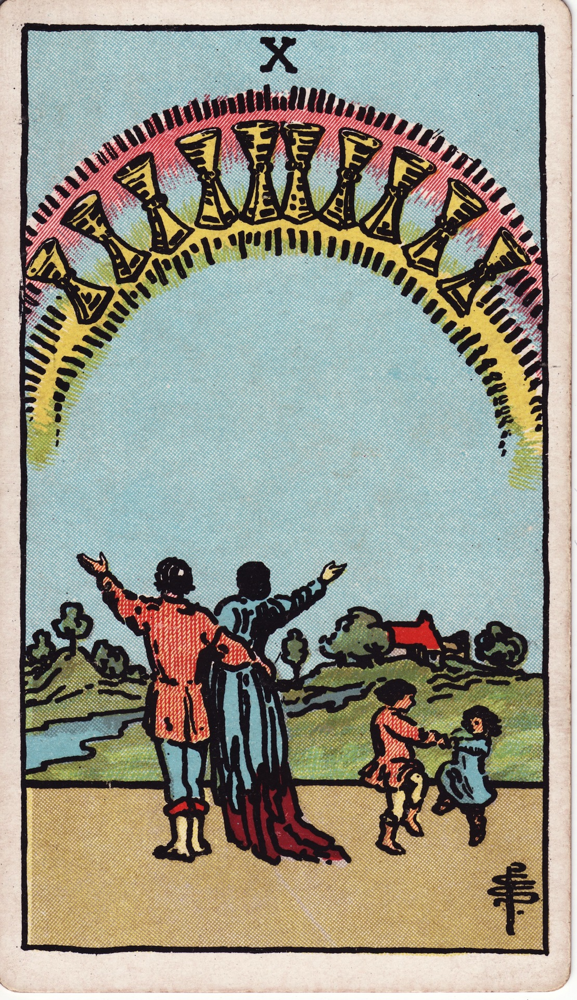

# Ten of Cups

The Ten of Cups portrays the rainbow of fulfillment—emotional legacy, chosen family, and the harmony that ripples through generations when hearts align with love.

*Keywords:* harmony, family bliss, legacy, shared fulfillment  
*Mood:* radiant, wholehearted, celebratory  
*Polarity:* receptive, culminating

*Art interpretation cue:* Frame a family or community beneath a rainbow of cups. The environment should feel safe, open, and lush—an outward expression of inner peace.

### Artistic Direction

Show the culmination of the suit: joy shared openly with loved ones. The scene should include nature, movement, and a sense of continuity.

*   **Core Symbolism & Composition:**
    *   **Rainbow of Ten Cups:** Arc across the sky, symbolizing blessing and covenant fulfilled.
    *   **Family or Community:** Partners, children, elders, or chosen kin celebrating together—arms raised, embracing, dancing.
    *   **Home & Landscape:** Cottage, village, or sanctuary nestled in fertile land; a river or meadow suggests sustained abundance.
    *   **Sky Illumination:** Soft sunlight breaking through clouds, casting iridescent hues.
*   **Mood & Atmosphere:**
    Use saturated colors—vivid greens, turquoise, warm gold. Let the rainbow and figures radiate warmth that reaches the viewer.

### Esoteric Correspondences

*   **Title:** Lord of Perfected Success.
*   **Astrology:** Mars in Pisces (March 11 – March 20). Passion devoted to compassion, action guided by empathy.
*   **Element:** Water fulfilled through communal love and spiritual purpose.
*   **Kabbalah:** Malkuth in Briah (Kingdom in the Creative World). Emotional dreams manifest in reality.

### Numerology (10)

Ten marks completion and transition. In Cups, it is the pinnacle of emotional satisfaction, pointing toward the next cycle’s seed (the Ace).

### Core Meanings (Upright)

*   **Family Harmony:** Domestic happiness, supportive partnerships, loving homes.
*   **Community Bliss:** Chosen family, queer kin, or communities celebrating shared values.
*   **Emotional Legacy:** Passing down love, traditions, and healing to future generations.
*   **Dream Realized:** Big emotional goal achieved—marriage, reconciliation, return home.

### Core Meanings (Reversed)

*   **Surface Harmony:** Picture-perfect appearances masking underlying tension.
*   **Unrealistic Expectations:** Idealizing “happily ever after” without doing the work.
*   **Family Strain:** Conflict, boundaries needed, or redefining what family means.
*   **Delayed Joy:** Vision not yet manifest—requires patience and community effort.

### The Card as a Person

*   **Upright:** A matriarch/patriarch, community elder, or leader devoted to emotional well-being for all.
*   **Reversed:** Someone projecting an ideal family image while struggling privately, or skeptical of love’s longevity.

### Guiding Questions

*   **Upright:**
    *   How do I honor the family or community that sustains me?
    *   What legacy of love am I building?
    *   Which traditions keep our joy alive?
    *   How can gratitude ripple through my relationships today?
*   **Reversed:**
    *   Where is harmony superficial, and what truth needs to be voiced?
    *   What version of family actually nourishes my soul?
    *   How can conflict become a doorway to deeper unity?
    *   What patient steps will manifest the future I envision?

### Affirmations

*   **Upright:** “I celebrate the love that surrounds and sustains us.”
*   **Reversed:** “I release perfection and nurture authentic connection.”

### Love & Relationships

*   **Upright:** Marriage, commitment ceremonies, blended families thriving.
*   **Reversed:** Tension under the surface, fear of long-term commitment, or mismatched visions for home life.
*   **Self-Question:** “What does ‘happily ever after’ mean for me today?”

### Work & Money

*   **Upright:** Mission-driven work, family businesses, teams that feel like home.
*   **Reversed:** Work/life imbalance straining relationships, projecting success outward while feeling empty.
*   **Self-Question:** “Does my work support the life I want to live with my people?”

### Spiritual & Psychological

*   **Themes:** Emotional integration, communal rituals, healing generational patterns.
*   **Actionable Advice:**
    1.  **Family Altar:** Create a shared space honoring ancestors, mentors, or chosen family.
    2.  **Gratitude Gathering:** Host a circle where each member names a dream realized.
    3.  **Legacy Letter:** Write to future generations about the love you are cultivating today.

### Cross-Card Echoes

*   **Nine → Ten:** Personal contentment blossoms into shared harmony.
*   **Ten ↔ Ten of Pentacles:** Both depict legacy; Cups focus on emotional wealth, Pentacles on material lineage.
*   **Ten → Ace:** Completion refills the cup; from legacy springs new beginnings.

### Impression Palette

#### Blessing Song

“Rainbow overhead, hearthfire within—may our love outlast the storm that birthed it.”

#### Story Snippet

Children raced across the hillside, their laughter twining with the river’s song. Two elders clasped hands beneath the rainbow of cups and whispered, “We did it.” Around them, friends and kin danced, proof that the dream had become a home.
