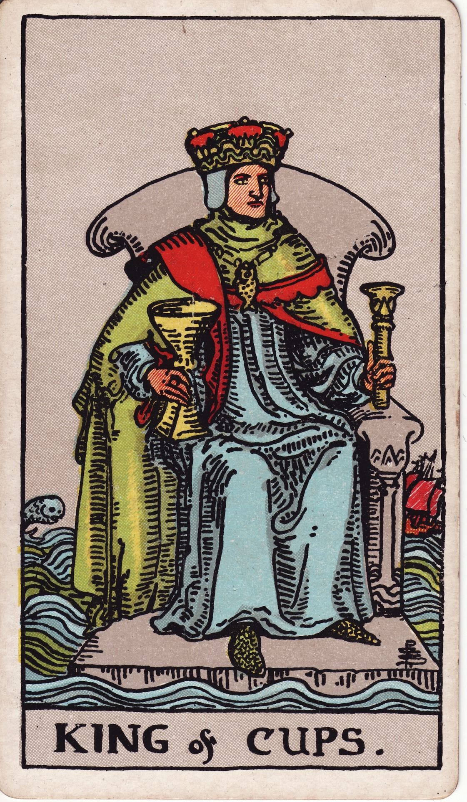

# King of Cups

The King of Cups embodies masterful emotional leadership—a figure of profound calm in the storm, compassionate yet impeccably composed. He has learned to channel the powerful currents of feeling into constructive wisdom, guiding himself and others with a steady, reassuring empathy. He is the anchor in the emotional sea.

*Keywords:* emotional authority, diplomacy, calm leadership, mature empathy, compassionate control
*Mood:* composed, reassuring, deeply present, steady
*Polarity:* directive, receptive intelligence

*Art interpretation cue:* Seat the King on a solid throne that appears to float upon a turbulent sea. His gaze should be steady and direct, his grip on his cup and scepter confident but relaxed. Around him, waves may crash or ships may sail, but they do not disturb his serene composure.

### Artistic Direction

Depict a figure of serene, unshakeable strength. The King should look utterly at home amidst the motion of the sea, emphasizing his role as a stable anchor in a world of constant flux.

*   **Core Symbolism & Composition:**
    *   **The Floating Throne:** The throne itself is solid, often made of stone or coral, but it rests directly on the surface of the water. This symbolizes his mastery: he does not suppress the emotional currents, but has built a stable foundation upon them.
    *   **The Cup & Scepter:** He holds both the cup (receptivity to emotion) and the scepter (the authority to direct it). His cup is open, unlike the Queen’s, showing that his wisdom is now meant to be shared.
    *   **The Turbulent Sea:** The water around him is active—waves, a leaping fish, a distant ship—representing the external emotional drama of the world, which he observes with detached compassion.
    *   **The Skyline:** A clear, distant horizon with soft clouds suggests his broad perspective and his ability to see beyond the immediate emotional weather.
*   **Mood & Atmosphere:**
    Use a palette of deep blues, royal purples, and stately gold accents. The lighting can be focused on the King’s face and hands, underscoring his calm presence and conscious choices.

### Esoteric Correspondences

*   **Title:** The Prince of the Chariot of the Waters.
*   **Astrology:** As the Air of Water, the King represents the intellect applied to emotion. He governs the celestial quadrant from 20° Libra to 20° Scorpio.
*   **Element:** Air of Water. This combination signifies the fusion of intellect and feeling; it is diplomacy married to compassion, clarity born from emotional depth.
*   **Kabbalah:** Tiphareth to Yesod in the suit of Water (Briah). He is the mediator who translates the deep, receptive understanding of the Queen into wise, foundational guidance for the community.

### Archetypal Role

Kings (or Princes) represent outward mastery, command, and mature leadership. In the suit of Cups, the King is the master counselor, the fair mediator, the compassionate authority figure, and the artist who has mastered his emotional medium.

### Core Meanings (Upright)

*   **Masterful Emotional Leadership:** The ability to remain a calm center in a crisis, to mediate conflicts with grace, and to offer wise, balanced counsel.
*   **A Therapeutic Presence:** Holding emotional space for others with professional skill and genuine care, as a therapist, coach, healer, or spiritual leader.
*   **Diplomatic Skill & Poise:** Navigating complex social, political, or family dynamics with profound empathy and strategic calm.
*   **Creative & Compassionate Direction:** Leading a project or a group from a place of heart-centered vision and unwavering stability.

### Core Meanings (Reversed)

*   **Emotional Suppression or Detachment:** Bottling up feelings to maintain control, appearing stoic and aloof to a fault, and becoming emotionally unavailable.
*   **Manipulative Control:** Using a calm, rational veneer to hide mood swings, passive-aggression, or the subtle manipulation of others’ feelings.
*   **Emotional Volatility:** A loss of his usual composure. The King is being tossed about by the waves, becoming moody, irritable, or prone to outbursts.
*   **Codependency & Burnout:** Over-identifying with the role of the supporter, leading to a neglect of his own needs, which can result in burnout or a reliance on substances to cope.

### The Card as a Person

*   **Upright:** A respected mentor, a fair-minded counselor, a compassionate manager, or a community leader who is deeply rooted in their emotional intelligence.
*   **Reversed:** Someone who is emotionally unavailable, subtly manipulative, or struggling with hidden addictions or unresolved emotional turmoil.

### Guiding Questions

*   **Upright:**
    *   How can you lead with your heart while maintaining your center?
    *   What emotional wisdom are you uniquely positioned to offer your community right now?
    *   Where is a calm, diplomatic approach most needed in your life?
    *   How do you remain compassionate without getting swept away by the currents of others’ feelings?
*   **Reversed:**
    *   Where are you denying or suppressing your own feelings in order to appear strong?
    *   What healthy, constructive outlets would allow you to release emotional pressure?
    *   Are you subtly trying to control a situation instead of communicating your needs directly?
    *   Who is the supporter for the supporter? Where can you turn for your own counsel?

### Affirmations

*   **Upright:** “I guide with balanced empathy and remain grounded in my own truth.”
*   **Reversed:** “I have the courage to acknowledge my own feelings and to seek support when I need it.”

### Love & Relationships

*   **Upright:** A stable, supportive, and emotionally mature partner who creates a deep sense of safety and offers wise guidance.
*   **Reversed:** A partner who is emotionally distant, prone to moodiness, or who has taken on a caregiver role to the point of fatigue and resentment.
*   **Self-Question:** “How can I share my own feelings and vulnerabilities, even as I hold space for others?”

### Work & Money

*   **Upright:** A call for values-driven leadership, skillful conflict mediation, and a more human-centered approach to management.
*   **Reversed:** Burnout from emotional labor at work, a cold and detached management style, or the misuse of influence and emotional intelligence.
*   **Self-Question:** “Does my style of leadership nourish me as well as it nourishes others?”

### Spiritual & Psychological

*   **Themes:** The practice of emotional regulation, developing compassionate authority, the art of spiritual counseling, and the path to sobriety or emotional balance.
*   **Actionable Advice:**
    1.  **Anchor Practice:** Before entering a potentially charged conversation or meeting, take three minutes to practice grounding breathwork to consciously set a calm, centered tone.
    2.  **Council Circle:** Gather a small group of trusted peers for a reciprocal support session where everyone has a chance to both give and receive counsel.
    3.  **Boundaries Audit:** Identify one area where your sense of responsibility is outweighing your capacity. Practice delegating that task or sharing the emotional load.

### Cross-Card Echoes

*   **Queen of Cups → King of Cups:** The Queen’s internal, intuitive mastery of emotion evolves into the King’s external, active leadership and guidance.
*   **King of Cups ↔ Justice:** Both archetypes are masters of balance and fairness. The King achieves this through the medium of emotion and empathy, while Justice works through the medium of intellect and universal law.
*   **King of Cups → Ace of Cups:** After mastering and stewarding the entire suit of Cups, the King is the one who pours that collective wisdom back into the Ace, initiating a new cycle of emotional potential.

### Impression Palette

#### A Meditation Script

“Feel the waves of feeling rise and fall beneath you, their rhythm powerful but predictable. You are not the waves; you are the vessel that stays afloat. You are the steady throne on the water, offering guidance without needing to absorb every tide.”

#### A Leadership Anecdote

The storm raged, and the sailors shouted for direction, their panic rising with the waves. The King simply stood at the helm, cup in hand, and began to breathe in time with the swell of the ocean. “Match the sea’s rhythm,” he said, his voice calm and clear. One by one, their frantic energy settled into focused purpose, and the ship found its course again.