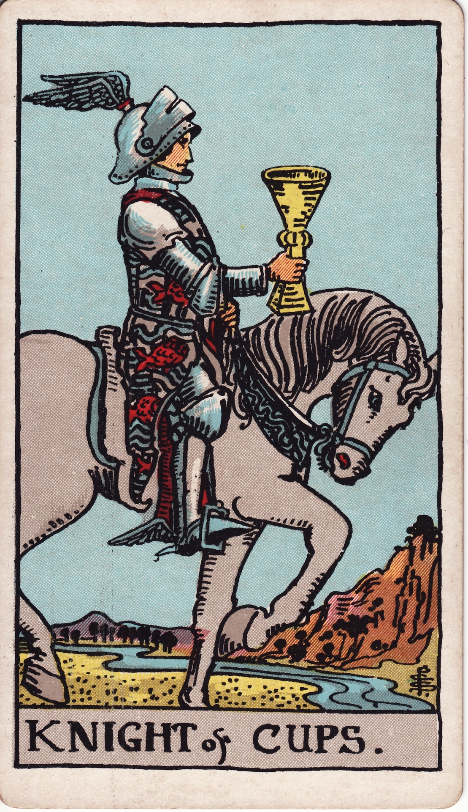

# Knight of Cups

The Knight of Cups is the questing heart, the romantic idealist, the poetic messenger, and the seeker of soulful and beautiful experiences. He rides not for battle, but for beauty, bearing an invitation to feel deeply and to act on the call of the heart. He is motion guided by emotion, a diplomat and a dreamer in one.

*Keywords:* romance, invitations, vision quest, emotional action, diplomacy
*Mood:* dreamy, chivalrous, quest-driven, sincere
*Polarity:* dynamic, receptive-in-motion

*Art interpretation cue:* Depict a knight or traveler guiding a gentle, calm steed while offering a cup forward. The landscape should feel fluid and lyrical—a flowing river, a twilight sky, or a moonlit desert—to emphasize that this is a journey guided by the currents of intuition.

### Artistic Direction

Show a figure of poised yet passionate grace. The energy is one of forward momentum, but it is a smooth, flowing advance, not a charge. This is the envoy of love, and his approach is as important as his message.

*   **Core Symbolism & Composition:**
    *   **The Knight & Steed:** The knight’s armor is often adorned with fish or wave motifs, signifying his allegiance to the emotional realm. His helmet may have wings, linking him to the messenger god Hermes. The horse is typically calm and deliberate, lifting its hoof with grace, not aggression.
    *   **The Extended Cup:** The cup is held out before the rider, a clear symbol of an offer, an invitation, or the object of his quest.
    *   **The River Crossing:** The horse is often shown moving alongside or across a river, a classic symbol of traversing emotional landscapes and the flow of life.
    *   **The Sky:** A sunset or twilight sky captures the romantic, often idealized ambiance of the Knight’s mission.
*   **Mood & Atmosphere:**
    Use a palette of shimmering silvers, soft blues, and rose golds. The scene should feel like a serenade on horseback—calm, purposeful, and deeply romantic.

### Esoteric Correspondences

*   **Title:** The Lord of the Waves and Waters.
*   **Astrology:** As the Fire of Water, this Knight is not tied to a specific decan but represents the active, fiery pursuit of watery, emotional goals. He governs the celestial quadrant from 20° Aquarius to 20° Pisces.
*   **Element:** Fire of Water. This combination represents passion harnessed in service of feeling, inspiration that motivates compassionate action, and the courage to follow one’s heart.
*   **Kabbalah:** Tiphareth in the suit of Water (Briah). The harmonizing, beautifying force of the sun (Tiphareth) carrying the heart’s message outward into the world.

### Archetypal Role

Knights (or Princes) represent pursuit, a mission, and the active, outward expression of their suit’s element. In the suit of Cups, the Knight is the one who follows the call of the heart and invites others to join him on a journey toward beauty, connection, or a cherished ideal.

### Core Meanings (Upright)

*   **A Romantic Gesture:** The arrival of an invitation, a proposal, a declaration of love, or a significant act of courtship.
*   **A Creative Mission:** The active pursuit of an artistic, musical, or spiritual pilgrimage with unwavering devotion.
*   **Inspired Action:** Moving forward with a plan that is guided by intuition, dreams, and a deep sense of compassion.
*   **Diplomacy & Peacemaking:** An offer to negotiate peace, a call for reconciliation, or the graceful expression of a heartfelt truth.

### Core Meanings (Reversed)

*   **Unrealistic Idealism:** A tendency to over-romanticize people or situations, chasing fantasies, or embodying a rescuer complex that is not grounded in reality.
*   **Emotional Volatility:** Inconsistent follow-through, moodiness that undermines trust, or a tendency to “ghost” when a situation becomes too real.
*   **Manipulative Charm:** The use of allure, flattery, or poetic language without genuine sincerity; seduction without commitment.
*   **A Stalled Quest:** A fear of rejection or vulnerability that halts progress on a creative or romantic journey.

### The Card as a Person

*   **Upright:** A lover, a poet, a therapist, a musician, or any gentle soul who leads with their feelings and invites others into a world of beauty and deeper connection.
*   **Reversed:** Someone who is fickle, seductive but non-committal, or addicted to the thrill of the chase more than the reality of the connection.

### Guiding Questions

*   **Upright:**
    *   What heartfelt mission are you willing to champion, even if it seems idealistic?
    *   How can you communicate your deepest feelings with both courage and grace?
    *   Which creative or romantic quest is calling you forward right now?
    *   Where in your life is an act of gentle diplomacy needed to mend a rift?
*   **Reversed:**
    *   Are you chasing a fantasy of a person or situation instead of building a real connection?
    *   How can you align your charm and charisma with genuine integrity?
    *   Where has a fear of vulnerability caused your journey to stall?
    *   What consistent, tangible action could you take to prove your devotion?

### Affirmations

*   **Upright:** “I pursue beauty and connection with a sincere and courageous heart.”
*   **Reversed:** “I ground my romantic passion in reality so that my promises hold true weight.”

### Love & Relationships

*   **Upright:** Romantic overtures, poetic confessions of love, soulful and idealized dating experiences.
*   **Reversed:** The danger of “love bombing,” inconsistent signals that create anxiety, or deep-seated commitment issues masked by charm.
*   **Self-Question:** “Does my pursuit of connection honor the heart of the other person as much as my own?”

### Work & Money

*   **Upright:** Creative pitches, ventures focused on art or beauty, and a call for more compassionate and inspiring leadership.
*   **Reversed:** Chasing glamorous but impractical ideas without a solid strategy; a lack of pragmatic planning that undermines creative genius.
*   **Self-Question:** “How can I pair my brilliant inspiration with reliable, consistent delivery?”

### Spiritual & Psychological

*   **Themes:** The modern-day vision quest, the practice of devotional art, and the development of emotional intelligence in action.
*   **Actionable Advice:**
    1.  **Pilgrimage Planning:** Choose a physical location or a dedicated practice that embodies your heart’s calling. Take one tangible step toward it this week.
    2.  **The Love Letter:** Write a message—whether romantic or platonic—that expresses your sincere gratitude and heartfelt intentions for a relationship.
    3.  **Creative Devotion:** Commit to a small, daily artistic ritual (writing one line of poetry, playing one chord, sketching one image) as an offering to your muse.

### Cross-Card Echoes

*   **Page of Cups → Knight of Cups:** The Page receives the surprising message from the unconscious; the Knight takes that message and embarks on a quest to deliver it to the world.
*   **Knight of Cups ↔ Temperance:** Both cards are alchemical, blending elements. The Knight ferries emotions between people, acting as a conduit for connection, while Temperance alchemizes and integrates opposing forces within the self.
*   **Knight of Cups → Queen of Cups:** After the active quest for connection, the Knight’s emotional energy matures into the deep, intuitive sovereignty of the Queen.

### Impression Palette

#### A Love Note

“I ride with a chalice full of moonlight, my heart’s own compass. I ask only if you will meet me where the river finally kisses the shore.”

#### Ballad Fragment

Hoofbeats on water,
A lantern heart to guide the way,
A cup held like a star.