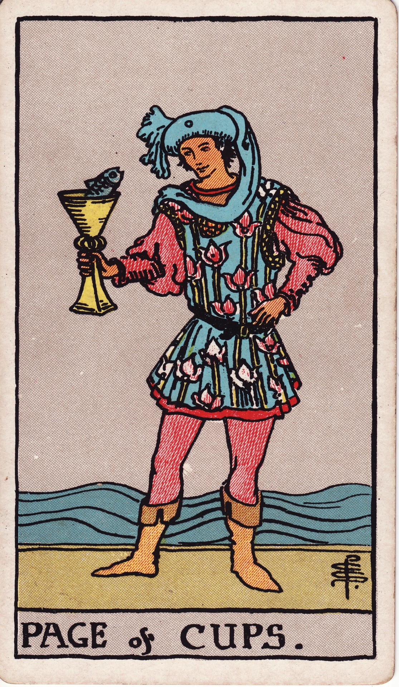

# Page of Cups

The Page of Cups is the messenger of the heart’s first whisper, a soul full of curiosity who listens for the subtle murmur of intuition and responds with wide-eyed wonder. This card embodies a tender emotional innocence, a playful willingness to explore feelings, and the creative spark that arises from an open and receptive spirit.

*Keywords:* curiosity, intuitive messages, creative muse, emotional beginnings
*Mood:* whimsical, tender, exploratory, imaginative
*Polarity:* receptive, initiating

*Art interpretation cue:* Present a youthful figure holding a cup from which a surprising messenger—a fish, a lotus, a glimmer of light—emerges. The figure’s posture should be relaxed, their eyes wide with gentle fascination, not shock. They are a student of wonder.

### Artistic Direction

Illustrate the magical moment when innocence meets inspiration. The environment should mirror the fluid, imaginative nature of the Page, with elements like shorelines, tidal pools, pastel skies, and gentle, lapping waves.

*   **Core Symbolism & Composition:**
    *   **The Youthful Figure:** Often depicted as gender-fluid or androgynous to represent a state of pure, ungendered emotional openness. Their clothing can be playful and artistic, perhaps patterned with waves or oceanic motifs.
    *   **The Cup with a Messenger:** A fish, a tiny oracle, or a glowing light peeks out from the cup. This symbolizes an unexpected insight rising from the unconscious, a message from the soul that is both surprising and delightful.
    *   **The Shore or Tidal Pool:** This liminal space, where water meets land, represents the threshold of consciousness where intuition and hidden feelings rise to the surface. Shells or strange sea-fauna can accent the theme.
    *   **Creative Tools:** The Page might be adorned with or holding scrolls, a paintbrush, or a musical instrument, signaling their role as a channel for creative and emotional expression.
*   **Mood & Atmosphere:**
    Use a palette of seafoam greens, coral pinks, and soft, dawn-like blues. The lighting should feel fresh and hopeful, like the first light of a new day, casting a gentle, dreamy glow on the scene.

### Esoteric Correspondences

*   **Title:** The Princess of the Waters; The Lotus of the Palace of the Floods.
*   **Astrology:** As an earth-of-water card, the Page is not tied to a specific decan but represents the grounding of emotion into tangible form. It rules the celestial quadrant around the North Pole and is linked to the entire zodiac through its elemental grounding function.
*   **Element:** Earth of Water. This combination represents emotion seeking form, intuitive ideas on the verge of manifestation, and the body’s wisdom.
*   **Kabbalah:** Malkuth in the suit of Water (Briah). The Kingdom, or the final, physical expression of the emotional and creative world.

### Archetypal Role

Pages (or Princesses) represent students, messengers, and the initial spark of a new phase. In the suit of Cups, the Page is the moment a feeling is first consciously recognized, explored with playful curiosity, and tentatively expressed.

### Core Meanings (Upright)

*   **Intuitive Messages:** The arrival of meaningful dreams, synchronicities, a heartfelt text message, or a gentle emotional invitation.
*   **A Creative Spark:** A sudden rush of inspiration to write, paint, compose, or otherwise give form to your inner emotional world.
*   **Emotional Learning:** Approaching a situation with a beginner’s heart, open to learning empathy, practicing forgiveness, and truly listening.
*   **A Gentle Offer:** Someone in your life (or you yourself) is shyly expressing affection, offering a sincere apology, or extending a hand in friendship.

### Core Meanings (Reversed)

*   **Emotional Immaturity:** A tendency toward moodiness, childish reactions, or an avoidance of emotional responsibility.
*   **Creative Blocks:** Doubting your own talent, ignoring the whispers of your muse, or feeling creatively frustrated and stuck.
*   **Mixed Signals:** Communication that is confusing or coy; playful teasing that hides a true intention or a fear of vulnerability.
*   **Hypersensitivity:** A tendency to be easily wounded, to take everything personally, or to be overwhelmed by emotion. A need for better emotional boundaries and grounding.

### The Card as a Person

*   **Upright:** A young artist, a sensitive empath, a student of psychology or healing arts, or a messenger bringing unexpected emotional news.
*   **Reversed:** Someone who is emotionally immature, flaky, or lost in a world of fantasy without any follow-through. They may be prone to sulking or passive-aggression.

### Guiding Questions

*   **Upright:**
    *   What surprising message is your intuition trying to deliver to you right now?
    *   How can you engage with your feelings more playfully and with greater curiosity?
    *   Which creative outlet is calling for your attention?
    *   Where are you being invited to respond with wonder instead of judgment?
*   **Reversed:**
    *   How can you ground your sensitivity so that it becomes a strength, not a liability?
    *   What emotional responsibility are you dodging by remaining in a state of playful aloofness?
    *   Which specific self-doubt is stifling your creative expression?
    *   How can you clarify the emotional messages you send and receive?

### Affirmations

*   **Upright:** “I welcome my feelings and intuitions with a sense of wonder and gentle care.”
*   **Reversed:** “I balance my imaginative spirit with presence and loving responsibility.”

### Love & Relationships

*   **Upright:** The beginning of a flirtation, the exchange of sweet notes, a budding romance full of innocence, or a heartfelt and sincere apology.
*   **Reversed:** Immature relationship games, mixed signals that create confusion, or emotional volatility that destabilizes the connection.
*   **Self-Question:** “How can I communicate what is in my heart with both honesty and a touch of playfulness?”

### Work & Money

*   **Upright:** New creative opportunities, an internship, a call to study emotional intelligence, or developing more soulful and authentic messaging.
*   **Reversed:** A lack of professionalism, procrastination driven by creative anxiety, or a tendency toward escapism at work.
*   **Self-Question:** “Where can a dose of curiosity and wonder improve my craft or my professional relationships?”

### Spiritual & Psychological

*   **Themes:** Dreamwork, inner-child healing, artistic journaling, and the practice of intuitive play (following synchronicities and creative whims).
*   **Actionable Advice:**
    1.  **Dream Sketch:** Keep a journal by your bed. When you wake from a dream, immediately sketch an image or write down a key phrase and reflect on its emotional message.
    2.  **Inner Child Letter:** Write a short, encouraging note to your younger self, acknowledging their sensitivity and creativity.
    3.  **Creative Date:** Take yourself on a solo adventure designed to stir the senses—visit a museum, walk along a shoreline, listen to new music, or attend a poetry reading.

### Cross-Card Echoes

*   **Ace of Cups ↔ Page of Cups:** Both cards herald new emotional currents. The Ace is the pure, unmanifested wellspring, while the Page is the first messenger who brings a cup of that water to conscious attention.
*   **Page of Cups → Knight of Cups:** The Page receives the creative inspiration; the Knight takes that inspiration and embarks on a quest to act on it.
*   **Page of Cups ↔ The Fool:** These two cards share a profound innocence and a radical openness to exploring uncharted territory—for the Page, this territory is emotional and intuitive.

### Impression Palette

#### Diary Entry

“The fish popped its head above the rim of the cup and told me a joke that only my heart could understand. I laughed out loud, suddenly, deeply grateful that nobody else was around to witness the ridiculous, wonderful way that magic keeps finding me.”

#### Micro-Poem

Message in a cup,
Foam-tipped words kiss my shoreline—
Sweet curiosity.