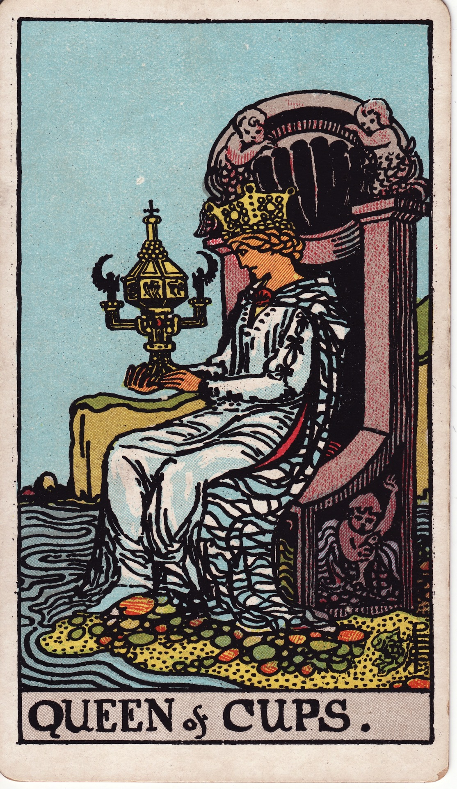

# Queen of Cups

The Queen of Cups is the sovereign of empathy—intuitive, compassionate, and deeply attuned to emotional tides. She embodies sacred receptivity and the art of holding space.

*Keywords:* empathy, intuition, emotional mastery, compassionate counsel  
*Mood:* serene, nurturing, mystical  
*Polarity:* receptive, containing

*Art interpretation cue:* Seat the Queen near water, gazing into a decorated cup or scrying vessel. Her throne should integrate sea motifs—shells, mermaids, waves—signaling her dominion over feeling.

### Artistic Direction

Depict regal softness. The Queen’s power is subtle yet undeniable, communicated through her calm presence and rich symbolism.

*   **Core Symbolism & Composition:**
    *   **Throne by the Sea:** Intricate carvings of fish, scallops, or water spirits. Sand or tide pools at her feet.
    *   **Covered Cup:** A lidded chalice symbolizing secrets, depth, and guarded intuition.
    *   **Flowing Robes:** Fabrics reminiscent of tides, perhaps translucent or patterned with waves.
    *   **Supporting Creatures:** Dolphins, swans, or sea horses reflecting emotional intelligence.
*   **Mood & Atmosphere:**
    Use aquamarine, silver, and pearl tones. Lighting should feel like moonlight reflected on calm waters.

### Esoteric Correspondences

*   **Title:** Queen of the Thrones of the Waters.
*   **Astrology:** Water of Water; governs 20° Gemini to 20° Cancer (Gemini III, Cancer I-II).
*   **Element:** Water refined—intuition, compassion, psychic sensitivity.
*   **Kabbalah:** Binah in the suit of Water—understanding shaped into care.

### Archetypal Role

Queens embody mastery, nurturing, and sovereignty. In Cups, she is the empathic counselor, the healer who knows how to receive and reflect emotion.

### Core Meanings (Upright)

*   **Intuitive Wisdom:** Trusting inner knowing, psychic development, dream interpretation.
*   **Compassionate Leadership:** Holding space, offering counsel, nurturing others with grace.
*   **Emotional Stability:** Calm presence in turbulent times, emotional maturity.
*   **Creative Flow:** Artistic expression rooted in feeling—poetry, music, ritual arts.

### Core Meanings (Reversed)

*   **Emotional Overload:** Absorbing others’ pain, lack of boundaries, empath fatigue.
*   **Manipulation via Emotion:** Moodiness, guilt tactics, passive aggression.
*   **Self-Neglect:** Caring for everyone but oneself, retreating into fantasy.
*   **Blocked Intuition:** Doubting inner voice, ignoring red flags.

### The Card as a Person

*   **Upright:** Therapist, healer, artist, or caregiver who radiates calm empathy.
*   **Reversed:** Someone emotionally overwhelmed, co-dependent, or using sensitivity to control situations.

### Guiding Questions

*   **Upright:**
    *   How can I honor my intuition today?
    *   Where am I called to hold compassionate space?
    *   Which creative practice soothes my soul?
    *   How do I nurture without absorbing?
*   **Reversed:**
    *   What boundaries protect my emotional well-being?
    *   Am I expressing my needs or expecting others to guess?
    *   Where does martyrdom hide beneath kindness?
    *   How can I refill before pouring out?

### Affirmations

*   **Upright:** “My intuition is wise; my heart is a sanctuary.”
*   **Reversed:** “I protect my sensitivity with loving boundaries.”

### Love & Relationships

*   **Upright:** Deep emotional intimacy, supportive partnership, healing conversations.
*   **Reversed:** Smothering, mood swings, emotional manipulation, or martyrdom.
*   **Self-Question:** “Can I receive love with the same grace I give it?”

### Work & Money

*   **Upright:** Care-based professions, heart-centered leadership, artistic direction.
*   **Reversed:** Difficulty separating work from emotion, unclear professional boundaries.
*   **Self-Question:** “How do I honor my feelings while making wise decisions?”

### Spiritual & Psychological

*   **Themes:** Clairvoyance, emotional healing, ancestral waters, sacred listening.
*   **Actionable Advice:**
    1.  **Water Meditation:** Spend time by water or use a bowl for scrying—ask for guidance.
    2.  **Compassion Audit:** List where compassion flows easily and where it drains you; adjust boundaries accordingly.
    3.  **Self-Nurture Ritual:** Create a luxurious bath or soothing routine dedicated solely to replenishing yourself.

### Cross-Card Echoes

*   **Knight → Queen:** Passion matures into serene mastery.
*   **Queen ↔ High Priestess:** Both guard mysteries; the Queen applies them relationally.
*   **Queen → King:** After containing emotion, the Queen teaches how to direct it outward.

### Impression Palette

#### Prayer Bowl

“Mother of tides, let my heart stay clear like moonlit water, reflecting truth without distortion.”

#### Short Story Moment

She cupped the sealed chalice, listening to the sea inside. When the petitioner finished speaking, the Queen simply nodded and opened the lid. Mist rose, revealing the answer in rippling light. “Feel it,” she whispered. “Your heart already knows.”
