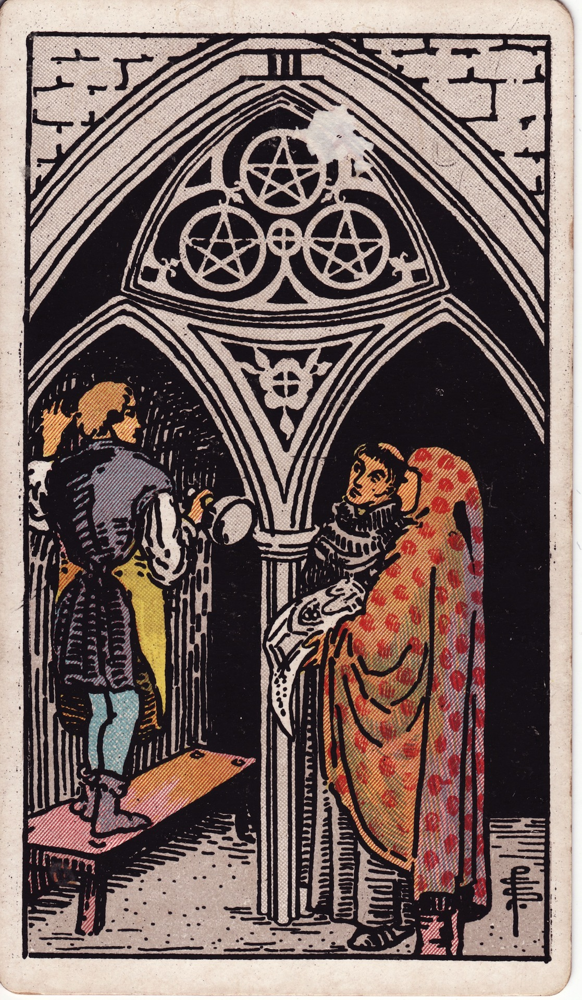

# Three of Pentacles

The Three of Pentacles is craftsmanship in concert—collaboration, mastery, and shared vision building something enduring. It honors skilled teamwork, apprenticeships, and the blending of talents into tangible achievement.

*Keywords:* collaboration, craftsmanship, teamwork, mastery, shared goals
*Mood:* industrious, cooperative, attentive, constructive
*Polarity:* stabilizing, synergistic

*Art interpretation cue:* Illustrate artisans conferring within a cathedral or workshop. One presents plans while others build, emphasizing the harmony between design, labor, and vision.

### Artistic Direction

Show dedicated collaboration. The scene should hum with focused energy—each contributor respected and essential.

*   **Core Symbolism & Composition:**
    *   **Architect, Artisan, Patron:** Trio representing vision, skill, and resources combining.
    *   **Cathedral Arch:** Long-term projects—artistry with spiritual or communal purpose.
    *   **Pentacles in Stone:** Carved symbols integrate art into structure, indicating lasting impact.
    *   **Blueprints or Tools:** Plans matched with craftsmanship.
*   **Mood & Atmosphere:**
    Use warm sandstone, deep burgundy, and muted blues. Light streaming through stained glass conveys inspiration.

### Esoteric Correspondences

*   **Title:** The Lord of Material Works.
*   **Astrology:** Mars in Capricorn (December 31 – January 9). Ambition meets discipline; work executed with excellence.
*   **Element:** Earth engineered—effort structured toward mastery.
*   **Kabbalah:** Binah in Assiah (Understanding in the World of Action). Wisdom shaping matter through cooperative effort.

### Numerology (3)

Three brings synthesis and expression. In Pentacles, it turns skill and resources into collaborative creation—a masterpiece that outlives the makers.

### Core Meanings (Upright)

*   **Teamwork:** Successful collaboration, constructive feedback, shared craftsmanship.
*   **Skill Development:** Apprenticeship, mentorship, learning through practice.
*   **Recognition:** Being noticed for expertise and contribution.
*   **Blueprint to Reality:** Plans manifesting through coordinated effort.

### Core Meanings (Reversed)

*   **Lack of Collaboration:** Miscommunication, siloed work, competition undermining progress.
*   **Quality Control Issues:** Cutting corners, skill gaps, or unclear expectations.
*   **Unrecognized Labor:** Feeling undervalued, freelancing without support.
*   **Disorganized Planning:** Vision without structure stalls the build.

### The Card as a Person

*   **Upright:** A dedicated artisan, engineer, designer, or team player committed to excellence.
*   **Reversed:** Someone struggling to cooperate, or a leader who fails to coordinate talents.

### Guiding Questions

*   **Upright:**
    *   What collective goal calls for our combined strengths?
    *   How can I refine my skills through mentorship or collaboration?
    *   Where is constructive feedback helping my craft evolve?
    *   Which systems keep our project aligned and efficient?
*   **Reversed:**
    *   Where do roles or expectations need clarification?
    *   How can I address quality issues without blame?
    *   What resources or training do we need to succeed?
    *   Am I ready to ask for the recognition or compensation I deserve?

### Affirmations

*   **Upright:** “I build with excellence, honoring every collaborator’s gift.”
*   **Reversed:** “I invite alignment, communication, and craftsmanship into our shared work.”

### Love & Relationships

*   **Upright:** Building a life together—home projects, shared financial goals, couples therapy.
*   **Reversed:** Unequal effort, lack of teamwork, or neglecting practical aspects of partnership.
*   **Self-Question:** “How do we co-create a foundation that reflects both of our dreams?”

### Work & Money

*   **Upright:** Successful projects, promotions, collaborative wins, portfolio building.
*   **Reversed:** Team dysfunction, underutilized skills, lack of project management.
*   **Self-Question:** “How can structure and communication elevate our craft?”

### Spiritual & Psychological

*   **Themes:** Sacred labor, mindful craftsmanship, honoring mentors, building community.
*   **Actionable Advice:**
    1.  **Skill Share:** Teach or learn a craft within your community.
    2.  **Process Ritual:** Document your workflow; refine it for clarity and excellence.
    3.  **Gratitude Circle:** Acknowledge collaborators; express appreciation for each role.

### Cross-Card Echoes

*   **Three of Pentacles ↔ Three of Cups:** Collaboration at work, celebration in community—both honor shared effort.
*   **Three of Pentacles ↔ Hierophant:** Tradition and mentorship guiding craftsmanship.
*   **Three of Pentacles → Eight of Pentacles:** Collaboration fosters the mastery refined through dedicated practice.

### Impression Palette

#### Workshop Ledger

“Stone fitted, arches aligned. Notes: Master Elena’s suggestion elevated the pattern. Tomorrow—rose window tracery begins.”

#### Terza Rima Triplet

Hands, minds, and hearts entwine in sacred stone,  
Blueprints made breath beneath the vaulted air—  
Our craft becomes a prayer the years will own.
