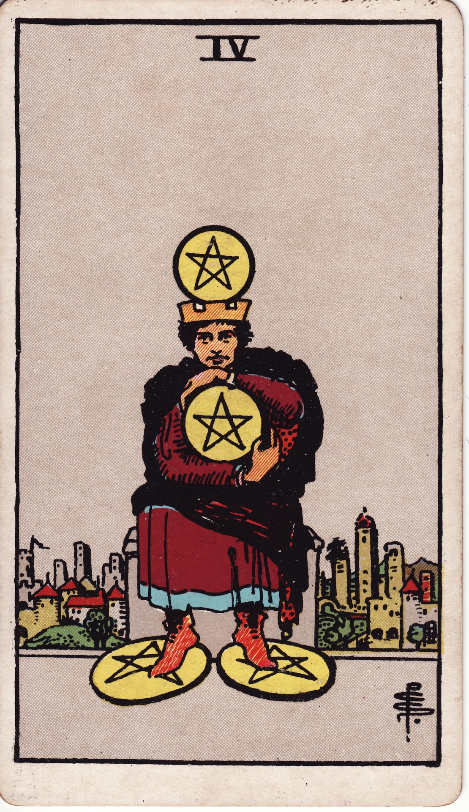

# Four of Pentacles

The Four of Pentacles is the fortress of security—clinging to resources, boundaries, and stability. It reflects prudent stewardship yet warns against gripping so tightly that abundance ceases to flow.

*Keywords:* security, control, stability, possessiveness, conservation
*Mood:* guarded, deliberate, structured, reserved
*Polarity:* stabilizing, contractive

*Art interpretation cue:* Portray a figure seated firmly, clutching a pentacle to their chest, with others beneath their feet and crowning their head. The city behind them suggests they guard their resources from the bustle.

### Artistic Direction

Depict composed restraint. The composition should emphasize solidity—straight lines, symmetrical framing, and a sense of grounded stillness.

*   **Core Symbolism & Composition:**
    *   **Four Pentacles Placement:** Crown, heart, hands, and feet—values anchored mentally, emotionally, physically, and materially.
    *   **Seated Figure:** Stability and control, yet potentially rigid posture.
    *   **City Walls:** Prosperity maintained through boundaries and careful management.
    *   **Muted Palette:** Earthy tones reflecting seriousness and continuity.
*   **Mood & Atmosphere:**
    Use dark greens, deep browns, and muted golds. Minimal movement illustrates the desire to hold position.

### Esoteric Correspondences

*   **Title:** The Lord of Earthly Power.
*   **Astrology:** Sun in Capricorn (January 10 – January 19). Discipline, ambition, and structured resource management.
*   **Element:** Earth fortified—stability maintained through deliberate control.
*   **Kabbalah:** Chesed in Assiah (Mercy in the World of Action). Abundance conserved for responsible use.

### Numerology (4)

Four creates foundations and boundaries. In Pentacles, it manifests as strong financial or energetic structures—security that must remain flexible to stay healthy.

### Core Meanings (Upright)

*   **Financial Security:** Saving, budgeting, building reserves.
*   **Healthy Boundaries:** Protecting time, energy, or space deliberately.
*   **Conservative Approach:** Strategic planning, careful expansion.
*   **Ownership:** Claiming authority over assets or leadership roles.

### Core Meanings (Reversed)

*   **Stagnation:** Hoarding, fear-based attachment, lack of generosity.
*   **Insecurity:** Control tactics masking anxiety or scarcity mindset.
*   **Forced Letting Go:** Circumstances demand release—taxes, bills, unexpected expenses.
*   **Opening Up:** Learning to share, invest, or trust others.

### The Card as a Person

*   **Upright:** A disciplined saver, CFO, archivist, or protector of legacy.
*   **Reversed:** Someone rigid, stingy, or overly fearful; alternatively, a person learning to loosen control.

### Guiding Questions

*   **Upright:**
    *   What deserves protection right now?
    *   How do my boundaries support long-term stability?
    *   Where can careful planning prevent future stress?
    *   What does security feel like in my body?
*   **Reversed:**
    *   Where am I gripping too tightly out of fear?
    *   How can generosity or investment invite flow back in?
    *   Which outdated beliefs about money or power can be released?
    *   What support systems ease my need for rigid control?

### Affirmations

*   **Upright:** “I steward my resources wisely, honoring the structures that sustain me.”
*   **Reversed:** “I release fear and allow generosity to refresh my stability.”

### Love & Relationships

*   **Upright:** Establishing boundaries, prioritizing security, building trust slowly.
*   **Reversed:** Possessiveness, jealousy, emotional withholding, or financial control.
*   **Self-Question:** “How can we feel secure while staying open-hearted?”

### Work & Money

*   **Upright:** Saving for a goal, conservative investments, protecting intellectual property.
*   **Reversed:** Micromanaging, risk aversion blocking growth, or unwise hoarding.
*   **Self-Question:** “Where is it time to reinvest, delegate, or share?”

### Spiritual & Psychological

*   **Themes:** Root chakra work, scarcity healing, valuing tradition, mindful accumulation.
*   **Actionable Advice:**
    1.  **Resource Audit:** Inventory assets—money, time, skills—and create a stewardship plan.
    2.  **Giving Ritual:** Donate or gift something meaningful to encourage flow.
    3.  **Grounding Practice:** Meditate on roots extending from the spine into earth, inviting secure yet flexible stability.

### Cross-Card Echoes

*   **Four of Pentacles ↔ Four of Cups:** Material security versus emotional withdrawal; balance grounding with openness.
*   **Four of Pentacles ↔ Emperor:** Structure and control; assess whether they protect or confine.
*   **Four of Pentacles → Six of Pentacles:** Security evolves into generosity when aligned with abundance mindset.

### Impression Palette

#### Ledger Entry

“Reserves intact. Doors bolted. Reminder: stability thrives when gates open on feast days.”

#### Quatrain

Hands clasp the coin-heart,  
city stones guard silent gold.  
To keep the hearth warm,  
remember to share the coal.
