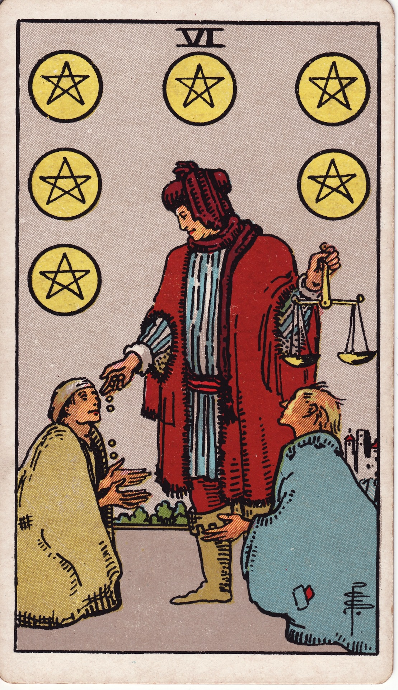

# Six of Pentacles

The Six of Pentacles is the rhythm of giving and receiving—reciprocity, generosity, and the balanced flow of resources. It reminds us that abundance expands when shared with discernment.

*Keywords:* generosity, reciprocity, charity, balance, resource flow
*Mood:* benevolent, harmonious, grateful, fair
*Polarity:* stabilizing, distributive

*Art interpretation cue:* Depict a benefactor offering coins to kneeling figures while holding scales. The imagery should emphasize compassion paired with equitable discernment.

### Artistic Direction

Show generosity grounded in fairness. The composition should highlight balanced giving—not pity, but partnership.

*   **Core Symbolism & Composition:**
    *   **Scales:** Justice, balance, and mindful distribution.
    *   **Exchange:** Coins flowing from hand to hand—resources in motion.
    *   **Contrasting Clothing:** Differing statuses represented with dignity and mutual respect.
    *   **Warm Cityscape:** Prosperity shared within a community setting.
*   **Mood & Atmosphere:**
    Use rich golds, warm reds, and earthy browns. Soft sunlight underscores kindness.

### Esoteric Correspondences

*   **Title:** The Lord of Material Success.
*   **Astrology:** Moon in Taurus (May 1 – May 10). Comfort, nurturing, and consistent generosity.
*   **Element:** Earth harmonized—resources circulating sustainably.
*   **Kabbalah:** Tiphareth in Assiah (Beauty in the World of Action). Balanced grace manifesting through material kindness.

### Numerology (6)

Six harmonizes opposites through compassion. In Pentacles, it embodies the flow of energy that keeps abundance alive—giving and receiving as sacred exchange.

### Core Meanings (Upright)

*   **Generous Support:** Donations, mentoring, scholarships, mutual aid.
*   **Receiving Help:** Accepting assistance, grants, or community care.
*   **Financial Balance:** Income meets expenses; resources handled fairly.
*   **Value Exchange:** Offering expertise or time in ways that uplift others.

### Core Meanings (Reversed)

*   **Power Imbalance:** Strings attached, patronizing charity, unequal relationships.
*   **Debt or Dependence:** Feeling beholden, difficulty standing independently.
*   **Withholding:** Fear of giving; resources stagnate.
*   **Inequity:** Need to reassess how resources are distributed.

### The Card as a Person

*   **Upright:** A philanthropist, mentor, community organizer, or kind employer who shares abundance wisely.
*   **Reversed:** Someone controlling with their generosity, or a person hesitant to accept help.

### Guiding Questions

*   **Upright:**
    *   Where can I share my resources or receive help with gratitude?
    *   How can I ensure generosity is sustainable for all involved?
    *   What systems promote fairness and dignity?
    *   Which skills or assets can I offer that uplift others?
*   **Reversed:**
    *   What boundaries do I need to avoid manipulation?
    *   Am I giving from guilt or true generosity?
    *   How can I receive support without shame?
    *   Where does inequity need rectifying in my community?

### Affirmations

*   **Upright:** “I participate in the flow of abundance, giving and receiving with grace.”
*   **Reversed:** “I offer and accept help with boundaries, ensuring reciprocity and respect.”

### Love & Relationships

*   **Upright:** Balanced give-and-take, practical support, acts of service.
*   **Reversed:** Unequal effort, financial control, emotional debt.
*   **Self-Question:** “How can we share resources and care in a way that nourishes both of us?”

### Work & Money

*   **Upright:** Raises, bonuses, fair wages, successful philanthropy, mentorship.
*   **Reversed:** Salary discrepancies, favoritism, debts lingering, or reluctance to compensate fairly.
*   **Self-Question:** “What structures ensure my work and others’ work is valued properly?”

### Spiritual & Psychological

*   **Themes:** Prosperity rituals, gratitude practice, service work, healing scarcity through community.
*   **Actionable Advice:**
    1.  **Generosity Ritual:** Set aside time or money weekly for intentional giving.
    2.  **Receiving Practice:** Accept a compliment or assistance without deflecting.
    3.  **Equity Review:** Assess budgets, donations, or policies—do they reflect your values?

### Cross-Card Echoes

*   **Six of Pentacles ↔ Six of Cups:** Material generosity meets emotional kindness—nostalgic sharing and support.
*   **Six of Pentacles ↔ Justice:** Fair distribution guided by ethics and balance.
*   **Six of Pentacles → Ten of Pentacles:** Sustained generosity lays groundwork for enduring legacy.

### Impression Palette

#### Donation Ledger

“Disbursed funds: education, food pantry, seed grants. Balance remains healthy. Gratitude noted from every hand.”

#### Reciprocal Verse

Open palm, coin falls—  
moonlit tide of give-and-take.  
Ebb returns as gift.
