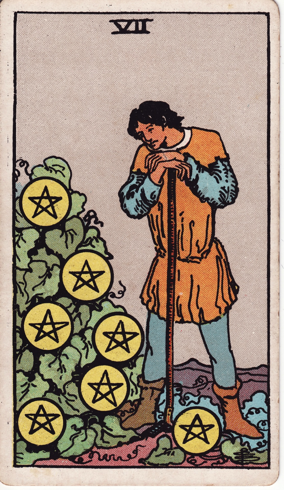

# Seven of Pentacles

The Seven of Pentacles is the farmer’s pause—the reflective moment of assessing progress, adjusting plans, and exercising patience. It honors long-term investment and the discipline to wait for harvest.

*Keywords:* patience, evaluation, long-term planning, perseverance, cultivated growth
*Mood:* contemplative, steady, pragmatic, hopeful
*Polarity:* stabilizing, reflective

*Art interpretation cue:* Depict a gardener leaning on a tool, observing pentacles growing like fruit on a vine or trellis. The setting should suggest slow, deliberate cultivation.

### Artistic Direction

Highlight the quiet satisfaction of work in progress. The scene must evoke diligence, rest, and strategic planning.

*   **Core Symbolism & Composition:**
    *   **Pentacle Vine:** Investments ripening over time; progress visible but incomplete.
    *   **Resting Gardener:** Paused mid-work, weighing next steps.
    *   **Earthy Tools:** Shovel, hoe, or baskets ready for eventual harvest.
    *   **Seasonal Landscape:** Late summer or early autumn colors emphasize timing and patience.
*   **Mood & Atmosphere:**
    Use olive greens, ochres, and tawny golds. Soft lighting suggests late afternoon reflection.

### Esoteric Correspondences

*   **Title:** The Lord of Success Unfulfilled.
*   **Astrology:** Saturn in Taurus (May 11 – May 20). Discipline paired with steadfast growth; delayed gratification.
*   **Element:** Earth reviewed—measured effort ensuring sustainable yield.
*   **Kabbalah:** Netzach in Assiah (Victory in the World of Action). Endurance carried through material persistence.

### Numerology (7)

Seven tests and refines. In Pentacles, it reviews progress, refines strategy, and reinforces commitment to long-range goals.

### Core Meanings (Upright)

*   **Assessment:** Evaluating results, adjusting plans, checking returns on investment.
*   **Patience:** Allowing time for growth; resisting haste.
*   **Strategic Pause:** Resting after labor to plan the next phase.
*   **Sustainable Progress:** Slow and steady wins the harvest.

### Core Meanings (Reversed)

*   **Impatience:** Frustration with slow results, tempted to uproot prematurely.
*   **Stagnation:** Lack of progress due to poor planning or neglect.
*   **Misplaced Effort:** Investing energy in unfruitful endeavors.
*   **Readjustment Needed:** Reallocate resources or redefine goals.

### The Card as a Person

*   **Upright:** A patient investor, gardener, researcher, or artisan who respects process.
*   **Reversed:** Someone restless, discouraged, or unwilling to commit to long-term strategy.

### Guiding Questions

*   **Upright:**
    *   What progress have I already made, and how can I honor it?
    *   Which adjustments will optimize future harvests?
    *   Where does patience serve me better than rushing?
    *   How can rest sharpen my focus for the next phase?
*   **Reversed:**
    *   What signals suggest it’s time to pivot or prune?
    *   Am I investing energy where returns align with my values?
    *   How can I balance patience with proactive change?
    *   Who can offer insight into improving my strategy?

### Affirmations

*   **Upright:** “I trust the process—tending diligently, resting wisely, and allowing time to ripen the harvest.”
*   **Reversed:** “I reassess with honesty, redirecting effort where growth can thrive.”

### Love & Relationships

*   **Upright:** Building a life together slowly, evaluating relationship goals, tending emotional gardens.
*   **Reversed:** Impatience with progress, questioning commitment, or needing to invest more care.
*   **Self-Question:** “How can we nurture our bond with patient, intentional effort?”

### Work & Money

*   **Upright:** Long-term projects, savings plans, delayed gratification paying off, business evaluations.
*   **Reversed:** Poor ROI, burnout from slow progress, needing to revise strategies or budgets.
*   **Self-Question:** “What metrics reveal my growth, and how can I refine my plan?”

### Spiritual & Psychological

*   **Themes:** Mindful pacing, seasonality, resilience, mindful rest, sustainability.
*   **Actionable Advice:**
    1.  **Progress Journal:** Track milestones; note lessons learned.
    2.  **Garden Meditation:** Tend plants or visualize tending goals—weed, water, wait.
    3.  **Strategic Review:** Conduct quarterly reviews of finances, health, or projects.

### Cross-Card Echoes

*   **Seven of Pentacles ↔ Seven of Cups:** Choosing wisely; dreams meet patient reality.
*   **Seven of Pentacles ↔ Temperance:** Both advocate patience, balance, and measured adjustment.
*   **Seven of Pentacles → Eight of Pentacles:** After assessment, return to diligent craftsmanship.

### Impression Palette

#### Field Journal

“Week 27: Vines thickening—yield projected higher than last season. Note: prune western trellis to invite more light.”

#### Pastoral Haiku

Hands rest on warm wood,  
seedlings whisper, “Not yet—soon.”  
Harvest hums in roots.
