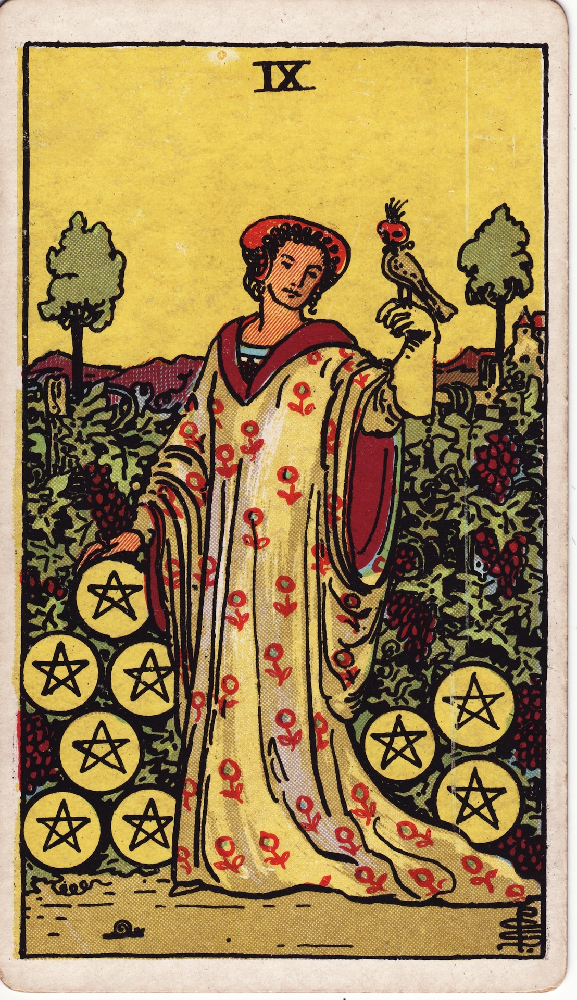

# Nine of Pentacles

The Nine of Pentacles is cultivated elegance—self-made abundance, independence, and the refined enjoyment of life’s pleasures. It celebrates standing tall within a sanctuary you tended yourself.

*Keywords:* self-sufficiency, luxury, refinement, independence, cultivated success
*Mood:* serene, opulent, confident, graceful
*Polarity:* receptive, radiant

*Art interpretation cue:* Show a figure in sumptuous attire strolling through a lush vineyard or garden, a falcon perched on their glove. The scene should exude serenity and earned opulence.

### Artistic Direction

Convey poised contentment. The garden should feel abundant yet meticulously cared for, mirroring the figure’s cultivated life.

*   **Core Symbolism & Composition:**
    *   **Falcon:** Discipline, trained luxury, enjoyment balanced with mastery.
    *   **Vineyard/Garden:** Harvest resulting from patient care and investment.
    *   **Golden Robes:** Material comfort and personal style.
    *   **Pentacles Climbing:** Wealth supporting growth—trellised coins among grapes or roses.
*   **Mood & Atmosphere:**
    Use rich golds, burgundy, deep greens, and soft sunlight. Let textures—silk, leaves, fruit—pop vividly.

### Esoteric Correspondences

*   **Title:** The Lord of Material Gain.
*   **Astrology:** Venus in Virgo (September 2 – September 11). Beauty crafted through diligence and refinement.
*   **Element:** Earth luxuriated—material success shaped with grace.
*   **Kabbalah:** Yesod in Assiah (Foundation in the World of Action). Grounded stability transmuted into elegant experience.

### Numerology (9)

Nine reflects culmination and self-possession. In Pentacles, it is the fruition of long-term effort—the enjoyment of stability before sharing it with legacy.

### Core Meanings (Upright)

*   **Self-Sufficiency:** Financial independence, owning your achievements.
*   **Refined Living:** Beauty, art, nature, and leisure enjoyed mindfully.
*   **Confidence:** Trust in your abilities and discernment.
*   **Sanctuary:** A home or environment curated to nourish soul and senses.

### Core Meanings (Reversed)

*   **Isolation:** Success shared with no one; loneliness amid luxury.
*   **Overindulgence:** Focus on appearances over substance.
*   **Self-Worth Issues:** Feeling undeserving of comfort or fearing loss of success.
*   **Financial Dependence:** Needing to reclaim autonomy.

### The Card as a Person

*   **Upright:** An entrepreneur, connoisseur, gardener, or artist living intentionally and independently.
*   **Reversed:** Someone who doubts their worth, overspends, or feels trapped by golden cages.

### Guiding Questions

*   **Upright:**
    *   How can I savor the abundance I’ve created?
    *   What rituals honor my independence and self-love?
    *   Which luxuries genuinely nourish me?
    *   How can I share my resources from a full heart?
*   **Reversed:**
    *   Where can I invite companionship or mentorship into my world?
    *   What boundaries ensure indulgence remains healthy?
    *   How do I celebrate success without fear of it vanishing?
    *   What step reclaims my financial or energetic sovereignty?

### Affirmations

*   **Upright:** “I delight in the sanctuary I have built; my elegance is earned and embodied.”
*   **Reversed:** “I balance independence with connection, trusting I deserve both abundance and warmth.”

### Love & Relationships

*   **Upright:** Healthy autonomy, enjoying time alone, luxury shared with chosen companions.
*   **Reversed:** Emotional walls, reliance on wealth over intimacy, feeling unapproachable.
*   **Self-Question:** “How can I let love enrich my cultivated life without surrendering independence?”

### Work & Money

*   **Upright:** Successful ventures, passive income, professional recognition, elegant entrepreneurship.
*   **Reversed:** Financial dependence, gilded cages, workaholism to sustain lifestyle.
*   **Self-Question:** “What choices reinforce both wealth and well-being?”

### Spiritual & Psychological

*   **Themes:** Gratitude rituals, sacred self-care, nature communion, art as devotion.
*   **Actionable Advice:**
    1.  **Abundance Gratitude:** List luxuries (large or small) you’ve cultivated and savor them intentionally.
    2.  **Sanctuary Upgrade:** Enhance a space with beauty—flowers, art, textures that delight your senses.
    3.  **Falcon Meditation:** Visualize a trained falcon returning—symbolizing disciplined joy under your command.

### Cross-Card Echoes

*   **Nine of Pentacles ↔ Nine of Cups:** Personal fulfillment in material versus emotional realms; together, they celebrate self-love and contentment.
*   **Nine of Pentacles ↔ Empress:** Cultivated abundance meets natural fertility; both bask in beauty.
*   **Nine of Pentacles → Ten of Pentacles:** Personal success expands into generational legacy and community prosperity.

### Impression Palette

#### Estate Journal

“Morning rounds: ripening grapes, falcon returned with grace. Noted gratitude for the life these hands have woven.”

#### Opulent Haiku

Silk whispers through vines,  
falcon eye and heart at ease—  
wealth blooms in stillness.
