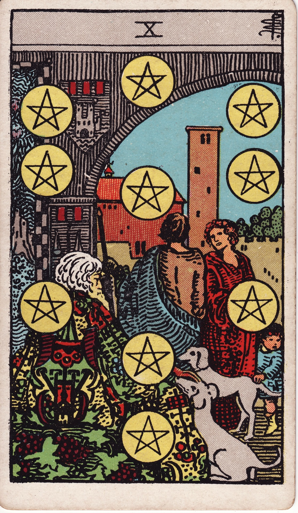

# Ten of Pentacles

The Ten of Pentacles is enduring legacy—wealth, stability, and lineage woven across generations. It celebrates prosperous households, traditions upheld, and the stewardship of blessings for those who follow.

*Keywords:* legacy, family wealth, stability, tradition, long-term success
*Mood:* abundant, grounded, communal, reverent
*Polarity:* stabilizing, expansive

*Art interpretation cue:* Depict a multigenerational scene beneath an archway adorned with pentacles. Elders, heirs, and companions mingle in a courtyard, suggesting continuity, heritage, and shared prosperity.

### Artistic Direction

Show the fullness of a thriving lineage. The composition should feel rich with symbolism—dogs, tapestries, and emblems showing history and care.

*   **Core Symbolism & Composition:**
    *   **Pentacle Arch:** Protection and continuity of material blessings.
    *   **Elders & Children:** Generational exchange—wisdom, inheritance, belonging.
    *   **Domestic Animals:** Loyal guardians of home and legacy.
    *   **Estate Setting:** Architecture, vineyards, or cityscapes representing established success.
*   **Mood & Atmosphere:**
    Use warm golds, deep reds, olive greens, and stone grays. Light should feel soft and celebratory.

### Esoteric Correspondences

*   **Title:** The Lord of Wealth.
*   **Astrology:** Mercury in Virgo (September 12 – September 21). Practical brilliance organizing resources for collective benefit.
*   **Element:** Earth fulfilled—material success distributed across community.
*   **Kabbalah:** Malkuth in Assiah (Kingdom in the World of Action). Physical world perfected and sustained.

### Numerology (10)

Ten signifies completion and legacy. In Pentacles, it marks the culmination of effort into tangible lineage, long-term security, and communal prosperity.

### Core Meanings (Upright)

*   **Generational Wealth:** Inheritance, family businesses, long-term investments.
*   **Home & Family:** Strong roots, supportive clans, intergenerational living.
*   **Tradition:** Rituals, values, and culture preserved and celebrated.
*   **Retirement & Stability:** Enjoying the fruits of sustained effort.

### Core Meanings (Reversed)

*   **Family Conflict:** Disputes over inheritance, clashing values, estrangement.
*   **Legacy in Question:** Uncertain succession plans, broken traditions.
*   **Financial Instability:** Risk to long-term investments; need for planning.
*   **Redefining Family:** Chosen family replacing blood ties; building new traditions intentionally.

### The Card as a Person

*   **Upright:** A patriarch/matriarch, estate manager, genealogist, or community elder committed to legacy building.
*   **Reversed:** Someone estranged from roots, or a leader struggling to maintain stability.

### Guiding Questions

*   **Upright:**
    *   What legacy am I building, and who benefits from it?
    *   How can I honor tradition while staying adaptable?
    *   Which systems ensure stability for my community or family?
    *   How do I celebrate the milestones we’ve earned?
*   **Reversed:**
    *   What generational patterns need healing or redesign?
    *   How can I create safety nets for the future?
    *   Which values deserve preservation, and which can evolve?
    *   Who belongs in my chosen lineage?

### Affirmations

*   **Upright:** “I steward abundance wisely, honoring those before me and empowering those to come.”
*   **Reversed:** “I heal legacy wounds and craft traditions rooted in integrity and love.”

### Love & Relationships

*   **Upright:** Family milestones—marriage, home ownership, generational celebrations.
*   **Reversed:** Tension with in-laws, clashing values, or redefining what family looks like.
*   **Self-Question:** “How do we weave our love into a legacy of stability and joy?”

### Work & Money

*   **Upright:** Retirement planning, family businesses, long-term wealth strategies, endowments.
*   **Reversed:** Succession issues, corporate instability, mismanaged estates.
*   **Self-Question:** “What structures ensure financial well-being for the long run?”

### Spiritual & Psychological

*   **Themes:** Ancestor work, stewardship, community care, inheritance of values.
*   **Actionable Advice:**
    1.  **Legacy Map:** Document family stories, assets, or traditions you want to pass on.
    2.  **Ancestor Ritual:** Create an altar or offering to honor those who paved the way.
    3.  **Estate Planning:** Review wills, trusts, or community agreements to ensure clarity.

### Cross-Card Echoes

*   **Ten of Pentacles ↔ Ten of Cups:** Material legacy meets emotional legacy; together they describe holistic fulfillment.
*   **Ten of Pentacles ↔ Hierophant:** Tradition, lineage, and institutional wisdom intersect.
*   **Ten of Pentacles → Ace of Pentacles:** Each completion seeds new opportunities for the next generation.

### Impression Palette

#### Ancestral Chronicle

“We gathered beneath the archway, generations woven into one tapestry. The dogs barked approval as new vows were written onto old stone.”

#### Legacy Haiku

Old vines, newborn hands—  
coins chime in the family hall.  
Roots whisper, “Carry.”
