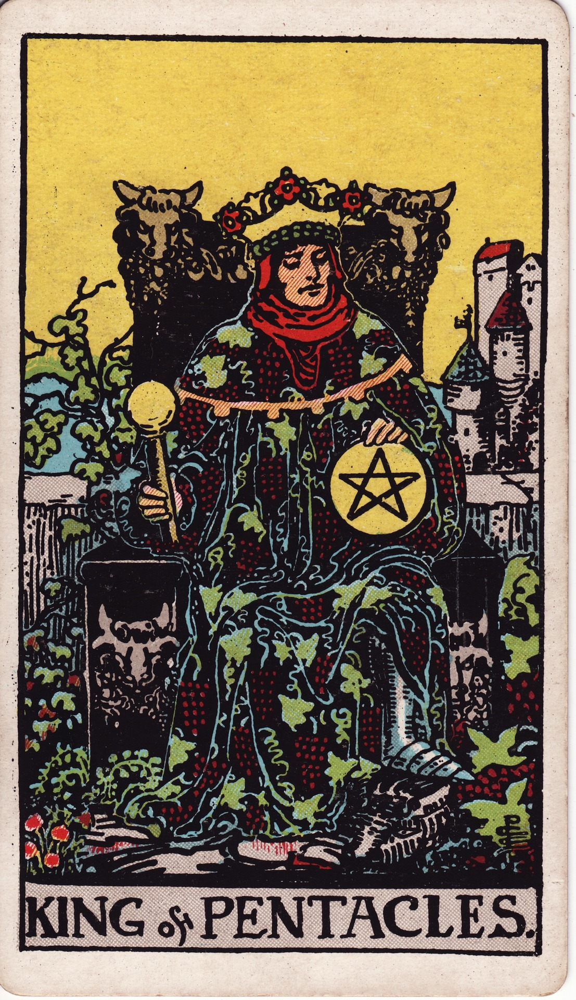

# King of Pentacles

The King of Pentacles is sovereign prosperity—the architect of tangible success, enterprise, and enduring security. He manifests abundance through strategic stewardship, generosity, and grounded leadership.

*Keywords:* wealth, leadership, stability, entrepreneurship, stewardship
*Mood:* confident, established, generous, pragmatic
*Polarity:* directive, sustaining

*Art interpretation cue:* Portray the King enthroned amid vineyards or a prosperous estate, holding a golden scepter or pentacle. Bulls, grapes, and ornate architecture should symbolize wealth anchored in the earth.

### Artistic Direction

Convey majestic stability. The King appears relaxed yet powerful, surrounded by evidence of his thriving domain.

*   **Core Symbolism & Composition:**
    *   **Pentacle Scepter:** Authority in financial and material realms.
    *   **Bulls or Oxen:** Taurus energy—strength, patience, and grounded abundance.
    *   **Vineyards & Castles:** Prosperity cultivated over time; legacy in action.
    *   **Sumptuous Textiles:** Rich fabrics emphasize comfort earned and shared.
*   **Mood & Atmosphere:**
    Use deep emeralds, royal purples, and gilded highlights. Lighting should glow warmly, reflecting security and hospitality.

### Esoteric Correspondences

*   **Title:** The Prince of the Chariot of Earth.
*   **Astrology:** Fire of Earth—dynamic mastery of material resources, ruling 20° Aries to 20° Taurus.
*   **Element:** Fire of Earth. Visionary ambition harnessed to practical outcomes.
*   **Kabbalah:** Chokmah to Tiphareth in Assiah. Wisdom channels into balanced material leadership.

### Archetypal Role

Kings (or Princes) embody outward mastery. In Pentacles, the King is the investor, CEO, land steward, or community pillar who turns resources into thriving systems.

### Core Meanings (Upright)

*   **Strategic Wealth:** Successful businesses, investments, and financial leadership.
*   **Generous Provider:** Supporting family, employees, or community with resources and mentorship.
*   **Practical Vision:** Implementing plans that produce lasting stability.
*   **Embodied Authority:** Confidence rooted in experience and tangible achievements.

### Core Meanings (Reversed)

*   **Materialism:** Greed, status obsession, or misusing wealth.
*   **Rigid Leadership:** Resistance to innovation, micromanagement.
*   **Financial Instability:** Mismanagement, risky ventures gone wrong.
*   **Work-Life Imbalance:** Prioritizing empire over emotional or spiritual needs.

### The Card as a Person

*   **Upright:** A successful entrepreneur, financial advisor, mentor, or patriarch/matriarch who builds and sustains prosperity.
*   **Reversed:** Someone stingy, power-hungry, or disconnected from the human impact of their wealth; alternatively, an insecure leader trying to appear stable.

### Guiding Questions

*   **Upright:**
    *   What systems or structures need my leadership right now?
    *   How can my success uplift others sustainably?
    *   Which investments align with my values and long-term vision?
    *   How do I celebrate prosperity with gratitude and generosity?
*   **Reversed:**
    *   Where has ambition overshadowed personal well-being?
    *   How can I restore ethical stewardship to my finances?
    *   What outdated structures require modernization?
    *   How can I integrate heart and home into my leadership?

### Affirmations

*   **Upright:** “I steward wealth with wisdom, generosity, and grounded authority.”
*   **Reversed:** “I realign my leadership with integrity, balance, and compassionate care.”

### Love & Relationships

*   **Upright:** Providing stability, nurturing family legacy, loyal commitment.
*   **Reversed:** Controlling behavior, prioritizing work over intimacy, transactional affection.
*   **Self-Question:** “How can leadership and love reinforce each other in my relationships?”

### Work & Money

*   **Upright:** Thriving enterprises, wise investments, strategic planning, successful mentorship.
*   **Reversed:** Financial missteps, authoritarian management, stagnation due to unwillingness to adapt.
*   **Self-Question:** “What decisions ensure prosperity remains ethical and resilient?”

### Spiritual & Psychological

*   **Themes:** Prosperity consciousness, grounded generosity, body-mind integration, ancestral stewardship.
*   **Actionable Advice:**
    1.  **Legacy Plan:** Review long-term strategies—wills, trusts, philanthropic goals.
    2.  **Hospitality Ritual:** Host a meal or gathering that shares abundance with community.
    3.  **Sensory Grounding:** Engage in rituals using earth, stone, or gardening to stay connected to the source of wealth.

### Cross-Card Echoes

*   **King of Pentacles ↔ King of Cups:** Material leadership paired with emotional intelligence creates holistic rulers.
*   **King of Pentacles ↔ Emperor:** Structure, authority, and stability; the King applies empire-building to the material plane.
*   **King of Pentacles → Ace of Pentacles:** His mastery seeds new ventures for the next generation.

### Impression Palette

#### Estate Proclamation

“The vineyards flourish, the granaries brim, the workers dine at long tables. Prosperity is a promise I keep for all under my care.”

#### Regal Haiku

Golden vines entwine—  
kingdom rooted in rich loam.  
Generosity.
