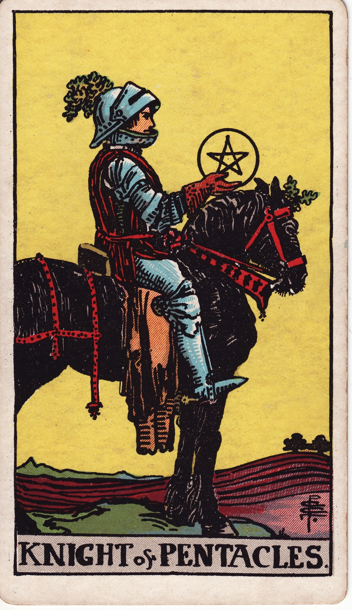

# Knight of Pentacles

The Knight of Pentacles is steadfast diligence—the reliable steward who moves slowly, deliberately, and with unwavering commitment. He represents persistence, responsibility, and the patient pursuit of tangible goals.

*Keywords:* diligence, reliability, routine, perseverance, methodical progress
*Mood:* steady, serious, grounded, dutiful
*Polarity:* dynamic, methodical

*Art interpretation cue:* Depict the Knight atop a patient, sturdy horse, holding a pentacle as if inspecting plans. The landscape should be cultivated fields ready for planting or harvest.

### Artistic Direction

Emphasize still momentum—a sense of poised action rather than speed. The mood should be calm, focused, and industrious.

*   **Core Symbolism & Composition:**
    *   **The Still Horse:** Movement may be paused, but readiness is clear; emphasizes caution and preparation.
    *   **Pentacle Offered:** Represents planning, productivity, and devotion to task.
    *   **Farmland:** Rows of crops or tilled soil show ongoing, disciplined labor.
    *   **Earthy Armor:** Practical gear instead of ornate decoration underscores functionality.
*   **Mood & Atmosphere:**
    Use russet browns, olive greens, and twilight golds. Let the light feel late afternoon—workday nearly done yet steady.

### Esoteric Correspondences

*   **Title:** The Lord of the Wild and Fertile Land.
*   **Astrology:** Air of Earth—strategic application of grounded effort, ruling 20° Leo to 20° Virgo.
*   **Element:** Air of Earth. Thoughtful planning applied to material tasks.
*   **Kabbalah:** Tiphareth in Assiah (Beauty in the World of Action). Harmonized duty expressed through practical service.

### Archetypal Role

Knights (or Princes) embody pursuit. In Pentacles, the Knight is the hardworking farmer, project manager, or craftsman who advances through routine, patience, and integrity.

### Core Meanings (Upright)

*   **Steady Progress:** Slow but consistent advancement toward goals.
*   **Responsibility:** Reliability, follow-through, honoring commitments.
*   **Practical Planning:** Budgets, workflows, schedules, systems.
*   **Service & Duty:** Showing up for tasks others might abandon.

### Core Meanings (Reversed)

*   **Stagnation:** Overcautious, stuck in routine, resistant to change.
*   **Workaholism:** Life consumed by duty; joy neglected.
*   **Laziness:** Procrastination or half-hearted effort contrary to the Knight’s potential.
*   **Rigidity:** Inflexible plans, refusal to adapt even when necessary.

### The Card as a Person

*   **Upright:** A dependable coworker, farmer, engineer, caregiver, or anyone known for consistency.
*   **Reversed:** Someone stubborn, unmotivated, or overly cautious, needing inspiration to move.

### Guiding Questions

*   **Upright:**
    *   What routine will support this goal day by day?
    *   How do I honor commitments with integrity?
    *   Where does consistency trump speed?
    *   Who relies on me, and how can I show up fully?
*   **Reversed:**
    *   Where do I need flexibility or innovation?
    *   What joy or rest have I neglected?
    *   How can I rekindle motivation for stalled tasks?
    *   Do I need to release responsibilities that aren’t mine?

### Affirmations

*   **Upright:** “I build lasting success through patient, devoted effort.”
*   **Reversed:** “I adjust my pace with wisdom, balancing diligence with renewal.”

### Love & Relationships

*   **Upright:** Dependable partner, steady commitment, practical acts of love.
*   **Reversed:** Stagnation, boredom, imbalance between work and intimacy.
*   **Self-Question:** “How can consistency and romance coexist in our bond?”

### Work & Money

*   **Upright:** Sustainable growth, reliable employment, thorough planning, long-term investments.
*   **Reversed:** Career stagnation, burnout from overwork, failure to adapt to new methods.
*   **Self-Question:** “Which systems secure my goals while leaving room for evolution?”

### Spiritual & Psychological

*   **Themes:** Devotional practice, mindful service, embodied discipline, earth rituals.
*   **Actionable Advice:**
    1.  **Routine Reset:** Evaluate daily habits; refine them for efficiency and rest.
    2.  **Task Ritual:** Approach chores as meditative acts—focus on presence and care.
    3.  **Nature Stewardship:** Volunteer or tend to land, plants, or animals as spiritual practice.

### Cross-Card Echoes

*   **Knight of Pentacles ↔ Knight of Cups:** Duty meets devotion—balance practical service with emotional care.
*   **Knight of Pentacles ↔ Temperance:** Both value steady, measured pace and mindful action.
*   **Knight of Pentacles → Queen of Pentacles:** Diligence matures into nurturing stewardship.

### Impression Palette

#### Field Report

“Furrows aligned, seed schedule maintained. Tomorrow: irrigation check before sunset. No shortcuts; harvest will thank us.”

#### Work Chant

Step by step, earth hums—  
steady hands, no wasted stroke.  
Harvest answers patience. 
