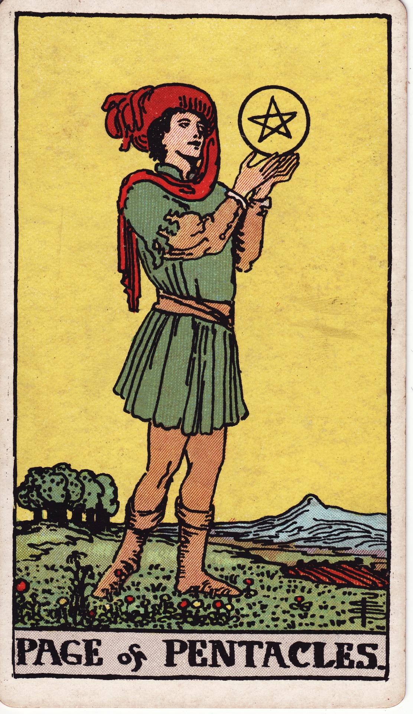

# Page of Pentacles

The Page of Pentacles is the student of the tangible—the eager apprentice who studies nature, finance, and craft with grounded curiosity. They appear when it’s time to learn by doing and invest in practical dreams.

*Keywords:* study, apprenticeship, new opportunity, grounded curiosity, manifestation
*Mood:* earnest, attentive, hopeful, methodical
*Polarity:* receptive, exploratory

*Art interpretation cue:* Show a youthful figure admiring a pentacle held at eye level, standing in a verdant field. Their posture reflects focus and budding ambition.

### Artistic Direction

Convey fresh dedication. The Page should look captivated by the pentacle, ready to plant seeds of knowledge and prosperity.

*   **Core Symbolism & Composition:**
    *   **Raised Pentacle:** Represents study, intention, and the first blueprint of manifestation.
    *   **Blooming Field:** Fertile ground for new ventures—academic, financial, or personal.
    *   **Simple Attire:** Practical clothing suitable for study and labor.
    *   **Mountains in Distance:** Long-term goals and growth ahead.
*   **Mood & Atmosphere:**
    Use gentle greens, sunlit golds, and soft browns. Let the air feel crisp, as if morning dew still lingers.

### Esoteric Correspondences

*   **Title:** Princess of the Echoing Hills, the Rose of the Palace of Earth.
*   **Astrology:** Earth of Earth—pure grounded potential, ruling from 0° Capricorn to 0° Aries.
*   **Element:** Earth of Earth. Material curiosity, practical beginnings, body-centered learning.
*   **Kabbalah:** Malkuth in Assiah (Kingdom in the World of Action). The physical realm becomes the classroom for growth.

### Archetypal Role

Pages (or Princesses) embody beginnings, messages, and student energy. In Pentacles, the Page is the diligent learner, aspiring entrepreneur, or nature devotee ready to practice what they study.

### Core Meanings (Upright)

*   **New Studies:** Education, apprenticeships, certifications, practical research.
*   **Opportunity:** Job offers, internships, grounded projects.
*   **Manifestation Planning:** Vision boards, budgets, business plans.
*   **Body Awareness:** Health routines, nutrition, mindful embodiment.

### Core Meanings (Reversed)

*   **Lack of Follow-Through:** Procrastination, distractions, or half-hearted commitments.
*   **Financial Naivete:** Poor budgeting, unrealistic expectations.
*   **Study Blocks:** Disinterest in school or training; needing new motivation.
*   **Unfocused Effort:** Trying to do too much without structure.

### The Card as a Person

*   **Upright:** A dedicated student, apprentice, farmer, or budding entrepreneur eager to learn.
*   **Reversed:** Someone careless with money, resistant to study, or lacking grounded plans.

### Guiding Questions

*   **Upright:**
    *   What subject or skill am I ready to learn deeply?
    *   How can I organize my resources to support this goal?
    *   What small steps today build long-term stability?
    *   How do I keep curiosity alive while committing to routine?
*   **Reversed:**
    *   Where am I avoiding the foundational work?
    *   How can I re-engage with learning in a way that feels meaningful?
    *   Which financial habits need attention?
    *   Who can mentor me in grounding my dreams?

### Affirmations

*   **Upright:** “I study the world with devotion, planting seeds that will flourish through steady care.”
*   **Reversed:** “I focus my curiosity into practical steps, honoring the foundations of success.”

### Love & Relationships

*   **Upright:** Building relationships through shared projects, learning together, practical acts of care.
*   **Reversed:** Inconsistency, immaturity, or reluctance to invest effort in the relationship.
*   **Self-Question:** “How can small, tangible gestures cultivate trust and affection?”

### Work & Money

*   **Upright:** Entry-level roles, internships, launching small businesses, research, grant proposals.
*   **Reversed:** Missed deadlines, job-hopping, ignoring budgets, lack of practical planning.
*   **Self-Question:** “What steps lay a strong foundation for my career or finances?”

### Spiritual & Psychological

*   **Themes:** Earthing practices, mindful learning, nature study, slow ritual, gratitude.
*   **Actionable Advice:**
    1.  **Study Plan:** Create a schedule for learning or skill-building; stick to incremental goals.
    2.  **Budget Ritual:** Track spending, set small savings targets, celebrate progress.
    3.  **Nature Walk:** Observe the physical world as teacher—collect insights, textures, or natural symbols.

### Cross-Card Echoes

*   **Page of Pentacles ↔ Page of Swords:** Practical study meets intellectual curiosity; combine theory with action.
*   **Page of Pentacles → Knight of Pentacles:** Dedication deepens into dependable diligence.
*   **Page of Pentacles ↔ Hermit:** Learning through nature, solitude, and humble observation.

### Impression Palette

#### Field Notebook

“Observation: soil rich after last rain. Plan—plant the dream today, track growth weekly. Pentacle gleams like a promise.”

#### Seed Song

Hold the coin to light,  
whisper plans into the loam—  
roots begin to learn.
