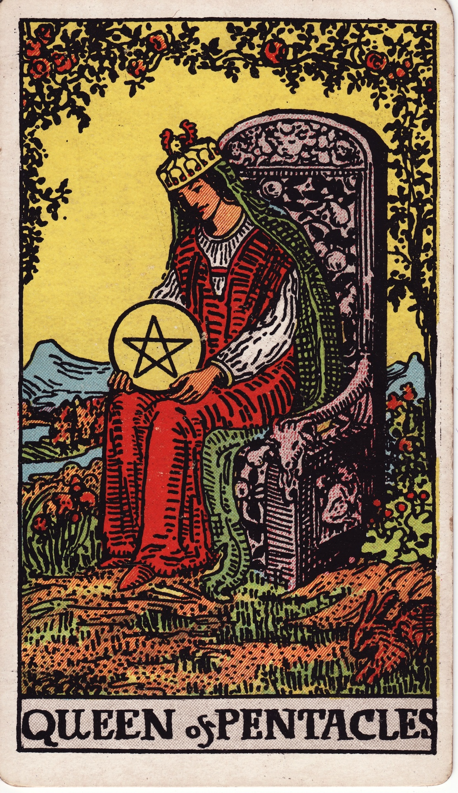

# Queen of Pentacles

The Queen of Pentacles is sovereign nurturance—earthly wisdom expressed through care, prosperity, and practical magic. She embodies the hearth, blending resourcefulness with sensual comfort and grounded compassion.

*Keywords:* nurturing abundance, practicality, sensual comfort, resourcefulness, grounded care
*Mood:* warm, generous, serene, nurturing
*Polarity:* receptive, sustaining

*Art interpretation cue:* Depict the Queen seated in a lush garden or domestic sanctuary, cradling a pentacle like a cherished treasure. Surround her with flora, fauna, and symbols of fertility and home.

### Artistic Direction

Convey embodied abundance. The scene should feel cozy yet regal—textures, animals, and plant life illustrating her caretaking domain.

*   **Core Symbolism & Composition:**
    *   **Pentacle Cradled:** She honors resources as sacred and personal.
    *   **Rabbits or Goats:** Fertility, vitality, and domestic guardianship.
    *   **Garden & Textiles:** Herbs, fruits, tapestries—magic woven into daily life.
    *   **Earthy Crown:** Adorned with florals and vines, grounding her authority.
*   **Mood & Atmosphere:**
    Use deep greens, amber golds, and rich terracottas. Lighting should be soft, like late afternoon sun across a warm kitchen table.

### Esoteric Correspondences

*   **Title:** The Queen of the Thrones of Earth.
*   **Astrology:** Water of Earth—emotional nurturance flowing into material care, ruling 20° Sagittarius to 20° Capricorn.
*   **Element:** Water of Earth. Compassion grounding into practical support.
*   **Kabbalah:** Binah to Geburah in Assiah. Understanding shapes disciplined stewardship of resources.

### Archetypal Role

Queens (or Thrones) express receptive mastery. In Pentacles, the Queen is the healer, homemaker, herbalist, CEO of care—someone who sustains the material world with heart-centered leadership.

### Core Meanings (Upright)

*   **Nurturing Support:** Providing comfort, nourishment, and stability.
*   **Domestic Prosperity:** Creating cozy homes, thriving businesses, abundant gardens.
*   **Practical Magic:** Combining intuition with resource management.
*   **Work-Life Harmony:** Balancing responsibilities with self-care.

### Core Meanings (Reversed)

*   **Overextension:** Caring for everyone else at the expense of self.
*   **Neglect:** Domestic chaos, disconnection from body or environment.
*   **Material Worry:** Anxiety about finances, scarcity mindset.
*   **Boundary Challenges:** Difficulty saying no; overgiving.

### The Card as a Person

*   **Upright:** A loving caregiver, entrepreneur, herbalist, chef, or leader who fosters prosperity and comfort.
*   **Reversed:** Someone depleted, resentful, or struggling to maintain their sanctuary.

### Guiding Questions

*   **Upright:**
    *   How can I nourish myself and others with practical wisdom?
    *   What rituals support a thriving home or business?
    *   Where can sensual pleasure enhance my well-being?
    *   How do I steward resources with love?
*   **Reversed:**
    *   Where do I need to replenish before I can keep giving?
    *   What boundaries protect my energy and time?
    *   How can I reconnect with my body and environment?
    *   Which financial or domestic systems need reorganization?

### Affirmations

*   **Upright:** “I cultivate abundance with warmth, wisdom, and embodied care.”
*   **Reversed:** “I nourish myself first so my care for others remains generous and sustainable.”

### Love & Relationships

*   **Upright:** Sensuality, loyal partnership, creating nurturing spaces for loved ones.
*   **Reversed:** Maternal burnout, imbalance of care, partners taking support for granted.
*   **Self-Question:** “What does a balanced, nourishing relationship look like for me?”

### Work & Money

*   **Upright:** Successful home-based ventures, finance management, thriving teams under her care.
*   **Reversed:** Overworking, mismanaged budgets, or undervaluing one’s contributions.
*   **Self-Question:** “How can I align my livelihood with care, sustainability, and profit?”

### Spiritual & Psychological

*   **Themes:** Hearth magic, body temple rituals, herbal wisdom, gratitude practices.
*   **Actionable Advice:**
    1.  **Hearth Ritual:** Cook a nourishing meal or brew herbal tea as an offering to yourself and your home.
    2.  **Sensory Sanctuary:** Refresh spaces with textures, scents, and plants that calm your nervous system.
    3.  **Resource Check-In:** Review finances or pantry stores; create systems that support ease.

### Cross-Card Echoes

*   **Queen of Pentacles ↔ Empress:** Both radiate fertility and nurturance; the Queen adds practical stewardship.
*   **Queen of Pentacles ↔ Queen of Cups:** Emotional care and material care weave together.
*   **Queen of Pentacles → King of Pentacles:** Personal nurturance matures into community leadership and legacy building.

### Impression Palette

#### Hearthside Journal

“Bread rising, herbs hanging to dry. The house hums. Tonight’s prosperity: laughter, full bowls, soft blankets.”

#### Comfort Haiku

Lantern glow, warm stew,  
hands in soil, heart at peace—  
home is holy ground.
