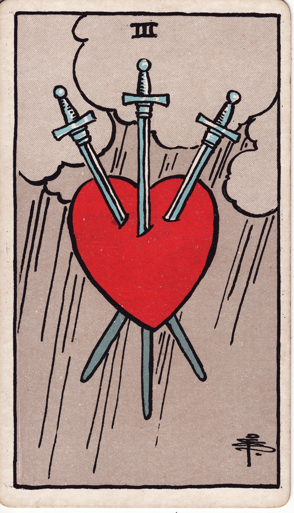

# Three of Swords

The Three of Swords is heartbreak made visible—the piercing of illusion, the raw ache of truth unveiled, the storm that strips away what is false. It is sorrow with purpose, opening space for honest healing.

*Keywords:* heartbreak, truth revealed, grief, emotional release, painful clarity
*Mood:* stormy, exposed, cathartic, solemn
*Polarity:* receptive, penetrating

*Art interpretation cue:* Portray a heart pierced by three swords, suspended against a stormy sky. Rain or lightning should suggest catharsis and the cleansing quality of tears.

### Artistic Direction

Capture the stark beauty of honest pain. The composition should feel stripped of ornament—only the essential image of heartbreak and the promise of healing rain.

*   **Core Symbolism & Composition:**
    *   **Pierced Heart:** Symbolizes emotional truth exposed, often through loss or betrayal.
    *   **Three Swords:** Each blade can represent thought, message, or action that delivered the wound.
    *   **Storm Clouds & Rain:** Tears, release, and the cleansing that follows grief.
    *   **Suspended Space:** The heart floats, detached from bodies, indicating universal experience rather than personal blame.
*   **Mood & Atmosphere:**
    Use slate grays, muted crimsons, and flashes of silver. Let rain streaks or thunderbolts convey intensity and purification.

### Esoteric Correspondences

*   **Title:** The Lord of Sorrow.
*   **Astrology:** Saturn in Libra (October 3 – October 12). Structures of relationship tested against fairness, leading to necessary reckonings.
*   **Element:** Air cutting through emotion; thoughts that wound yet reveal.
*   **Kabbalah:** Binah in Yetzirah (Understanding in the World of Formation). Deep comprehension often arrives through sorrow.

### Numerology (3)

Three expresses synthesis; here, it synthesizes pain, insight, and transformation. In Swords, it marks the unveiling of truth at personal cost.

### Core Meanings (Upright)

*   **Heartbreak:** Loss, betrayal, or dissolution that compels honest grieving.
*   **Painful Clarity:** Learning truths that puncture illusions.
*   **Emotional Release:** Tears and sorrow acting as sacred cleansing.
*   **Necessary Separation:** Letting go of what no longer aligns, even when it hurts.

### Core Meanings (Reversed)

*   **Lingering Pain:** Difficulty moving on; wounds reopening.
*   **Repressed Grief:** Avoiding tears, denying sorrow, or numbing out.
*   **Healing in Progress:** The swords fall away; the heart begins to mend.
*   **Unforgiveness:** Clinging to resentment, preventing closure.

### The Card as a Person

*   **Upright:** Someone amid heartbreak, candid about pain, or a counselor holding space for grief.
*   **Reversed:** A person stuck in bitterness or stoic denial, resisting the healing process.

### Guiding Questions

*   **Upright:**
    *   What truth has pierced me, and what does it ask me to release?
    *   How can I honor and process this grief without judgment?
    *   Which supports (rituals, people, practices) help me heal?
    *   What wisdom emerges from this heartbreak?
*   **Reversed:**
    *   Where am I still carrying a sword that could be gently removed?
    *   How might forgiveness free my heart—not for them, but for me?
    *   What emotions am I avoiding that need expression?
    *   Which healing modalities can help me move forward?

### Affirmations

*   **Upright:** “I allow my heart to feel fully so it may heal honestly.”
*   **Reversed:** “I release the blades of the past and invite compassion to sew me whole.”

### Love & Relationships

*   **Upright:** Breakups, conflict, infidelity, or painful revelations in relationships.
*   **Reversed:** Reconciliation attempts, old wounds resurfacing, or lingering sadness from past loves.
*   **Self-Question:** “What truth about love must I accept to heal completely?”

### Work & Money

*   **Upright:** Professional setbacks, disappointing news, or team conflicts that force honest appraisal.
*   **Reversed:** Difficulty bouncing back from failure, or learning from mistakes to rebuild stronger.
*   **Self-Question:** “How can I transform this disappointment into wisdom?”

### Spiritual & Psychological

*   **Themes:** Shadow work, cathartic release, the sacredness of tears, integration after loss.
*   **Actionable Advice:**
    1.  **Grief Ritual:** Create a safe space to cry, write, or speak the pain aloud; honor it with candlelight.
    2.  **Heart Letter:** Write to the person or situation that hurt you; burn or bury the letter when ready to release.
    3.  **Support Seeking:** Engage therapy, support groups, or trusted confidants who can witness your process.

### Cross-Card Echoes

*   **Three of Swords ↔ Three of Cups:** Heartbreak versus celebration; eventually, mourning gives way to communal joy again.
*   **Three of Swords ↔ Death:** Both require surrender; endings make space for transformation.
*   **Three of Swords → Six of Swords:** Healing continues through transition and compassionate movement forward.

### Impression Palette

#### Elegy

“Three blades sang through the thunder; my heart split open like rain-soaked earth. In the breach, truth took root.”

#### Lament Haiku

Rain threads through the wound—  
broken sky mirrors my chest.  
Storms teach how to mend.
