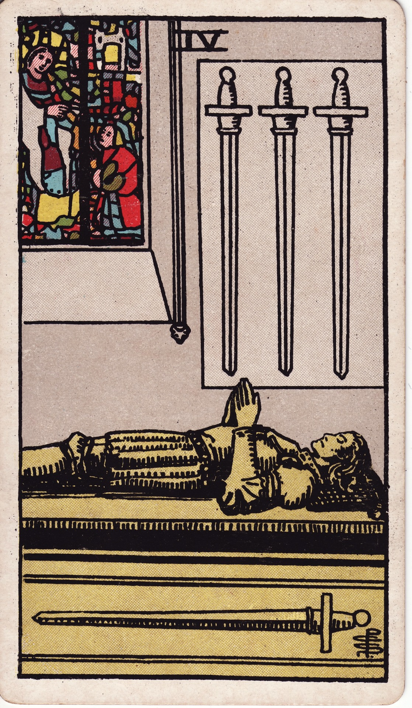

# Four of Swords

The Four of Swords is sanctuary of the mind—a sacred pause that restores clarity, composure, and spiritual stamina. After conflict or overwhelm, it invites retreat, meditation, and quiet integration.

*Keywords:* rest, recovery, contemplation, retreat, mental restoration
*Mood:* serene, hushed, reflective, suspended
*Polarity:* stabilizing, recuperative

*Art interpretation cue:* Depict a figure lying in repose within a chapel or sanctuary, hands folded in prayer or meditation. Three swords may hang overhead while one rests beneath, symbolizing rest under the watch of ongoing challenges.

### Artistic Direction

Convey stillness that heals. The scene should exude reverent quiet, as if every echo is absorbed by sacred stone and stained glass light.

*   **Core Symbolism & Composition:**
    *   **Resting Figure:** Represents deliberate withdrawal from conflict to recover.
    *   **Three Hanging Swords:** External challenges remain but are temporarily set aside.
    *   **Horizontal Sword:** The mind at rest; the answer waiting to be taken up after recuperation.
    *   **Sanctuary Setting:** Gothic windows, altars, or candles emphasize sacred solitude.
*   **Mood & Atmosphere:**
    Use muted gold, cool blues, and soft grays. Light filters gently, highlighting calm faces and folded hands.

### Esoteric Correspondences

*   **Title:** The Lord of Rest from Strife.
*   **Astrology:** Jupiter in Libra (October 13 – October 22). Expansion finds harmony through balanced retreat.
*   **Element:** Air stabilized—mind resting so equilibrium can return.
*   **Kabbalah:** Chesed in Yetzirah (Mercy in the World of Formation). Compassionate pause for the intellect.

### Numerology (4)

Four symbolizes structure and stability. In Swords, it establishes a peaceful container for the mind, offering a respite that rebuilds strength.

### Core Meanings (Upright)

*   **Rest & Recovery:** Taking a break to heal mentally, emotionally, or physically.
*   **Retreat:** Meditation, sabbatical, therapy, or spiritual seclusion.
*   **Quiet Preparation:** Regaining clarity before re-entering conflict.
*   **Mental Reset:** Protecting peace as a strategic choice.

### Core Meanings (Reversed)

*   **Restlessness:** Difficulty sitting still; mind refuses to quiet.
*   **Postponed Healing:** Ignoring the need for rest until burnout occurs.
*   **Returning to Action:** Recovery complete; time to re-engage with the world.
*   **Isolation:** Withdrawal becoming avoidance or loneliness.

### The Card as a Person

*   **Upright:** A contemplative, healer, monk, retreat leader, or counselor advocating for mindful rest.
*   **Reversed:** Someone who overworks, resists downtime, or checks out completely to avoid life.

### Guiding Questions

*   **Upright:**
    *   What sanctuary do I need to create or visit right now?
    *   How can I schedule restorative stillness before crisis forces it?
    *   Which practices calm my nervous system and restore clarity?
    *   What insights arrive only when I allow silence?
*   **Reversed:**
    *   Why am I denying myself rest, and what do I fear will surface if I stop?
    *   How will I know it’s time to rise and re-engage?
    *   Where has solitude slipped into avoidance?
    *   Who can support me in creating sustainable routines?

### Affirmations

*   **Upright:** “Rest is sacred strategy; I replenish so my mind remains wise and clear.”
*   **Reversed:** “I honor the rhythm of retreat and return, trusting the right moment to rise.”

### Love & Relationships

*   **Upright:** A pause to heal, couple retreats, taking space for reflection, honoring boundaries.
*   **Reversed:** Withdrawal, shutting down emotionally, or neglecting connection due to exhaustion.
*   **Self-Question:** “How can quiet time strengthen our relationship rather than distance it?”

### Work & Money

*   **Upright:** Sabbaticals, strategic pauses, mental health days, stepping back before a major decision.
*   **Reversed:** Overwork leading to collapse, refusal to take vacation, or procrastination disguised as rest.
*   **Self-Question:** “What restorative practice will make my next move stronger?”

### Spiritual & Psychological

*   **Themes:** Meditation, prayer, mindful breathing, sleep hygiene, spiritual retreats.
*   **Actionable Advice:**
    1.  **Stillness Ritual:** Set aside 15 minutes daily for silent contemplation or breathwork.
    2.  **Digital Sabbath:** Unplug from screens for a full day to allow mental reset.
    3.  **Sacred Space Creation:** Designate a corner of your home as a meditation nook or rest altar.

### Cross-Card Echoes

*   **Four of Swords ↔ Four of Wands:** Restful sanctuary versus celebratory homecoming—both create stability.
*   **Four of Swords ↔ Hermit:** Seeking wisdom through solitude and introspection.
*   **Four of Swords → Five of Swords:** Emerging from rest into potential conflict; choose your battles wisely.

### Impression Palette

#### Contemplative Prayer

“Let my breath be a lantern, my silence a chapel. In stillness, sharpen my mind for the paths ahead.”

#### Lullaby

Swords on the wall rest—  
mind kneels in a hush of gold.  
Sleep, and rise renewed.
