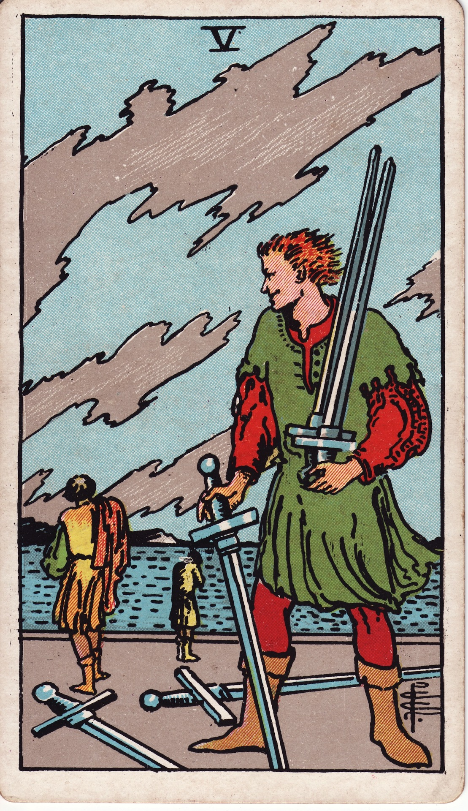

# Five of Swords

The Five of Swords is the aftermath of a hollow victory—the sharp sting of winning at a cost, betrayal, or choosing strategy without honor. It reveals the ethical dilemmas of intellect when used for domination rather than truth.

*Keywords:* conflict, defeat, ego battle, manipulation, hollow victory
*Mood:* tense, bitter, alienating, uneasy
*Polarity:* dynamic, disruptive

*Art interpretation cue:* Depict a figure collecting swords while others walk away defeated. The sky should bruise with unsettled weather, indicating lingering tension and regret.

### Artistic Direction

Convey moral ambiguity. The scene must leave viewers questioning whether victory was worth the cost.

*   **Core Symbolism & Composition:**
    *   **Sword Collector:** The victor holds multiple swords—evidence of conquest and possible opportunism.
    *   **Retreating Figures:** Those defeated walk away, shoulders slumped, illustrating loss or betrayal.
    *   **Stormy Backdrop:** Winds or dark clouds symbolize disrupted harmony.
    *   **Scattered Weapons:** Abandoned swords hint at conflicts left unresolved.
*   **Mood & Atmosphere:**
    Use cold greens, tarnished silvers, and gray-blue skies. Highlight the unsettling calm after conflict.

### Esoteric Correspondences

*   **Title:** The Lord of Defeat.
*   **Astrology:** Venus in Aquarius (January 20 – January 29). Harmony seeks innovation but may sacrifice hearts for ideals.
*   **Element:** Air distorted—intellect wielded without empathy.
*   **Kabbalah:** Geburah in Yetzirah (Severity in the World of Formation). Discipline misapplied becomes cruelty.

### Numerology (5)

Five introduces instability and challenge. In Swords, it stresses ethical tests: will the mind serve integrity or ego?

### Core Meanings (Upright)

*   **Hollow Victory:** Winning through coercion or manipulation that damages relationships.
*   **Conflict & Betrayal:** Arguments where no one truly wins; trust erodes.
*   **Sharp Words:** Sarcasm, cruelty, or gaslighting.
*   **Setting Boundaries:** Walking away from toxic dynamics to protect peace.

### Core Meanings (Reversed)

*   **Reconciliation:** Seeking to repair damage; apologizing, making amends.
*   **Lingering Resentment:** Grudges, inability to move past conflict.
*   **Self-Sabotage:** Defeatist thinking; expecting betrayal.
*   **Choosing Peace:** Refusing to engage in destructive battles.

### The Card as a Person

*   **Upright:** A cunning strategist, debatably ethical competitor, or someone who thrives on intellectual dominance.
*   **Reversed:** Someone haunted by guilt, seeking forgiveness, or repeatedly entering toxic dynamics.

### Guiding Questions

*   **Upright:**
    *   What victory am I pursuing, and at what cost?
    *   Where might I be using intellect to wound rather than understand?
    *   Is it wiser to walk away than to win this fight?
    *   What ethical line must not be crossed?
*   **Reversed:**
    *   Which bridges need mending, and how can I initiate repair?
    *   What beliefs about defeat or unworthiness am I ready to release?
    *   How can I choose peace without sacrificing self-respect?
    *   Who in my life benefits if I soften my approach?

### Affirmations

*   **Upright:** “I choose integrity over empty victory; my words serve truth, not ego.”
*   **Reversed:** “I release the past, seek reconciliation, and engage only in worthy battles.”

### Love & Relationships

*   **Upright:** Petty arguments, power struggles, cutting remarks; a need for honest reflection.
*   **Reversed:** An opening for apology, healing conversations, or choosing to part peacefully.
*   **Self-Question:** “Does winning this argument serve our love—or my ego?”

### Work & Money

*   **Upright:** Competitive sabotage, office politics, harsh critiques.
*   **Reversed:** Repairing professional relationships, rethinking aggressive tactics, or leaving toxic workplaces.
*   **Self-Question:** “How can I advocate for myself without replicating harmful dynamics?”

### Spiritual & Psychological

*   **Themes:** Shadow of intellect, ethical use of strategy, healing after betrayal, compassionate communication.
*   **Actionable Advice:**
    1.  **Conflict Debrief:** Reflect on a recent dispute—identify triggers, patterns, and lessons.
    2.  **Forgiveness Practice:** Write a letter (sent or unsent) offering or requesting forgiveness.
    3.  **Speech Cleanse:** Commit to a period of radically honest yet compassionate speech.

### Cross-Card Echoes

*   **Five of Swords ↔ Five of Wands:** Conflict of mind versus conflict of ambition; discern where to engage.
*   **Five of Swords ↔ Justice:** Justice balances the scales after unethical wins; accountability restores equilibrium.
*   **Five of Swords → Six of Swords:** Healing begins when you move away from toxic battlegrounds.

### Impression Palette

#### Moral Fable

“He gathered the swords and stood alone. The wind asked, ‘Was it worth the silence that follows?’”

#### Bitter Haiku

Victory tastes cold—  
lonely steel clinks in my hands.  
Who is cheering now?
