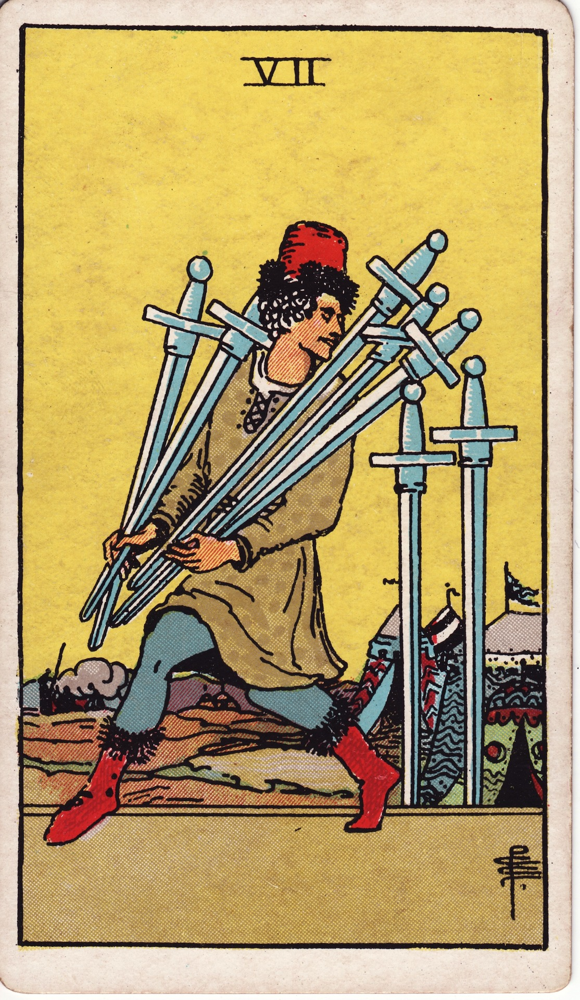

# Seven of Swords

The Seven of Swords is the strategy of shadows—the art of subtle moves, cunning plans, and the delicate dance between honesty and secrecy. It cautions against deception while honoring the need for clever tactics.

*Keywords:* strategy, stealth, deception, independence, cunning
*Mood:* sly, cautious, strategic, alert
*Polarity:* dynamic, covert

*Art interpretation cue:* Depict a figure slipping away with five swords in hand while two remain behind. The camp or encampment in the background suggests stealthy action taken on the fringes of community.

### Artistic Direction

Convey tension between cleverness and risk. The composition should pulse with quiet footsteps and sidelong glances.

*   **Core Symbolism & Composition:**
    *   **Stolen Swords:** Five blades carried away represent plans, ideas, or resources being taken or reclaimed.
    *   **Two Swords Left Behind:** Remain as trail markers or unfinished business.
    *   **Tent Camp:** Indicates actions taken on the periphery—either spying, avoiding confrontation, or acting covertly.
    *   **Sneaking Figure:** Expression should hint at motives—determined, anxious, or mischievous.
*   **Mood & Atmosphere:**
    Use twilight golds, muted blues, and shadowed violets. Lengthen shadows to increase suspense.

### Esoteric Correspondences

*   **Title:** The Lord of Unstable Effort.
*   **Astrology:** Moon in Aquarius (February 9 – February 18). Unorthodox tactics driven by intuition; emotional detachment guiding strategy.
*   **Element:** Air in flux—ideas maneuvering around obstacles.
*   **Kabbalah:** Netzach in Yetzirah (Victory in the World of Formation). Perseverance of intellect through indirect approaches.

### Numerology (7)

Seven tests and challenges. In Swords, it demands discernment about when to confront, when to negotiate, and when to move quietly.

### Core Meanings (Upright)

*   **Clever Strategy:** Thinking outside the box to solve problems.
*   **Independent Action:** Handling matters solo, reclaiming agency.
*   **Diplomacy & Tactics:** Navigating situations that require discretion.
*   **Protecting Ideas:** Guarding intellectual property or plans from misuse.

### Core Meanings (Reversed)

*   **Exposure:** Deception discovered, secrets revealed.
*   **Self-Deceit:** Fooling yourself, rationalizing dubious choices.
*   **Confession:** Choosing transparency after covert actions.
*   **Paranoia:** Seeing betrayal everywhere, undermining trust.

### The Card as a Person

*   **Upright:** A strategist, spy, hacker, journalist, or innovator who thrives on stealth and ingenuity.
*   **Reversed:** Someone manipulative, dishonest, or trapped in their own schemes.

### Guiding Questions

*   **Upright:**
    *   Where do I need a more strategic or subtle approach?
    *   Which plans should remain confidential for now?
    *   How can I ensure my tactics align with integrity?
    *   Is independence empowering me or isolating me?
*   **Reversed:**
    *   What truth needs to be told before it emerges without my consent?
    *   Where am I sabotaging myself by withholding information?
    *   How can transparency create better alliances?
    *   What fear drives my secrecy, and is it still valid?

### Affirmations

*   **Upright:** “I employ strategy wisely, honoring both cleverness and conscience.”
*   **Reversed:** “I release deception and step into honest, empowered action.”

### Love & Relationships

*   **Upright:** Private plans, elopements, or navigating complex dynamics with discretion.
*   **Reversed:** Secrets, lies, infidelity, or mistrust eroding intimacy.
*   **Self-Question:** “How can I ensure honesty while protecting sensitive truths?”

### Work & Money

*   **Upright:** Strategic negotiations, protecting trade secrets, or innovating quietly before launch.
*   **Reversed:** Office politics exposed, plagiarism, legal issues related to dishonesty.
*   **Self-Question:** “Does my approach balance discretion with ethical responsibility?”

### Spiritual & Psychological

*   **Themes:** Shadow work around honesty, reclaiming agency, discerning between intuition and paranoia.
*   **Actionable Advice:**
    1.  **Integrity Scan:** Examine where you’re acting in secret—does it align with your values?
    2.  **Strategy Session:** Outline a plan with contingencies to handle obstacles gracefully.
    3.  **Truth Ritual:** Confess a hidden truth in a safe space—journal, therapist, or trusted ally.

### Cross-Card Echoes

*   **Seven of Swords ↔ Seven of Wands:** Tactics versus direct defense; choose the method that honors your truth.
*   **Seven of Swords ↔ High Priestess:** Both value secrecy, but the Priestess holds sacred mystery while the Seven risks deception.
*   **Seven of Swords → Eight of Swords:** Poorly aligned strategy can lead to self-imposed traps.

### Impression Palette

#### Espionage Memo

“Target acquired. Five blades secured. Returning before dawn—leave the lantern in the eastern tower if the path is clear.”

#### Noir Monologue

I moved like cigarette smoke,  
through the seams of the camp.  
Truth is, I wasn’t stealing—  
just reclaiming what the night forgot it owed me.
