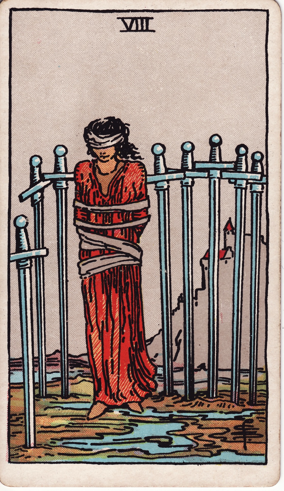

# Eight of Swords

The Eight of Swords is the prison of perception—feeling trapped, bound by fear or self-imposed limitations. Though the bindings seem tight, freedom is possible once you recognize the power of perspective.

*Keywords:* restriction, self-limitation, fear, mental prison, paralysis
*Mood:* anxious, constrained, uncertain, tentative
*Polarity:* receptive, inhibited

*Art interpretation cue:* Show a blindfolded figure bound loosely, surrounded by eight swords planted in the ground. The landscape should be dreary, yet a path to freedom glimmers nearby.

### Artistic Direction

Highlight the paradox: the cage appears solid, yet its bars are incomplete. Emphasize the psychological nature of the trap.

*   **Core Symbolism & Composition:**
    *   **Bound Figure:** Wrists tied, eyes blindfolded, representing limited vision and self-restraint.
    *   **Swords as Bars:** Arranged like a partial cage; there is an opening if the figure chooses to move.
    *   **Marshland or Mud:** Difficult terrain indicates discomfort, but the ground is navigable with care.
    *   **Castle in Distance:** Hope and refuge exist, but require courage to reach.
*   **Mood & Atmosphere:**
    Use muted grays, overcast skies, and soft blues. Allow a subtle shaft of light to suggest possibility.

### Esoteric Correspondences

*   **Title:** The Lord of Shortened Force.
*   **Astrology:** Jupiter in Gemini (May 21 – May 30). Expansion caught in duality; optimism hampered by conflicting thoughts.
*   **Element:** Air constrained—analysis becoming paralysis.
*   **Kabbalah:** Hod in Yetzirah (Splendor in the World of Formation). Intellect needs recalibration to restore flow.

### Numerology (8)

Eight denotes cycles, power, and mastery. In Swords, it points to mind-made binds and the opportunity to reclaim agency through new mental patterns.

### Core Meanings (Upright)

*   **Feeling Trapped:** Circumstances seem restrictive; anxiety clouds options.
*   **Self-Doubt:** Believing you are powerless when solutions exist.
*   **Victim Mindset:** Externalizing control, waiting for rescue.
*   **Need for Clarity:** Removing blindfolds—seeking perspective, asking for help.

### Core Meanings (Reversed)

*   **Release:** Breaking free from limiting beliefs; empowerment returns.
*   **New Perspective:** Seeing options where none seemed available.
*   **Risk of Regression:** Fear tempting you back into old patterns.
*   **Self-Sabotage Exposed:** Awareness of how thoughts shape experience.

### The Card as a Person

*   **Upright:** Someone feeling powerless, overwhelmed by anxiety, or stuck in analysis paralysis.
*   **Reversed:** A person reclaiming agency, challenging cognitive distortions, or supporting others’ liberation.

### Guiding Questions

*   **Upright:**
    *   What beliefs or fears keep me immobilized?
    *   Where am I waiting for permission that only I can grant?
    *   Who can provide perspective or assistance?
    *   What small, brave step can I take despite uncertainty?
*   **Reversed:**
    *   What internal shift recently liberated me, and how can I reinforce it?
    *   Where am I tempted to return to familiar restrictions?
    *   How can I support others who feel trapped?
    *   What daily practices keep my mind expansive and resilient?

### Affirmations

*   **Upright:** “I loosen the bindings of fear and trust my ability to choose a new path.”
*   **Reversed:** “I walk free from old constraints, guided by clarity and courage.”

### Love & Relationships

*   **Upright:** Feeling trapped in a relationship dynamic, fear of speaking truth, or emotional paralysis.
*   **Reversed:** Seeking counseling, communicating honestly, moving toward liberation together or apart.
*   **Self-Question:** “Where can boundaries or transparency set us both free?”

### Work & Money

*   **Upright:** Stagnant job situations, bureaucratic red tape, fear of taking risks.
*   **Reversed:** Career breakthroughs, quitting limiting jobs, embracing innovative solutions.
*   **Self-Question:** “Which assumptions about my career or finances deserve reevaluation?”

### Spiritual & Psychological

*   **Themes:** Cognitive distortions, anxiety work, therapy, mindfulness, reclaiming sovereignty.
*   **Actionable Advice:**
    1.  **Thought Inquiry:** Challenge repeated negative beliefs—ask “Is this true? Who would I be without it?”
    2.  **Embodied Shift:** Practice grounding exercises—walk barefoot, stretch, move—to remind yourself of physical agency.
    3.  **Ask for Insight:** Reach out to mentors, coaches, or supportive friends for new perspectives.

### Cross-Card Echoes

*   **Eight of Swords ↔ Eight of Cups:** Mental versus emotional escape—both invite courageous departures.
*   **Eight of Swords ↔ Devil:** Examine where bondage is self-imposed; reclaim personal power.
*   **Eight of Swords → Nine of Swords:** Left unchecked, anxious thoughts can spiral into deeper distress; intervene early.

### Impression Palette

#### Inner Monologue

“The ropes bite only where I cling. If I dare to turn, the gap between swords widens. The castle lights are waiting.”

#### Chain-Break Haiku

Whispers bind my eyes,  
yet wind sings of open paths.  
Step. The cage dissolves.
