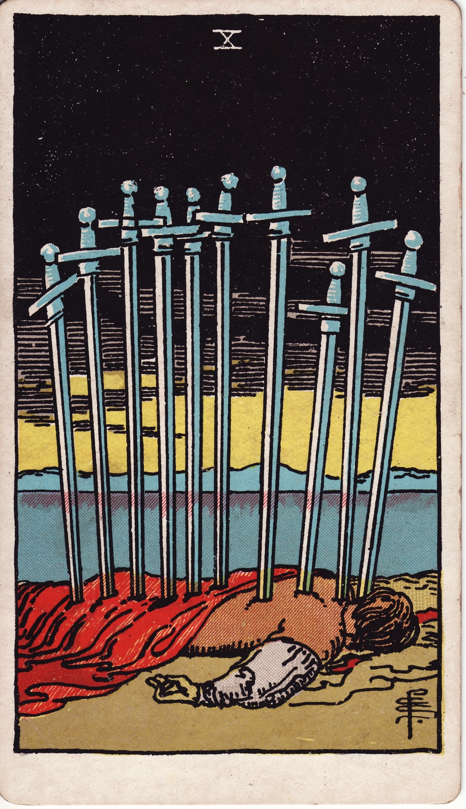

# Ten of Swords

The Ten of Swords is the terminus of the mind’s battle—the absolute ending, the collapse after overthinking, the surrender to what can no longer continue. Though stark, it marks a dawn beyond devastation.

*Keywords:* painful ending, rock bottom, surrender, finality, release
*Mood:* stark, sobering, cathartic, hollow-then-hopeful
*Polarity:* stabilizing, conclusive

*Art interpretation cue:* Portray a figure lying prone with ten swords piercing their back under a darkened sky. Beyond, the horizon should brighten, signaling new beginnings beyond the ending.

### Artistic Direction

Depict devastation with dignity. The composition must acknowledge pain while hinting unmistakably at dawn rising beyond the scene.

*   **Core Symbolism & Composition:**
    *   **Fallen Figure:** Represents the culmination of mental or verbal battles—nothing more can be added.
    *   **Ten Swords:** Overkill, overload, or the final blow; a dramatic depiction of completion.
    *   **Dark Clouds:** The crisis has peaked; the worst has happened.
    *   **Rising Sun:** New hope already appearing; endings make room for rebirth.
*   **Mood & Atmosphere:**
    Use inky blacks, steel grays, and blood reds, contrasted with a blaze of gold on the horizon. Let light break through resolutely.

### Esoteric Correspondences

*   **Title:** The Lord of Ruin.
*   **Astrology:** Sun in Gemini (June 11 – June 20). Awareness of duality leads to decisive endings; the mind admits what must conclude.
*   **Element:** Air exhausted—thought burned out, forcing surrender to reality.
*   **Kabbalah:** Malkuth in Yetzirah (Kingdom in the World of Formation). The mental realm reaches its limit in material consequence.

### Numerology (10)

Ten symbolizes completion and transition to a new cycle. In Swords, it signals a dramatic finale; no more analysis remains—only acceptance and release.

### Core Meanings (Upright)

*   **Final Ending:** A chapter definitively closes—relationships, jobs, beliefs, or narratives.
*   **Rock Bottom:** Exhaustion, defeat, or burnout demanding surrender.
*   **Release of Burden:** Once the worst is acknowledged, rebuilding begins.
*   **Truth Revealed:** Denial shattered; reality faced with clarity.

### Core Meanings (Reversed)

*   **Recovery Begins:** Rising after collapse; gradual regeneration.
*   **Lingering Pain:** Difficulty letting go; reliving trauma.
*   **Resistance to Ending:** Holding on despite knowing it’s over.
*   **New Dawn:** Choosing survival, resilience, and renewed purpose.

### The Card as a Person

*   **Upright:** Someone who has hit a wall, experienced betrayal, or is acknowledging finality with courage.
*   **Reversed:** A survivor rebuilding after trauma or someone reluctant to accept necessary closure.

### Guiding Questions

*   **Upright:**
    *   What story has reached its conclusion, no matter how I resist?
    *   How can surrender become liberation?
    *   Which support systems will help me rebuild?
    *   What wisdom does this ending reveal about my boundaries and needs?
*   **Reversed:**
    *   How will I honor the healing process as I rise again?
    *   Where am I reliving old pain—and how can I gently stop?
    *   Who can help me accept what’s over so new beginnings take root?
    *   What fresh commitments am I ready to make?

### Affirmations

*   **Upright:** “I release what has ended and allow dawn to find me.”
*   **Reversed:** “I rise from the ashes of old stories, renewed and resolute.”

### Love & Relationships

*   **Upright:** Breakups, divorces, betrayal exposed, or a relationship ending decisively.
*   **Reversed:** Healing post-breakup, closure, or resisting necessary endings.
*   **Self-Question:** “How can I honor the ending while trusting love will return in healthier forms?”

### Work & Money

*   **Upright:** Layoffs, failed ventures, burnout, or recognizing a project must end.
*   **Reversed:** New career beginnings after loss, learning from failure, or resisting change.
*   **Self-Question:** “Which lessons will guide my next chapter toward integrity and sustainability?”

### Spiritual & Psychological

*   **Themes:** Ego death, dark night of the soul, shadow integration, phoenix moments.
*   **Actionable Advice:**
    1.  **Endings Ritual:** Mark the closure with ceremony—burn, bury, or release symbols of what is finished.
    2.  **Restoration Plan:** Outline steps for recovery—rest, therapy, allies, nourishment.
    3.  **Sunrise Practice:** Watch the dawn intentionally; let the rising sun mirror your resilience.

### Cross-Card Echoes

*   **Ten of Swords ↔ Ten of Wands:** Mental versus physical overload; together they urge radical simplification.
*   **Ten of Swords ↔ Death:** Both signify endings; the Ten emphasizes mental surrender, Death the transformative rebirth.
*   **Ten of Swords → Ace of Swords:** When the mind is cleared to zero, a new, honest idea can be born.

### Impression Palette

#### Dawn Invocation

“Night yields; I surrender the wreckage. Rise, sun, and write a new chapter on the horizon of my bones.”

#### Minimalist Tercet

Steel sky fractures—light.  
Ten blades find their final rest.  
Breath returns with dawn.
