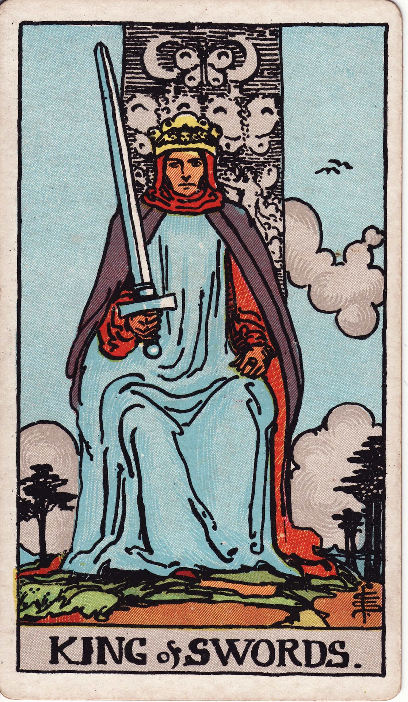

# King of Swords

The King of Swords is sovereign reason—a strategic commander who wields intellect, ethics, and authority with unwavering integrity. He represents mastery of the mind applied to leadership, law, and long-term vision.

*Keywords:* authority, strategy, ethical leadership, intellect, governance
*Mood:* judicious, composed, authoritative, clear
*Polarity:* directive, analytical

*Art interpretation cue:* Portray the King seated on a high throne carved with butterflies and stern symbolic faces. His sword stands upright, and his gaze meets the viewer directly, signaling uncompromising truth.

### Artistic Direction

Depict an aura of judicious command. The King should feel like both a judge and a strategist—fair, formidable, and decisive.

*   **Core Symbolism & Composition:**
    *   **Upright Sword:** Represents absolute clarity, justice, and the rule of law.
    *   **Throne & Crown:** Decorated with airy motifs—cherubs, birds, clouds—signifying intellect and authority.
    *   **Wind-Swept Cloak:** Suggests agility of thought and responsiveness.
    *   **Mountainous Horizon:** Emphasizes high perspective, long-range planning.
*   **Mood & Atmosphere:**
    Use steel blues, frosted whites, and hints of regal purple. Lighting should accentuate crisp edges and solemn dignity.

### Esoteric Correspondences

*   **Title:** The Prince of the Chariots of the Winds.
*   **Astrology:** Air of Air—pure mental mastery, ruling 20° Taurus to 20° Gemini.
*   **Element:** Air of Air. Strategic intellect applied to governance and systems.
*   **Kabbalah:** Chokmah to Tiphareth in Yetzirah. Wisdom filters into balanced administration.

### Archetypal Role

Kings (or Princes) embody outward mastery and stewardship. In Swords, the King is the judge, policy-maker, CEO, or respected elder offering objective guidance and enforcing law.

### Core Meanings (Upright)

*   **Strategic Leadership:** Making decisions with logic, foresight, and fairness.
*   **Authority in Thought:** Expertise, critical thinking, command of communication.
*   **Ethical Governance:** Aligning policies with integrity; upholding justice.
*   **Clear Communication:** Delivering judgments or advice with precision.

### Core Meanings (Reversed)

*   **Manipulative Control:** Coldness, authoritarian tendencies, weaponizing intellect.
*   **Abdication of Responsibility:** Avoiding decisions, misusing authority.
*   **Rigid Thinking:** Stubborn logic ignoring nuance or empathy.
*   **Legal/Communication Issues:** Contracts mismanaged, unfair rulings, misuse of law.

### The Card as a Person

*   **Upright:** A judge, professor, consultant, executive, or elder statesman respected for ethical clarity.
*   **Reversed:** A tyrant, biased official, or detached leader using intellect to dominate or evade accountability.

### Guiding Questions

*   **Upright:**
    *   What decision requires my highest integrity and strategic vision?
    *   How can I use my influence to create fair systems?
    *   Where does clear communication strengthen my leadership?
    *   Who benefits when I mentor with honesty and rigor?
*   **Reversed:**
    *   Where might I be substituting intellect for empathy?
    *   What responsibilities am I avoiding that must be faced?
    *   How can I invite diverse perspectives to avoid rigid thinking?
    *   Am I enforcing rules fairly, or favoring convenience?

### Affirmations

*   **Upright:** “I lead with truth, wisdom, and uncompromising integrity.”
*   **Reversed:** “I temper authority with empathy and invite accountability.”

### Love & Relationships

*   **Upright:** Mature communication, intellectual partnership, respect for autonomy.
*   **Reversed:** Emotional distance, overly critical tone, treating relationships like negotiations.
*   **Self-Question:** “How can leadership in love include vulnerability and warmth?”

### Work & Money

*   **Upright:** Boardroom decisions, legal rulings, strategic planning, mentorship.
*   **Reversed:** Biased leadership, poor counsel, bureaucratic red tape, manipulation.
*   **Self-Question:** “Where can ethical strategy elevate our mission?”

### Spiritual & Psychological

*   **Themes:** Mentorship, cognitive mastery, communication discipline, intellectual sovereignty.
*   **Actionable Advice:**
    1.  **Ethics Audit:** Review policies, behaviors, or beliefs—do they align with your moral compass?
    2.  **Mentor Outreach:** Offer guidance to someone who can benefit from your experience.
    3.  **Clarity Practice:** Practice concise communication—write or speak your truth in three sentences or fewer.

### Cross-Card Echoes

*   **King of Swords ↔ King of Cups:** Mind co-creates with heart—pair intellect with emotional intelligence.
*   **King of Swords ↔ Justice:** Both uphold law and fairness; the King enacts what Justice decrees.
*   **King of Swords → Ace of Swords:** His decrees inspire new beginnings grounded in truth and clarity.

### Impression Palette

#### Edict

“By my word, let truth prevail. No shadowed motive shall divert the winds of justice.”

#### Regal Haiku

Sword poised in pure air—  
verdict carried on the breeze.  
Reason crowns the day.
