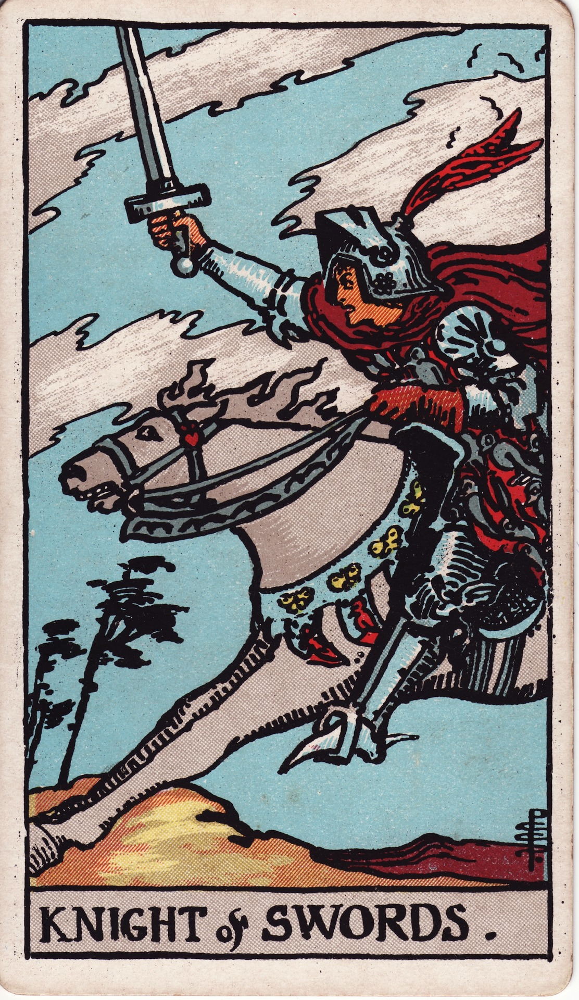

# Knight of Swords

The Knight of Swords is the charge of intellect—a fearless crusader of ideas, debate, and decisive communication. He races toward truth, driven by logic and urgency, eager to cut through confusion with swift action.

*Keywords:* decisive action, swift communication, intellectual bravery, ambition, urgency
*Mood:* intense, focused, quick, uncompromising
*Polarity:* dynamic, cutting

*Art interpretation cue:* Illustrate a knight charging forward on a galloping horse, sword held high against turbulent clouds. The wind whips his cape, underscoring speed and determination.

### Artistic Direction

Capture relentless momentum. The Knight’s expression should reflect laser focus and conviction as he rides into the fray.

*   **Core Symbolism & Composition:**
    *   **Galloping Steed:** Represents rapid thought and movement—no hesitation.
    *   **Raised Sword:** The weapon of reason cutting through chaos.
    *   **Storm Clouds:** Turbulent skies echo intellectual conflict or urgent stakes.
    *   **Feathered Helmet:** Symbolizes air, communication, and agility.
*   **Mood & Atmosphere:**
    Use steely grays, vibrant whites, and electric blues. Motion lines and wind-swept clouds convey velocity.

### Esoteric Correspondences

*   **Title:** The Lord of the Winds and the Breezes, the King of the Spirits of Air.
*   **Astrology:** Fire of Air—passion energizing intellect, ruling 20° Capricorn to 20° Aquarius.
*   **Element:** Fire of Air. Ideas pursued with zeal and decisive motion.
*   **Kabbalah:** Tiphareth in Yetzirah (Beauty in the World of Formation). Harmonized brilliance wielded outward.

### Archetypal Role

Knights (or Princes) embody pursuit and mission. In Swords, the Knight is the activist, journalist, litigator, or scholar racing to defend truth and dismantle ignorance.

### Core Meanings (Upright)

*   **Swift Decision:** Acting quickly on insight; launching bold initiatives.
*   **Passionate Debate:** Speaking up, defending beliefs, challenging injustice.
*   **Focused Ambition:** Pursuing goals with clarity and intensity.
*   **Message in Motion:** Important news, negotiations, or travel requiring speed.

### Core Meanings (Reversed)

*   **Rash Actions:** Acting without full information; impulsive judgments.
*   **Verbal Aggression:** Arrogance, cruelty, or intellectual bullying.
*   **Scattered Focus:** Starting many missions, finishing few.
*   **Delayed Plans:** Obstacles slow progress; frustration builds.

### The Card as a Person

*   **Upright:** A lawyer, journalist, activist, or strategist who leaps into action with fierce intellect.
*   **Reversed:** A reckless debater, online troll, or hot-tempered thinker whose words wound.

### Guiding Questions

*   **Upright:**
    *   What truth requires swift, decisive advocacy?
    *   How can I channel my mental energy into purposeful action?
    *   Where can courageously speaking up make a difference?
    *   How do I maintain integrity while moving fast?
*   **Reversed:**
    *   Where do I need to slow down and verify facts?
    *   How can I temper harsh delivery with empathy?
    *   What mission deserves focus instead of scattering my efforts?
    *   How can patience amplify the impact of my message?

### Affirmations

*   **Upright:** “I wield my mind like lightning—clear, courageous, and precise.”
*   **Reversed:** “I temper speed with wisdom so my words create, not destroy.”

### Love & Relationships

*   **Upright:** Direct conversations, intellectual chemistry, shared battles for justice.
*   **Reversed:** Arguments, critical tone, impatience with emotional processes.
*   **Self-Question:** “How can I speak passionately while honoring emotional timing?”

### Work & Money

*   **Upright:** Quick decision-making, crisis management, successful negotiation, rapid promotions.
*   **Reversed:** Reckless spending, hasty contracts, or communications mishaps.
*   **Self-Question:** “Where will smart strategy plus swift action create the greatest win?”

### Spiritual & Psychological

*   **Themes:** Courageous thinking, mental activism, righteous anger transformed into action.
*   **Actionable Advice:**
    1.  **Mission Statement:** Clarify the cause you’re charging toward; write it as a rallying cry.
    2.  **Breath Check:** Pair rapid action with grounding breath to avoid burnout.
    3.  **Debate with Grace:** Practice presenting your argument and inviting dialogue rather than domination.

### Cross-Card Echoes

*   **Knight of Swords ↔ Knight of Wands:** Mind and will charging together—brilliant but potentially reckless.
*   **Knight of Swords ↔ Justice:** Align swift action with fairness and law.
*   **Knight of Swords → Queen of Swords:** Tempered experience refines raw intellect into discerning wisdom.

### Impression Palette

#### Battle Dispatch

“Charging east. Storm on the horizon. Sword drawn for the truth we swore to defend—see you at first light.”

#### Speed Sonnet (Couplet)

Words like thunderbolt—  
I ride thought’s tempest, blade of clarity.
