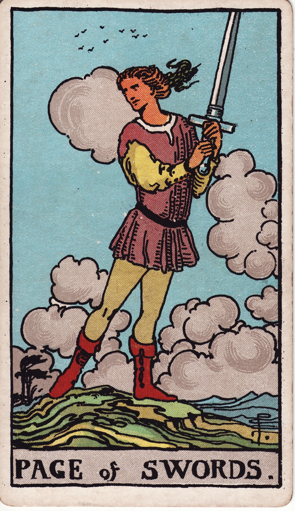

# Page of Swords

The Page of Swords is the inquisitive messenger of the mind—the eager student, swift communicator, and agile observer who thrives on questions and fresh ideas. They arrive when curiosity needs a voice.

*Keywords:* curiosity, communication, vigilance, new ideas, youthful intellect
*Mood:* alert, breezy, quick-witted, restless
*Polarity:* dynamic, exploratory

*Art interpretation cue:* Depict a youthful figure poised with a sword raised, hair and cloak whipping in the wind. Clouds swirl behind them, suggesting quick thoughts and shifting perspectives.

### Artistic Direction

Capture alert readiness. The Page stands watch over new information, ready to pivot and share.

*   **Core Symbolism & Composition:**
    *   **Raised Sword:** Prepared to engage, defend ideas, or announce news.
    *   **Windy Landscape:** Represents rapid thoughts, active intellect, and changeable plans.
    *   **Bright Eyes & Posture:** Suggest attentiveness, curiosity, and readiness to act.
    *   **Birds in Flight:** Signal communication, messages, and higher perspective.
*   **Mood & Atmosphere:**
    Use icy blues, pale golds, and gusty whites. Let the scene feel brisk and invigorating.

### Esoteric Correspondences

*   **Title:** Princess of the Rushing Winds, the Lotus of the Palace of Air.
*   **Astrology:** Earth of Air—grounding ideas into reality, ruling from 0° Libra to 0° Capricorn.
*   **Element:** Earth of Air. Fresh ideas seeking practical expression.
*   **Kabbalah:** Malkuth in Yetzirah (Kingdom in the World of Formation). The tangible world becomes the laboratory for thought.

### Archetypal Role

Pages (or Princesses) embody beginnings, messages, and learners. In Swords, the Page is the student journalist, budding writer, or curious analyst collecting data and sharing insight.

### Core Meanings (Upright)

*   **Curious Mind:** Asking questions, learning, researching.
*   **Communicative Spark:** Important news, announcements, or social media activity.
*   **Alertness:** Paying attention to details, watching the horizon for change.
*   **Intellectual Exploration:** Studying, experimenting, and debating with enthusiasm.

### Core Meanings (Reversed)

*   **Gossip or Rumors:** Miscommunication, speaking before verifying.
*   **Mental Restlessness:** Inconsistent focus, information overload.
*   **Immaturity:** Arguments for attention, blunt delivery without tact.
*   **Delayed News:** Messages slow to arrive; patience needed.

### The Card as a Person

*   **Upright:** A student, writer, journalist, analyst, or young activist eager to learn and speak out.
*   **Reversed:** Someone nosy, indiscreet, or overwhelmed by curiosity without discernment.

### Guiding Questions

*   **Upright:**
    *   What am I curious about, and how can I explore it deeply?
    *   Which conversations need honesty, even if awkward?
    *   How can I observe before reacting?
    *   What new skill or study calls to me?
*   **Reversed:**
    *   Where do I need better filters for the information I consume?
    *   How can I ground restless thoughts into action?
    *   What do I need to verify before sharing?
    *   How can I communicate more thoughtfully?

### Affirmations

*   **Upright:** “I honor my curiosity and share truth with clarity and care.”
*   **Reversed:** “I pause to verify and channel my quick mind with integrity.”

### Love & Relationships

*   **Upright:** Honest conversations, intellectual chemistry, playful banter.
*   **Reversed:** Overanalyzing texts, miscommunication, or spying due to insecurity.
*   **Self-Question:** “How can I communicate openly while respecting privacy?”

### Work & Money

*   **Upright:** Research projects, interviews, internships requiring adaptability.
*   **Reversed:** Office gossip, misunderstandings, or lack of follow-through on ideas.
*   **Self-Question:** “Where can learning or networking open new doors?”

### Spiritual & Psychological

*   **Themes:** Beginner’s mind, truth-seeking, intellectual honesty, mindfulness in speech.
*   **Actionable Advice:**
    1.  **Curiosity Journal:** Note questions that intrigue you; research one daily.
    2.  **Listening Practice:** Spend a conversation focusing on deep listening before responding.
    3.  **Skill Sprint:** Commit to learning a new skill in small, consistent intervals.

### Cross-Card Echoes

*   **Page of Swords ↔ Page of Pentacles:** Curiosity of mind meets curiosity of craft—study plus practice.
*   **Page of Swords → Knight of Swords:** Inquisitiveness evolves into decisive, swift action.
*   **Page of Swords ↔ Magician:** Harnessing words and ideas to manifest reality.

### Impression Palette

#### Dispatch

“Breaking breeze: signals shift on the northern ridge. I’ll keep watch—ink and blade ready.”

#### Whipcrack Haiku

Question sparks the wind—  
blade lifted to catch the news.  
Truth waits on my tongue.
