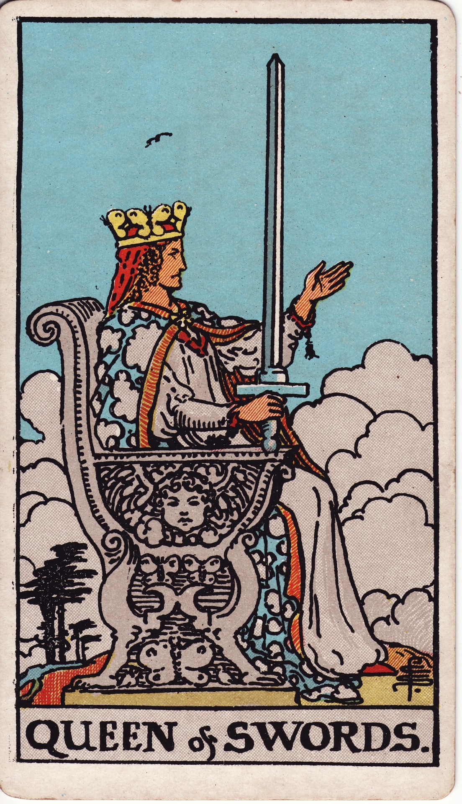

# Queen of Swords

The Queen of Swords is sovereign intellect—clear-eyed, discerning, and impeccably honest. She blends sharp logic with compassionate boundaries, offering counsel rooted in truth and lived experience.

*Keywords:* discernment, honesty, independence, perceptiveness, objective wisdom
*Mood:* cool, composed, incisive, dignified
*Polarity:* receptive, analytical

*Art interpretation cue:* Depict the Queen seated on a throne adorned with butterflies and clouds. One hand holds an upright sword; the other extends outward, signaling receptivity to truth and readiness to cut through illusion.

### Artistic Direction

Portray regal clarity. The Queen must appear approachable yet formidable—a counselor who invites truth and enforces boundaries.

*   **Core Symbolism & Composition:**
    *   **Upright Sword:** Signifies unflinching commitment to truth and justice.
    *   **Outstretched Hand:** Welcomes honest dialogue and fair hearing.
    *   **Butterflies & Birds:** Symbols of transformation, intellect, and perspective.
    *   **Clouded Throne:** Represents the airy throne of thought and the Queen’s dominion over the mind.
*   **Mood & Atmosphere:**
    Use cool blues, silvers, and crisp whites. The lighting should highlight clarity, with minimal shadow.

### Esoteric Correspondences

*   **Title:** The Queen of the Thrones of Air.
*   **Astrology:** Water of Air—emotional intelligence merged with cool rationality, ruling 20° Virgo to 20° Libra.
*   **Element:** Water of Air. Empathetic intellect, intuitive analysis.
*   **Kabbalah:** Binah to Tiphareth in Yetzirah. Understanding shapes balanced expression of truth.

### Archetypal Role

Queens (or Thrones) embody receptive mastery and influence. In Swords, the Queen is the judge, editor, therapist, or strategist who sees through pretense and offers precise guidance.

### Core Meanings (Upright)

*   **Discerning Wisdom:** Making decisions with clarity and fairness.
*   **Honest Communication:** Speaking truth kindly but directly.
*   **Healthy Boundaries:** Protecting energy, enforcing standards.
*   **Objective Insight:** Seeing patterns and motives with precision.

### Core Meanings (Reversed)

*   **Coldness:** Emotional detachment, blunt critique, cynicism.
*   **Overanalysis:** Paralyzed by overthinking or mistrust.
*   **Grief-Guarded:** Wounds turning into bitterness or aloofness.
*   **Miscommunication:** Sharp words alienating allies.

### The Card as a Person

*   **Upright:** A wise advisor, lawyer, editor, teacher, or mentor who uplifts others through honest counsel.
*   **Reversed:** Someone distant, suspicious, or cutting—protective walls too high to let warmth in.

### Guiding Questions

*   **Upright:**
    *   Where must I apply clear boundaries or honest truth?
    *   How can I pair empathy with precision in communication?
    *   What data supports my decisions, and what does intuition add?
    *   How do I model integrity for others?
*   **Reversed:**
    *   Where has pain hardened into cynicism?
    *   How can I soften my delivery without compromising truth?
    *   What emotional needs have I deferred in favor of intellect?
    *   Who can help me reframe a story that feels stuck?

### Affirmations

*   **Upright:** “I honor truth and insight, guiding with clarity and compassionate boundaries.”
*   **Reversed:** “I allow warmth and vulnerability to temper my sharp mind.”

### Love & Relationships

*   **Upright:** Mature conversations, honesty, respect for personal space, intellectual compatibility.
*   **Reversed:** Detachment, judgment, emotional distance, or fear of intimacy due to past hurts.
*   **Self-Question:** “How can honesty and warmth co-exist in my connections?”

### Work & Money

*   **Upright:** Strategic leadership, legal matters, writing, editing, policy-making, critical thinking roles.
*   **Reversed:** Harsh critiques at work, micromanaging, or analysis paralysis delaying decisions.
*   **Self-Question:** “Where can precise insight streamline our goals?”

### Spiritual & Psychological

*   **Themes:** Air + water integration, truth-telling rituals, therapy, clarity meditations.
*   **Actionable Advice:**
    1.  **Truth Letter:** Write an honest letter to yourself or someone else—send it or keep it ritualistically.
    2.  **Thought Audit:** List recurring thoughts; categorize them as fact, fear, or intuition.
    3.  **Boundary Blessing:** Speak aloud the boundaries protecting your well-being; visualize them as radiant sigils.

### Cross-Card Echoes

*   **Queen of Swords ↔ Queen of Cups:** Mind meets heart—use discernment without losing compassion.
*   **Queen of Swords → King of Swords:** Personal wisdom evolves into institutional leadership.
*   **Queen of Swords ↔ Justice:** Both weigh truth, fairness, and ethical discernment.

### Impression Palette

#### Judicial Soliloquy

“Bring me the facts, lay bare the motives, and I will hand back a verdict wrapped in wisdom.”

#### Frosted Haiku

Blade bright in the breeze—  
truths crystallize on her tongue.  
Clarity is kind.
