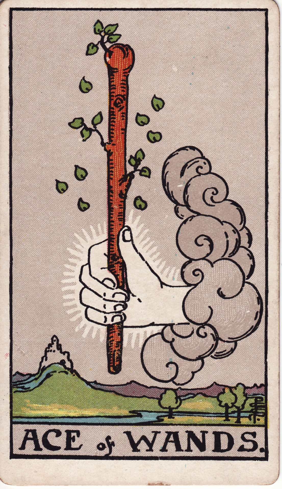

# Ace of Wands

The Ace of Wands is the primal spark of creation—the lightning strike that ignites purpose, passion, and raw initiative. It signals a moment when the soul is called to act, when inspiration flares like wildfire and demands to be given form. This is the sacred ember from which a whole adventure can blaze.

*Keywords:* creative ignition, bold beginnings, raw passion, divine spark
*Mood:* electric, sun-drenched, audacious, hungry
*Polarity:* dynamic, expansive

*Art interpretation cue:* Portray a hand or sacred figure presenting a staff that blazes with living fire. The background should feel like a horizon on the verge of dawn—charged, expectant, humming with heat.

### Artistic Direction

Depict a moment of ignition. Everything in the composition should suggest motion that is about to erupt, a flame that refuses containment.

*   **Core Symbolism & Composition:**
    *   **The Flaming Wand:** A staff sprouting leaves or embers that form blooming sparks. Show the wand as alive—growing, glowing, or crowned with flame.
    *   **The Hand of Spirit:** Often an ethereal hand emerges from a cloud, offering the wand as a divine commission. Include subtle solar motifs or phoenix feathers to emphasize sacred fire.
    *   **The Landscape:** Rolling hills, distant castles, or a path disappearing into a bright horizon hint at the journey awaiting the querent once they accept the torch.
    *   **Hidden Seeds:** Incorporate budding foliage, acorns, or salamanders near the wand to symbolize latent potential waiting for heat to activate it.
*   **Mood & Atmosphere:**
    Use a palette of searing golds, molten oranges, and ember reds. Highlight contrasts between shadowed earth and radiant flame to emphasize how inspiration lights the way through darkness.

### Esoteric Correspondences

*   **Title:** The Root of the Powers of Fire.
*   **Astrology:** Pure elemental Fire, associated with the spark of Aries yet representing the archetypal will to act before it is shaped by zodiacal nuance.
*   **Element:** Fire as primal creative force, will, daring, and vitality.
*   **Kabbalah:** Kether in Atziluth (the Crown in the World of Emanation). The first impulse of action descending from the divine blueprint.
*   **Timing:** The very beginning of a project, mission, or passion. Acts as a green light; momentum follows swiftly when seized.

### Numerology (Ace)

The Ace embodies oneness—the seed of an entire cycle. In Wands, it is the pure will to begin, the undiluted desire to create. This number asks you to claim authorship over your fire before it fractures into competing directions.

### Core Meanings (Upright)

*   **Creative Birth:** A new idea, business, art piece, or adventure crackles to life and invites immediate action.
*   **Courageous Initiative:** The moment to say yes to an opportunity, even if the path is uncharted.
*   **Divine Permission:** Confirmation that your passion is sacred; the universe hands you the torch.
*   **Vitality Surge:** Energy returns, motivation spikes, and inspiration refuels a once-dormant dream.

### Core Meanings (Reversed)

*   **False Start:** A promising idea meets resistance or fizzles without support.
*   **Creative Block:** Fear of visibility or perfectionism keeps the wand unlit.
*   **Energetic Burnout:** Exhaustion, depletion, or scattered focus drains momentum before it begins.
*   **Misaligned Desire:** Chasing a passion that isn’t truly yours, resulting in hollow enthusiasm.

### The Card as a Person

*   **Upright:** A visionary pioneer, entrepreneurial spark plug, or artist aflame with possibility.
*   **Reversed:** Someone enthralled by the idea of action but reluctant to commit, chronically starting yet rarely finishing.

### Guiding Questions

*   **Upright:**
    *   Which project or idea is begging for me to strike the match right now?
    *   Where am I being asked to respond with courage instead of hesitation?
    *   What ritual or commitment will help me feed this sacred flame?
    *   How can I anchor this inspiration into a concrete first step today?
*   **Reversed:**
    *   What fear or story douses my fire before it can take hold?
    *   Where do I need to rest or recharge so the spark returns authentically?
    *   Which inspiration am I holding that might belong to someone else?
    *   How can I simplify my focus so that one torch can burn brightly?

### Affirmations

*   **Upright:** “I am the spark that awakens worlds; I answer the call to create.”
*   **Reversed:** “I honor my fire by tending it wisely until the right moment arrives.”

### Love & Relationships

*   **Upright:** Electrifying chemistry, bold declarations, a relationship that launches with heat and shared ambition.
*   **Reversed:** Mixed signals, impulsive attraction without follow-through, or a connection stalled by fear of commitment.
*   **Self-Question:** “How can I choose partnership that amplifies my purpose rather than distracts from it?”

### Work & Money

*   **Upright:** Startup energy, green lights on pitches, promotions that require initiative, inspired leadership.
*   **Reversed:** Hesitation to pitch or launch, delays in funding, or lack of clarity about your mission statement.
*   **Self-Question:** “Where can decisive action ignite the next phase of my professional path?”

### Spiritual & Psychological

*   **Themes:** Awakening the inner muse, reclaiming ambition as sacred, embracing desire as a compass.
*   **Actionable Advice:**
    1.  **Ignition Ritual:** Light a candle and speak your next bold intention aloud. Commit to a single step before the flame goes out.
    2.  **Body Spark:** Move—dance, sprint in place, shake out limbs—to let your body feel the heat of initiative.
    3.  **Sacred Yes List:** Write down three invitations you will accept this month that support your passion, and three you will decline to preserve fuel.

### Cross-Card Echoes

*   **Ace of Wands → Two of Wands:** After accepting the torch, planning and direction become essential.
*   **Ace of Wands ↔ The Fool:** Both signal a leap into the unknown powered by trust in divine inspiration.
*   **Ace of Wands → Ace of Cups:** Fire meets water when passion seeks to connect with heart-centered purpose.

### Impression Palette

#### Invocation

“Flare, O ember, through the marrow of my daring. Let my palms glow with the promise I was born to wield.”

#### Haiku

Sky crackles awake—  
one torch lifted toward the sun,  
travel begins now.
