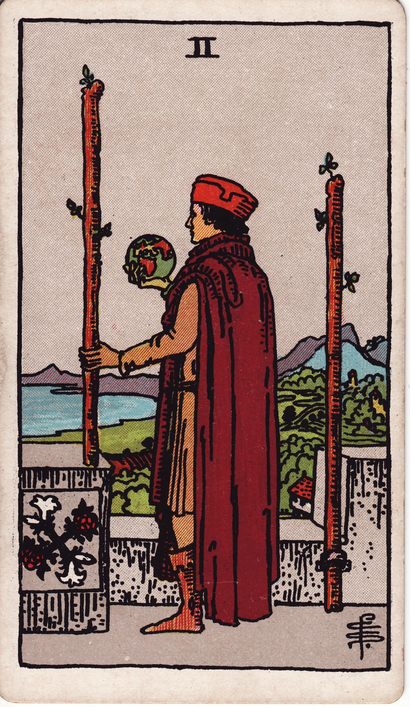

# Two of Wands

The Two of Wands is the moment of poised ambition—the vantage point from which you survey the terrain, gather courage, and choose your direction. The spark of the Ace has become a conscious plan, a desire to sculpt destiny with both vision and daring.

*Keywords:* strategic planning, bold vision, dominion, intentional expansion
*Mood:* focused, anticipatory, self-possessed, adventurous
*Polarity:* directive, projective

*Art interpretation cue:* Portray a figure standing at a parapet or threshold, holding a wand while another is anchored beside them. A globe, map, or horizon should emphasize strategic foresight and the pull of distant possibility.

### Artistic Direction

Capture the stillness before departure—the contemplative pause where power gathers as plans crystallize.

*   **Core Symbolism & Composition:**
    *   **Dual Wands:** One wand is gripped, symbolizing active choice; the other is secured to the wall, showing established authority. Together they frame the decision to expand beyond the familiar.
    *   **The Outlook:** A castle balcony, cliffside vista, or high tower underscores the command of perspective. Distant mountains, rivers, or ships hint at the world waiting to be claimed.
    *   **The Globe or Map:** Include a globe, compass, or parchment to reinforce visionary planning and the desire to explore.
    *   **Red Robes or Solar Motifs:** Draw on Aries imagery—bold colors, ram emblems, or blazing sunlight—to reflect courageous intent.
*   **Mood & Atmosphere:**
    Use vibrant reds, sunlit golds, and terra-cotta tones. Lighting should be clear and direct, suggesting determination and clarity.

### Esoteric Correspondences

*   **Title:** The Lord of Dominion.
*   **Astrology:** Mars in Aries (March 21 – March 30). Pure initiative meets strategic direction, forging decisive momentum.
*   **Element:** Fire moving into form, ambition harnessed for deliberate action.
*   **Kabbalah:** Chokmah in Atziluth (Wisdom in the World of Emanation). The raw will of fire begins to take shape through focused intent.

### Numerology (2)

Two asks for partnership, polarity, and choice. In Wands, it represents directional will—balancing instinct with strategy, impulse with intention, self with the world.

### Core Meanings (Upright)

*   **Visionary Planning:** Seeing the bigger picture and plotting a bold course.
*   **Taking the Helm:** Claiming leadership, authority, or entrepreneurial space.
*   **Calculated Risk:** Preparing to step beyond comfort zones with confidence.
*   **Global Perspective:** Thinking expansively—international business, travel, or partnerships.

### Core Meanings (Reversed)

*   **Fear of the Unknown:** Retreating from opportunity due to self-doubt.
*   **Stalled Initiatives:** Plans locked on paper without execution.
*   **Over-Control:** Micromanaging to the point of losing creative flow.
*   **Limited Vision:** Underestimating your potential or scope.

### The Card as a Person

*   **Upright:** A strategist, entrepreneur, or innovator who pairs daring ideas with strong planning.
*   **Reversed:** Someone with brilliant concepts who hesitates to launch, or a leader who keeps plans secret out of fear.

### Guiding Questions

*   **Upright:**
    *   What vista opens when I lift my gaze beyond the familiar?
    *   Which resources or allies support this next leap?
    *   How can I honor both intuition and data in my planning?
    *   Where is a decisive declaration of intention required?
*   **Reversed:**
    *   What fear keeps me gripping the parapet instead of stepping forward?
    *   How can I simplify my plan so progress resumes?
    *   Who could help me broaden my vision if I asked?
    *   Why am I waiting for perfect certainty when courage would suffice?

### Affirmations

*   **Upright:** “I claim my vision and chart the course my fire demands.”
*   **Reversed:** “I release hesitation and trust the path will meet my stride.”

### Love & Relationships

*   **Upright:** Couples planning a shared future, long-distance partnerships making decisive moves, adventures embarked upon together.
*   **Reversed:** Hesitation to commit, fear of change within the relationship, or divergent visions about what comes next.
*   **Self-Question:** “How can our shared direction be named clearly so we can walk it together?”

### Work & Money

*   **Upright:** Business expansion, strategic partnerships, stepping into leadership roles, pitching bold projects.
*   **Reversed:** Opportunity cost through delay, analysis paralysis, or lack of follow-through on strong concepts.
*   **Self-Question:** “What deliberate move will translate my plans into momentum this week?”

### Spiritual & Psychological

*   **Themes:** Claiming personal authority, embodying the pioneer archetype, aligning desire with purpose.
*   **Actionable Advice:**
    1.  **Vision Casting:** Spend time mapping your desired future—journal, storyboard, or create a mind map with concrete milestones.
    2.  **Threshold Ritual:** Stand at a doorway, balcony, or literal threshold. Speak aloud the expedition you are choosing and step through with intent.
    3.  **Courage Call:** Contact a mentor or peer who has walked a similar path and request their insight on your next move.

### Cross-Card Echoes

*   **Two of Wands ↔ Three of Wands:** Once the decision is made, momentum and visible returns follow.
*   **Two of Wands ↔ Two of Swords:** Fire plans action; air deliberates. Together, they ask for balanced choice between heart and mind.
*   **Two of Wands → Emperor:** Dominion at the micro level prepares you for sovereign leadership.

### Impression Palette

#### Exploration Log

“Day zero: I stand above the roofs of my old life. The map is unfinished, but my pulse draws its own longitude.”

#### Declarative Couplets

Two pillars ablaze—  
One anchors, one points the road.  
I choose the horizon. 
