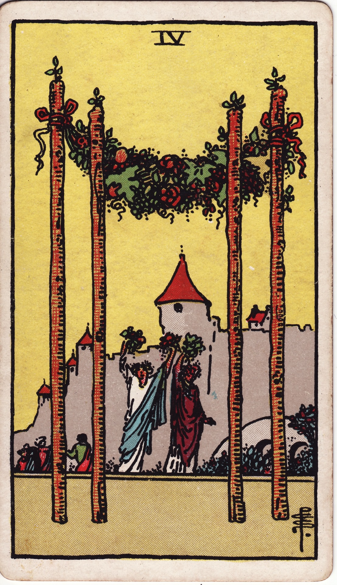

# Four of Wands

The Four of Wands is the hearth aflame with celebration. It marks a joyous threshold, a milestone secured through dedication and community. This is the homecoming feast, the wedding arch, the moment when effort crystallizes into shared delight and a sense of belonging.

*Keywords:* celebration, homecoming, milestone, communal joy, foundation
*Mood:* festive, harmonious, sunlit, welcoming
*Polarity:* stabilizing, radiant

*Art interpretation cue:* Illustrate a floral garland or canopy supported by four wands, with figures dancing or welcoming others beneath it. The scene should glow with warmth, abundance, and open doors.

### Artistic Direction

Capture an atmosphere of triumphant hospitality. This card is a visual toast to a milestone earned and shared.

*   **Core Symbolism & Composition:**
    *   **The Four Pillars:** Four wands form a celebratory arch or pavilion, symbolizing a stable structure built from passion and collaboration.
    *   **Garlands & Flowers:** Lush greenery, ribbons, or blossoms draped between the wands emphasize joy and flourishing.
    *   **The Revelers:** Figures in festive attire beckon others to join, signifying community, weddings, or team victories.
    *   **The Estate or Village:** A background home, castle, or communal space underscores the idea of belonging and shared success.
*   **Mood & Atmosphere:**
    Use luminous golds, warm peaches, and verdant greens. Lighting should be golden-hour brilliance, evoking both gratitude and exuberance.

### Esoteric Correspondences

*   **Title:** The Lord of Perfected Work.
*   **Astrology:** Venus in Aries (April 11 – April 20). Passion meets celebration; the warrior pauses to revel in love and partnership.
*   **Element:** Fire stabilized into joyful structure—ritual, rite of passage, communal flame.
*   **Kabbalah:** Chesed in Atziluth (Mercy in the World of Emanation). Fierce energy softens into blessing shared generously.

### Numerology (4)

Four represents structure, home, and the square foundation. In Wands, it signifies the first sanctuary built from your efforts—a safe harbor where creative fire can rest and be honored.

### Core Meanings (Upright)

*   **Milestone Celebration:** Weddings, launches, anniversaries, or team triumphs.
*   **Sacred Space:** Creating a home, altar, or community hub that feels like sanctuary.
*   **Joyful Welcome:** Hospitality extended to loved ones; reunion after a journey.
*   **Strong Foundations:** A project or relationship achieving stability and recognition.

### Core Meanings (Reversed)

*   **Delayed Celebration:** Postponed events, misaligned schedules, or tentative joy.
*   **Unstable Foundations:** A need to secure logistics before inviting others in.
*   **Private Victory:** Success not yet ready to be shared, or conflicts within the home.
*   **Social Overload:** Feeling obligated to celebrate when you crave quiet integration.

### The Card as a Person

*   **Upright:** The gracious host, community builder, event planner, or beloved friend who creates spaces of belonging.
*   **Reversed:** Someone who struggles to let others in, or who feels unworthy of celebration and thus avoids it.

### Guiding Questions

*   **Upright:**
    *   What milestone deserves a ritual or celebration right now?
    *   How can I honor the people who built this success with me?
    *   Where can I create a sense of home—physically or emotionally?
    *   Which traditions or rituals amplify our joy?
*   **Reversed:**
    *   What finishing touches are needed before I invite others into this space?
    *   Why do I hesitate to celebrate—what story is suppressing my joy?
    *   How can I create belonging for myself before offering it outward?
    *   Where do boundaries support the sanctity of my homecoming?

### Affirmations

*   **Upright:** “I celebrate the foundations I have built and welcome those who share my joy.”
*   **Reversed:** “I ensure my sanctuary is secure, then I share my light with discernment.”

### Love & Relationships

*   **Upright:** Engagements, moving in together, family reunions, parties that deepen bonds.
*   **Reversed:** Unresolved tensions in the household, delays in commitment, or guest list stress.
*   **Self-Question:** “What does home mean for us, and how can we embody it intentionally?”

### Work & Money

*   **Upright:** Launch parties, opening a studio or storefront, celebrating team success, securing a beneficial contract.
*   **Reversed:** Office politics dampening morale, delays in opening, or needing to stabilize finances before celebrating.
*   **Self-Question:** “How can I acknowledge the progress made while still tending the structure?”

### Spiritual & Psychological

*   **Themes:** Sacred celebration, gratitude rituals, anchoring joy in physical space.
*   **Actionable Advice:**
    1.  **Threshold Blessing:** Mark a doorway with herbs, smoke, or intention as you welcome in joy and protection.
    2.  **Gathering of Gratitude:** Host (or imagine) a small celebration honoring your recent wins or the people who supported you.
    3.  **Altars of Belonging:** Create or refresh an altar that reflects your current sense of home, placing symbols of success upon it.

### Cross-Card Echoes

*   **Four of Wands ↔ Four of Cups:** Contrast between joyful engagement and emotional withdrawal; balance celebration with introspection.
*   **Four of Wands ↔ The World:** Both celebrate completion and homecoming after a journey.
*   **Four of Wands → Ten of Pentacles:** Lay joyful foundations now to build generational legacy later.

### Impression Palette

#### Toast

“To foundations that glow like embers at dusk, to the doors we throw open, to the love that keeps returning home.”

#### Celebratory Chant

Four torches blazing,  
garlands catch the evening light—  
come in, stay, belong.
