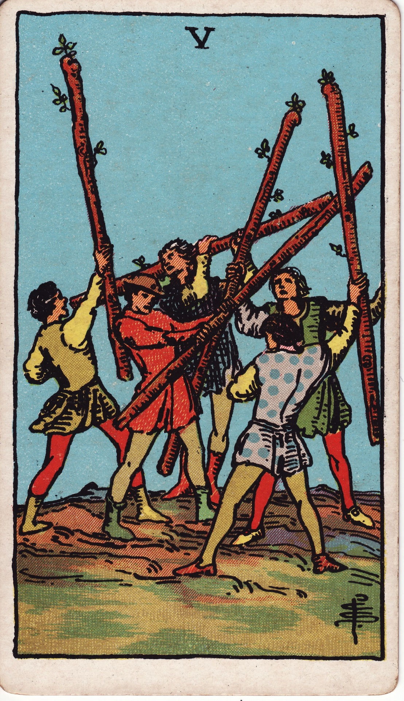

# Five of Wands

The Five of Wands is the crackle of creative friction. It represents sparring ideas, competitive tension, and the kind of clashing passion that, when navigated wisely, hones skill and reveals true desire. This is a forge made of five blazing wills colliding.

*Keywords:* competition, friction, creative conflict, testing ground, spirited debate
*Mood:* energized, chaotic, challenging, restless
*Polarity:* dynamic, disruptive

*Art interpretation cue:* Depict multiple figures wielding wands in a lively tussle. The scene should feel kinetic—more like a sparring match than a war—suggesting practice, rivalry, or the rehearsal stage before mastery.

### Artistic Direction

Portray conflict as a fiery workshop. The goal is not destruction but evolution through pressure, resistance, and play.

*   **Core Symbolism & Composition:**
    *   **Five Combatants:** Each figure expresses different styles or personalities, symbolizing competing ideas, egos, or approaches.
    *   **Crossed Wands:** The staves form X- or star-shaped intersections, showing tension, entanglement, and dynamic interplay.
    *   **Rough Terrain:** Uneven ground or unfinished structures remind us this arena is still in development—nothing is fixed yet.
    *   **Bright Sky:** Keep the palette energetic and sunlit to underscore that this is not a dire battle but a spirited challenge.
*   **Mood & Atmosphere:**
    Use fiery oranges, scarlet flashes, and electric yellows. Motion lines, flying sparks, or dust clouds help communicate kinetic energy.

### Esoteric Correspondences

*   **Title:** The Lord of Strife.
*   **Astrology:** Saturn in Leo (July 22 – August 1). Structure meets pride; discipline encounters the need for creative self-expression.
*   **Element:** Fire encountering resistance—heat tempered by challenge.
*   **Kabbalah:** Geburah in Atziluth (Severity in the World of Emanation). Fiery discipline cuts through complacency to reveal strength.

### Numerology (5)

Five disrupts stability to provoke growth. In Wands, it’s the friction that tests passion, ensuring your fire is resilient, authentic, and agile.

### Core Meanings (Upright)

*   **Healthy Competition:** Friendly rivalries that spur improvement and sharpen skill.
*   **Creative Brainstorm:** Energetic debate where multiple visions collide to birth innovation.
*   **Testing Ground:** Training, auditions, or trials that develop confidence and prowess.
*   **Rising to Challenge:** Embracing obstacles as fuel for your inner warrior.

### Core Meanings (Reversed)

*   **Toxic Conflict:** Ego battles, needless drama, or burnout from constant competition.
*   **Avoidance:** Fear of confrontation leading to suppressed ideas or dreams.
*   **Fragmented Focus:** Scattered energy; too many competing priorities to make progress.
*   **Stalled Creativity:** Struggle without purpose, leading to frustration.

### The Card as a Person

*   **Upright:** A passionate competitor, performer, or creative who thrives on challenge and lively debate.
*   **Reversed:** Someone easily triggered, conflict-averse, or prone to picking fights without clear intention.

### Guiding Questions

*   **Upright:**
    *   How can I use this friction to refine my craft?
    *   Where do healthy rivalries push me toward excellence?
    *   What rules of engagement keep this competition inspiring rather than damaging?
    *   Which value am I defending, and is it worth the energy?
*   **Reversed:**
    *   What conflict am I avoiding that actually needs honest engagement?
    *   Where has drama become a distraction from real progress?
    *   How can I gather scattered energy into one focused flame?
    *   What boundaries will protect my passion while resolving tension?

### Affirmations

*   **Upright:** “I welcome challenge as a forge that tempers my fire.”
*   **Reversed:** “I channel my energy into purposeful battles and release the rest.”

### Love & Relationships

*   **Upright:** Playful competition, lively debates, or couples learning to fight fair and grow together.
*   **Reversed:** Pettiness, unresolved jealousy, or constant sparring that drains affection.
*   **Self-Question:** “How can we turn conflict into collaborative growth rather than scorched earth?”

### Work & Money

*   **Upright:** Auditions, pitch competitions, team brainstorming sessions, or pushing to secure a coveted role.
*   **Reversed:** Workplace drama, sabotage, or wasting effort on ego battles instead of solutions.
*   **Self-Question:** “Where can I adopt a learner’s mindset and use competition to level up?”

### Spiritual & Psychological

*   **Themes:** Shadow integration, confronting envy, cultivating resilience through honest feedback.
*   **Actionable Advice:**
    1.  **Conflict Mapping:** Journal about current tensions—identify motives, desired outcomes, and constructive approaches.
    2.  **Ritual Sparring:** Engage in a physical or creative practice (martial arts, improv, debate club) that allows safe expression of competitive fire.
    3.  **Fuel Reframe:** List the skills gained from recent challenges; acknowledge how they sharpened you.

### Cross-Card Echoes

*   **Five of Wands ↔ Five of Swords:** Distinguish between honorable sparring and destructive conflict.
*   **Five of Wands → Six of Wands:** Mastering the contest paves the path to victory and recognition.
*   **Five of Wands ↔ The Tower:** Both shake foundations—but the Five offers rehearsal, while the Tower enforces revolution.

### Impression Palette

#### Rally Cry

“Clash with me, torchbearers! Let our sparks reveal which fires were meant to last.”

#### Free-Verse Snapshot

Five voices flare—  
not to conquer,  
but to test the tensile strength  
of why we burn at all.
