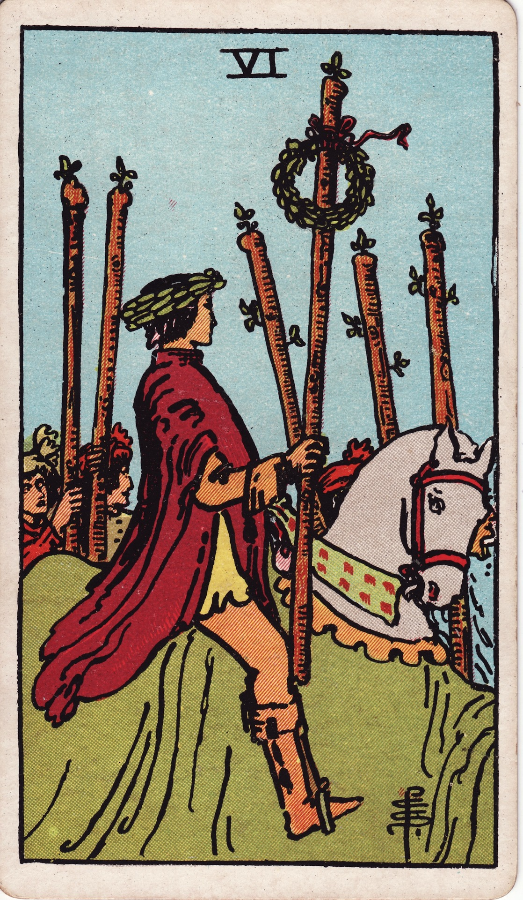

# Six of Wands

The Six of Wands is the triumphant return—the public acknowledgment of effort, the laurel crown awarded after courageous pursuit. It is the parade that honors perseverance and the leadership that inspires others to cheer.

*Keywords:* victory, recognition, leadership, triumph, public success
*Mood:* proud, radiant, validated, inspiring
*Polarity:* directive, celebratory

*Art interpretation cue:* Show a victorious rider or figure elevated above the crowd, holding a wand adorned with laurels. Supporters or companions celebrate alongside, underscoring collective morale.

### Artistic Direction

Capture a moment of visible success. The energy should feel uplifting, communal, and richly earned.

*   **Core Symbolism & Composition:**
    *   **The Laurel-Crowned Wand:** A wand crowned with wreaths signals triumph, achievement, and honored leadership.
    *   **The Elevated Figure:** A rider on horseback or leader on a platform conveys being seen, heard, and followed.
    *   **The Supporters:** Figures cheering or holding additional wands show that victory is shared and morale is high.
    *   **Banners & Sunlight:** Flags, streamers, or sunlight break through to emphasize joy and honor.
*   **Mood & Atmosphere:**
    Use bold golds, celebratory reds, and emerald accents. Let light concentrate around the victor to highlight admiration and charisma.

### Esoteric Correspondences

*   **Title:** The Lord of Victory.
*   **Astrology:** Jupiter in Leo (August 2 – August 11). Magnanimous leadership, generous success, and exuberant confidence.
*   **Element:** Fire elevated through recognition—passion rewarded and amplified.
*   **Kabbalah:** Tiphareth in Atziluth (Beauty in the World of Emanation). Harmonized fire radiates outward, inspiring others.

### Numerology (6)

Six is the balance of harmony and reciprocity. In Wands, it is the feedback loop between leader and community; victory is meaningful because it is witnessed and shared.

### Core Meanings (Upright)

*   **Public Recognition:** Awards, promotion, applause, or a burst of praise.
*   **Leadership Spotlight:** Stepping into visibility as a confident, inspiring figure.
*   **Momentum Gained:** Success fuels further motivation and trust in your path.
*   **Community Support:** Allies rally to celebrate and sustain your progress.

### Core Meanings (Reversed)

*   **Imposter Syndrome:** Struggling to trust success, fearing the crown will slip.
*   **Unrecognized Effort:** Achievements overlooked, or support withheld.
*   **Pride Before the Fall:** Ego-driven victory that alienates teammates.
*   **Delayed Praise:** Recognition arrives later than expected; patience is required.

### The Card as a Person

*   **Upright:** A charismatic leader, performer, athlete, or activist whose victories energize others.
*   **Reversed:** Someone hungry for validation yet unsure how to accept it gracefully, or who downplays their own achievements.

### Guiding Questions

*   **Upright:**
    *   What victory deserves to be acknowledged openly?
    *   How can I lead with generosity now that my influence is growing?
    *   Which supporters should I thank publicly?
    *   How can this success become a stepping stone rather than a finish line?
*   **Reversed:**
    *   What internal belief keeps me from enjoying recognition?
    *   Where have I neglected the contributions of others?
    *   How can I cultivate confidence without arrogance?
    *   What stage or platform better suits my message?

### Affirmations

*   **Upright:** “I celebrate my victories and lead with heart, knowing success is shared.”
*   **Reversed:** “I receive recognition with humility and channel it into meaningful service.”

### Love & Relationships

*   **Upright:** Celebrating relationship milestones, publicly affirming love, standing together as a power couple.
*   **Reversed:** Comparison, jealousy, or feeling unseen by a partner; one partner overshadowing the other.
*   **Self-Question:** “How can we spotlight each other’s wins and grow stronger together?”

### Work & Money

*   **Upright:** Promotions, successful launches, leading a team to victory, gaining a stellar reputation.
*   **Reversed:** Credit stolen, lack of acknowledgment, or fear of stepping into the spotlight.
*   **Self-Question:** “Where can I leverage this success to create sustainable growth for all involved?”

### Spiritual & Psychological

*   **Themes:** Integrating praise, embodying worthy leadership, aligning ego with service.
*   **Actionable Advice:**
    1.  **Victory Ledger:** Write down recent wins, no matter the size, and note who helped you achieve them.
    2.  **Gratitude Spotlight:** Publicly thank a collaborator, mentor, or team member who supported your climb.
    3.  **Radiance Meditation:** Visualize yourself wearing a laurel crown. Breathe in confidence, breathe out encouragement to others.

### Cross-Card Echoes

*   **Six of Wands ↔ Six of Cups:** Recognized success paired with heartfelt nostalgia and genuine connection.
*   **Six of Wands → Chariot:** Victory is secured; now steer your triumph toward higher missions.
*   **Six of Wands ↔ Wheel of Fortune:** Momentum shifts—stay adaptable to sustain success.

### Impression Palette

#### Laurel Ode

“You rode through doubt and dust; now let the sunlight crown you. Take the cheers—you’ve earned the echo.”

#### Victory Verse

Stand tall, torch aloft,  
crowd-fire reflecting your own.  
Lead us to our best.
